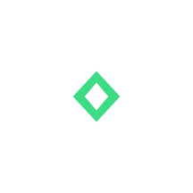
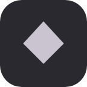
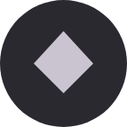
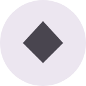
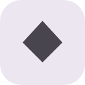
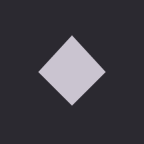
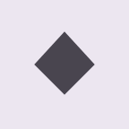
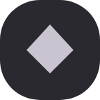
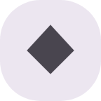

# Preview Baselines
## Android XML Resource Previews

Rendered from `:<module>:composePreviewRenderAndroidResources`. One row per (resource × qualifier × shape) capture. See [`references/resource-previews.md`](https://github.com/yschimke/skills/blob/main/skills/compose-preview/references/resource-previews.md) for the rendering catalogue.

### samples/android

| Resource | Type | Qualifiers | Shape | Image |
|---|---|---|---|---|
| `drawable/avd_pulse` | ANIMATED_VECTOR | `xhdpi` | — |  |
| `drawable/avd_pulse` | ANIMATED_VECTOR | `xhdpi` | — |  |
| `drawable/bg_button` | NINE_PATCH | `xhdpi` | — |  |
| `drawable/bg_button` | NINE_PATCH | `xhdpi` | — |  |
| `drawable/bg_button` | NINE_PATCH | `xhdpi` | — |  |
| `drawable/bg_button` | NINE_PATCH | `xhdpi` | — |  |
| `drawable/ic_compose_logo` | VECTOR | `night-xhdpi` | — |  |
| `drawable/ic_compose_logo` | VECTOR | `xhdpi` | — |  |
| `drawable/ic_launcher_background` | VECTOR | `xhdpi` | — |  |
| `drawable/ic_launcher_foreground` | VECTOR | `xhdpi` | — |  |
| `drawable/ic_launcher_legacy` | VECTOR | `xhdpi` | — |  |
| `drawable/ic_settings` | VECTOR | `xhdpi` | — |  |
| `mipmap/ic_launcher` | ADAPTIVE_ICON | `xhdpi` | — |  |
| `mipmap/ic_launcher` | ADAPTIVE_ICON | `xhdpi` | CIRCLE |  |
| `mipmap/ic_launcher` | ADAPTIVE_ICON | `xhdpi` | CIRCLE |  |
| `mipmap/ic_launcher` | ADAPTIVE_ICON | `xhdpi` | CIRCLE |  |
| `mipmap/ic_launcher` | ADAPTIVE_ICON | `xhdpi` | ROUNDED_SQUARE |  |
| `mipmap/ic_launcher` | ADAPTIVE_ICON | `xhdpi` | ROUNDED_SQUARE |  |
| `mipmap/ic_launcher` | ADAPTIVE_ICON | `xhdpi` | ROUNDED_SQUARE |  |
| `mipmap/ic_launcher` | ADAPTIVE_ICON | `xhdpi` | SQUARE |  |
| `mipmap/ic_launcher` | ADAPTIVE_ICON | `xhdpi` | SQUARE |  |
| `mipmap/ic_launcher` | ADAPTIVE_ICON | `xhdpi` | SQUARE |  |
| `mipmap/ic_launcher` | ADAPTIVE_ICON | `xhdpi` | SQUIRCLE |  |
| `mipmap/ic_launcher` | ADAPTIVE_ICON | `xhdpi` | SQUIRCLE |  |
| `mipmap/ic_launcher` | ADAPTIVE_ICON | `xhdpi` | SQUIRCLE |  |
| `mipmap/ic_launcher_round` | ADAPTIVE_ICON | `xhdpi` | — |  |
| `mipmap/ic_launcher_round` | ADAPTIVE_ICON | `xhdpi` | CIRCLE |  |
| `mipmap/ic_launcher_round` | ADAPTIVE_ICON | `xhdpi` | CIRCLE |  |
| `mipmap/ic_launcher_round` | ADAPTIVE_ICON | `xhdpi` | CIRCLE |  |
| `mipmap/ic_launcher_round` | ADAPTIVE_ICON | `xhdpi` | ROUNDED_SQUARE |  |
| `mipmap/ic_launcher_round` | ADAPTIVE_ICON | `xhdpi` | ROUNDED_SQUARE |  |
| `mipmap/ic_launcher_round` | ADAPTIVE_ICON | `xhdpi` | ROUNDED_SQUARE |  |
| `mipmap/ic_launcher_round` | ADAPTIVE_ICON | `xhdpi` | SQUARE |  |
| `mipmap/ic_launcher_round` | ADAPTIVE_ICON | `xhdpi` | SQUARE |  |
| `mipmap/ic_launcher_round` | ADAPTIVE_ICON | `xhdpi` | SQUARE |  |
| `mipmap/ic_launcher_round` | ADAPTIVE_ICON | `xhdpi` | SQUIRCLE |  |
| `mipmap/ic_launcher_round` | ADAPTIVE_ICON | `xhdpi` | SQUIRCLE |  |
| `mipmap/ic_launcher_round` | ADAPTIVE_ICON | `xhdpi` | SQUIRCLE |  |

