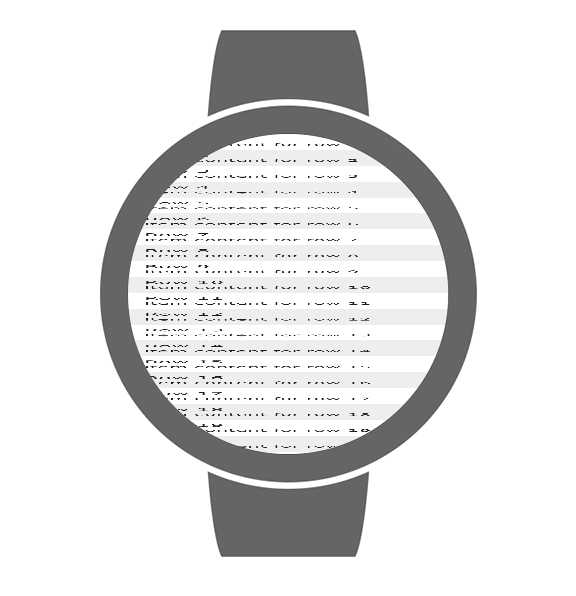

# Device frames

Composite a rendered `@Preview` into a real device bezel — a round Wear watch or a phone, with the
hardware buttons (crown / side button, power + volume) baked into the artwork — so a capture looks
like the device, the way Android Studio's "device frame" does. Useful for marketing shots and for
making a Wear/phone preview read as the physical product.

This is a **post-capture** step: the base PNG is rendered exactly as before, then a framed sibling
is written alongside it. It never changes or replaces the base capture, and a fetch/compose failure
is swallowed (logged) so it can't break a render.



*A sample preview rendered through the pipeline (`-PcomposePreview.deviceFrame.device=wear_round`),
composited into Google's CC-BY `wear_round` bezel — strap and crown come from the frame art.*

## Turning it on

Off by default. Enable per-invocation with a Gradle property:

```
./gradlew :app:composePreviewRenderAll -PcomposePreview.deviceFrame.device=auto
```

`auto` picks a frame from each preview's `device` class:

| `@Preview(device = …)` class                 | Frame       |
| -------------------------------------------- | ----------- |
| round Wear (`*_round`, `isround=true`)       | `wear_round` |
| square Wear (`wearos_square`)                | `wear_square` |
| phones (Pixel ids, `spec:…`, width/height)   | `pixel_5` (generic phone) |
| tablet / TV / automotive / XR / desktop      | *(un-framed)* |

Force one frame for every preview by naming a [Device Art Generator][dag] id instead of `auto`:

```
-PcomposePreview.deviceFrame.device=wear_round
```

## Output

For a framed preview, under `<render-dir>/../data/<previewId>/`:

- `deviceframe_<artId>.png` — the framed image.
- `deviceframe.json` — `{ device, artId, path, mediaType, attribution }`.
- `deviceframe-attribution.txt` — the CC-BY attribution (see below).

## Advanced (system properties)

The Gradle plugin forwards `-Dcomposeai.deviceframe.device=…` and `-Dcomposeai.deviceframe.cacheDir`
(the prefetch cache it just filled) to the renderer. Two more system properties tune the composite
(no Gradle-property wrapper yet — pass with `-D…` via `org.gradle.jvmargs` or a renderer arg):

| Property                       | Default | Meaning |
| ------------------------------ | ------- | ------- |
| `composeai.deviceframe.shadow` | `true`  | `false` drops the drop-shadow layer. |
| `composeai.deviceframe.glare`  | `true`  | `false` drops the screen-glare layer. |

The on-disk cache lives at `${java.io.tmpdir}/compose-preview-device-art/<artId>/port_<resource>.png`.

The Gradle plugin prefetches the needed layers (Ktor/OkHttp) into the cache before launching
renderers, so the render itself does no network IO. Layers are downloaded once and reused across
runs; pre-seed `cacheDir` with `<artId>/port_<resource>.png` files for fully offline / CI runs.

## How it works

- [`DeviceArtCatalog`](../data/deviceframe/core/src/main/kotlin/ee/schimke/composeai/data/deviceframe/DeviceArtCatalog.kt)
  — frame geometry (screen rectangle, corner radius, layers, notch) transcribed from Google's
  `device-art-generator.js`.
- [`DeviceFrameCompositor`](../data/deviceframe/core/src/main/kotlin/ee/schimke/composeai/data/deviceframe/DeviceFrameCompositor.kt)
  — pure `java.awt` (BufferedImage/Graphics2D) compositor reproducing the generator's layering
  (shadow → back → screen, anti-aliased rounded-rect/circle clip → notch redraw → glare). Runs
  unchanged on the Robolectric host JVM and the Desktop renderer.
- [`DeviceArtPrefetch`](../gradle-plugin/src/main/kotlin/ee/schimke/composeai/plugin/DeviceArtPrefetch.kt)
  — downloads the bezel layers into the on-disk cache **before** the render runs, via **OkHttp**
  (synchronous), in the Gradle daemon JVM. It lives in the plugin, not the renderer, on purpose: an
  HTTP client can't sit on the render subprocess classpath without skewing Compose's
  `kotlinx-coroutines` (`runBlockingK$default NoSuchMethodError` — see
  [RENDERER_COMPATIBILITY.md](RENDERER_COMPATIBILITY.md)). OkHttp (not Ktor) because Ktor 3.x needs
  coroutines ≥ 1.10 while the Gradle daemon ships an older one.
- [`CachedDeviceArtSource`](../data/deviceframe/connector/src/main/kotlin/ee/schimke/composeai/daemon/DeviceArtSource.kt)
  — the renderer-side layer source. Reads the prefetched cache only (no HTTP libs on the render
  classpath); a cache miss degrades to "no frame".
- [`DeviceFrameDataProducer`](../data/deviceframe/connector/src/main/kotlin/ee/schimke/composeai/daemon/DeviceFrameDataProducer.kt)
  — resolves the frame, fetches layers, composites, writes the artifacts. Called from the
  post-capture block in `RobolectricRenderTest` (Android) and `DesktopRendererMain` (Desktop),
  mirroring the display-filter step.

## Licensing / attribution

The bezel artwork is Google's [Device Art Generator][dag] output, licensed
**[CC BY 3.0](https://creativecommons.org/licenses/by/3.0/)**. Every framed image ships a
`deviceframe-attribution.txt` carrying the required attribution; keep it with the image when you
redistribute. The frame PNGs are **not** committed to this repo — they're fetched on demand and
cached — except one small `wear_round` frame used as a test fixture.

Only `wear_round` and `wear_square` exist in the generator (no Pixel Watch / modern Wear). For a
realistic modern watch, see the 3D device-model render (separate feature).

[dag]: https://developer.android.com/distribute/marketing-tools/device-art-generator
