# Render-lane parity — compose-m3 and wear-m3

"Switching lanes should change font antialiasing, not layout." This is the measured
state of that promise across every delivery lane the preview server offers for the two
in-repo design catalogs.

Every number below was produced against a local `compose-preview serve` carrying the
**published** `design-artifacts/compose-m3` and `design-artifacts/wear-m3` branches, with
the desktop live daemon, the Android (Robolectric) live daemon, and a locally built Wasm
tier all attached:

```bash
./gradlew :cli:installDist :cli:packageAndroidDaemon \
          :samples:cmp-wasm-catalog:wasmCatalogDist
unzip cli/build/distributions/compose-preview-android-daemon-*.zip -d /tmp/ad

ANDROID_HOME=/opt/android-sdk \
JAVA_OPTS=-Dcomposeai.cli.libDaemonAndroidDir=/tmp/ad/lib-daemon-android \
cli/build/install/compose-preview/bin/compose-preview serve \
  --catalogs compose-m3,wear-m3 --allow-render-trusted --live-seats 4 \
  --wasm-dir compose-m3=samples/cmp-wasm-catalog/build/wasmDist \
  --trust-store deploy/image/trust/producers.json --port 8899
```

The viewer was then driven through its lane toggles with Playwright, recording each
lane's intrinsic buffer size and the on-screen rect of the element showing it.

## Which lanes each catalog actually has

| Lane | `compose-m3` | `wear-m3` |
| --- | --- | --- |
| Snapshot PNG (baked, from the delivery branch) | ✅ | ✅ |
| On-demand `/render/<id>.png` (daemon, static) | ✅ desktop | ✅ Android |
| Live stream (`#cp-live-toggle`, daemon-pushed frames) | ✅ desktop | ✅ Android |
| In-browser Wasm (`#cp-lane-select` → `wasm`) | ✅ `:samples:cmp-wasm-catalog` | ❌ (Wear Compose is Android-only) |
| SVG export (`#cp-svg-toggle`, `compose/figma-svg`) | ✅ | ✅ |

Capture density differs per catalog and is **not** a lane property: `compose-m3` renders at
**2.625** (the AS phone default — its `@Preview`s carry `density = 2.625`), `wear-m3` at
**2.0**. So a `compose-m3` PNG is 2.625 px/dp in every lane, a `wear-m3` PNG 2.0 px/dp.

## Measured frame sizes

Every lane's own output, in pixels. `=` means identical to the snapshot PNG.

### compose-m3 (CMP desktop)

| Preview | Snapshot PNG | Live (daemon) | Wasm | SVG |
| --- | --- | --- | --- | --- |
| `button-filled` | 300×210 | = | = | = |
| `card-slots` | 653×253 | = | = | = |
| `textfield-outlined` | 819×252 | = | = | = |
| `text-serif` | 510×147 | = | = | = |
| `slider` | 662×210 | = | = | = |
| `progress-circular` | 189×189 | = | = | = |
| `template-appscaffold` | 1078×2399 | = | = | = |

### wear-m3 (Android / Robolectric)

| Preview | Snapshot PNG | Live (daemon) | SVG |
| --- | --- | --- | --- |
| `button-filled` | 165×136 | = | = |
| `card` | 454×160 | = | = |
| `text-maxlines-truncated` | 312×106 | = | = |
| `progress-circular` | 176×176 | = | = |
| `template-timetext-largeround` | 454×454 | = | = |
| `layout-list-largeround` | 454×454 | = | = |

Every lane of every sampled preview now agrees on its frame, and the viewer pins each lane
to the snapshot's rendered box, so switching moves nothing. Three of these columns did not
start out that way — see [what was fixed](#what-was-fixed-and-why-it-diverged).

## What parity looks like

**Desktop snapshot ⇄ desktop live is pixel-identical.** Not "close" — the only differing
pixels in the whole stage are the corner backend badge that changes from `▪ Snapshot` to
`▶ Live`.

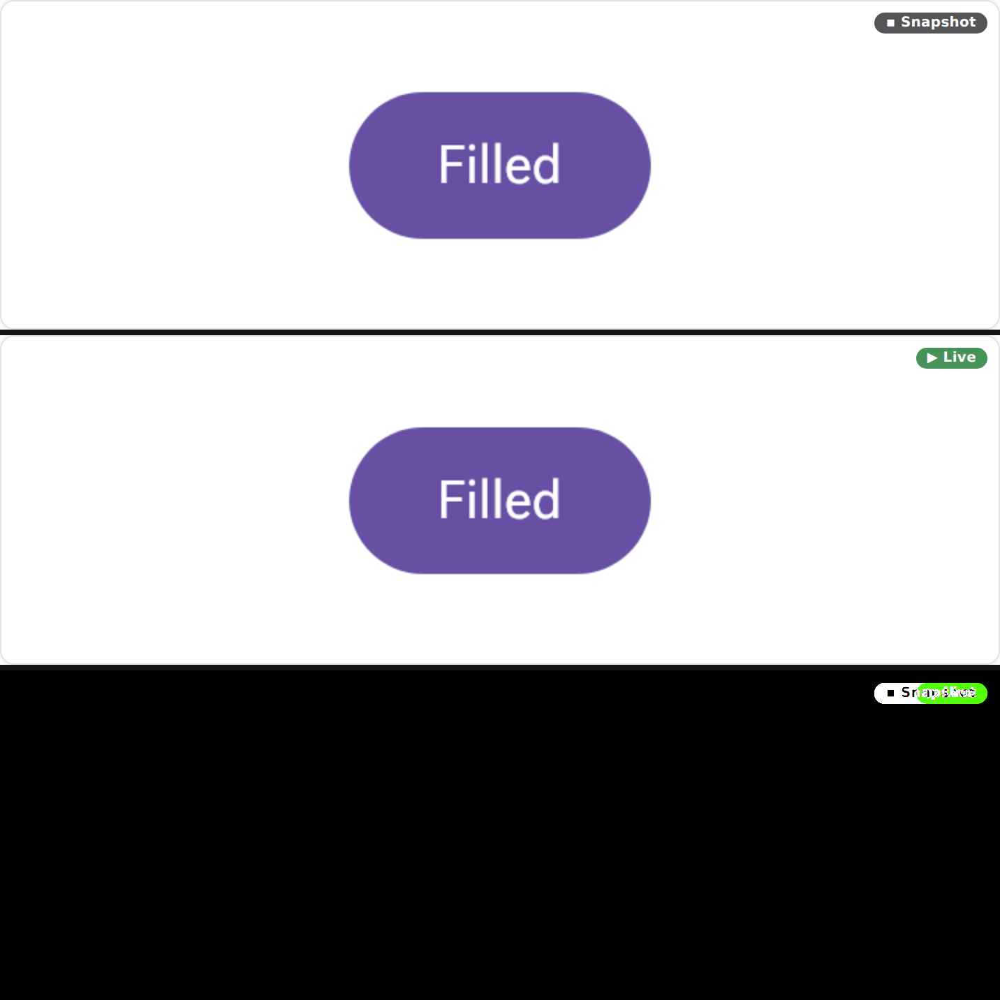

**Snapshot ⇄ Wasm keeps geometry to the pixel, and only antialiasing moves.** The
`CatalogApp` contain-fit contract holds: the sticker's dp geometry survives the trip into
the browser, and the diff is a one-pixel halo on every glyph and curve. The self-hosted
`fonts.json` faces mean even the `text-serif` specimen sets identically — the exact
"trivial font rendering difference" the lane swap is supposed to be limited to.

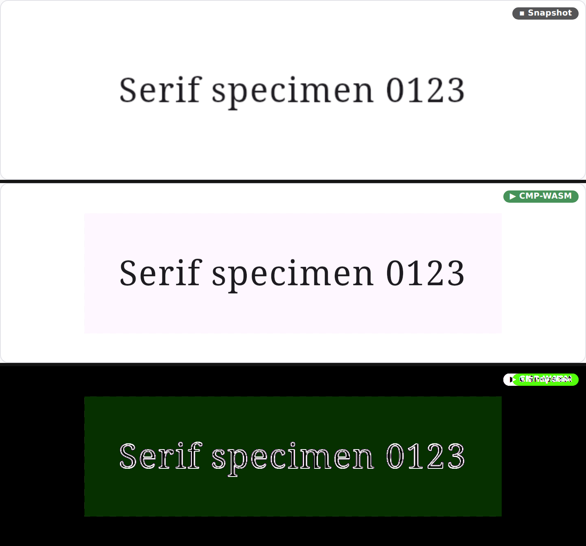

**Android and CMP desktop agree on the same sticker.** `FilledButtonFocused` exists twice —
Robolectric in `:samples:design-catalog-m3-android`, CMP desktop in
`:samples:design-catalog-m3`. Both render a 351×210 frame with the button's drawn extent at
(42,53)/(41,53), 267×105 vs 268×105 — a one-pixel antialiasing edge. The visible difference
is the M3 inset focus ring, which only androidx `material3` has (that's *why* the supplement
module exists), plus the opaque vs transparent sticker background.

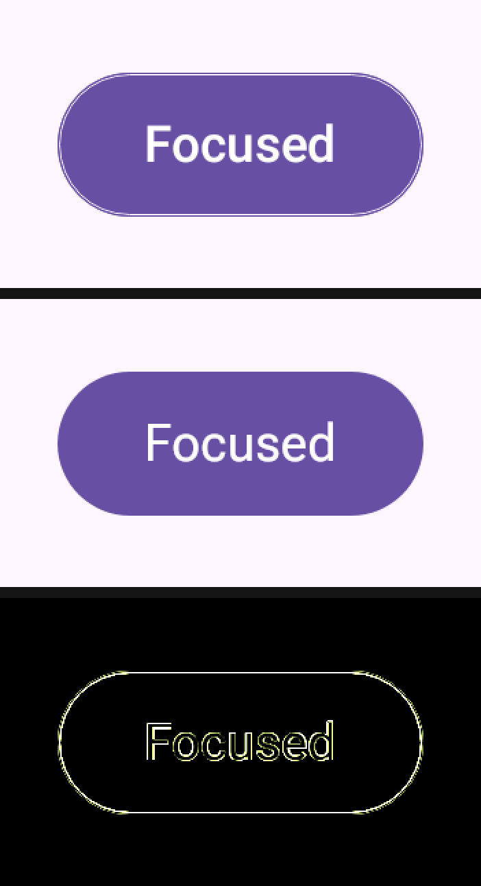

## What was fixed, and why it diverged

### 1. The wear-m3 live lane streamed the whole watch face

Every wrap-content Wear component sticker streamed at **454×454** — the large-round device
frame (227 dp × 2) — regardless of the size the same preview baked and the size the *static*
`/render/<id>.png` daemon path returned. The viewer contain-fits a stream buffer inside the
snapshot's rendered box rather than distorting it, so the component **shrank and re-centred**
the moment Live was enabled: `card` fits a square buffer into a 454×160 box, drawing the card
at **0.35×** and 147 px to the right.

**Cause.** Robolectric always draws into the whole activity window, so a wrap-content preview
lands top-left inside a much larger sandbox frame. `RenderEngine`'s one-shot path measures the
composable with a relaxed constraint and crops the PNG back to that measured size; the
held/interactive loop in `RobolectricHost` did neither — it filled the window and captured it
whole. Desktop never had the problem: `ImageComposeScene` is created at the measured size.

**Fix.** `InteractiveCommand.Start` now carries `wrapWidth` / `wrapHeight`, the held
composition applies the same AS-parity wrap measure the one-shot path does, and each streamed
frame is cropped through the shared `WrappedFrameCrop` (extracted from `RenderEngine` so the
two capture paths cannot drift again).

The wrap measure has to sit **inside** the extension pipeline, exactly where the one-shot path
puts it. An `AroundComposable` extension may fill the window, so measuring outside it reports
the sandbox: with the box one level out, `card` measured 454×454 instead of 454×160 and nothing
changed.

| Before | After |
| --- | --- |
| 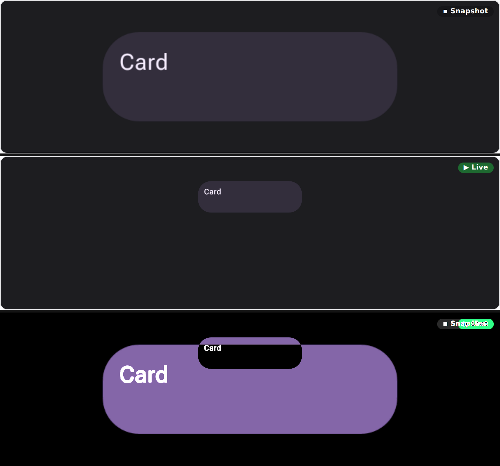 | 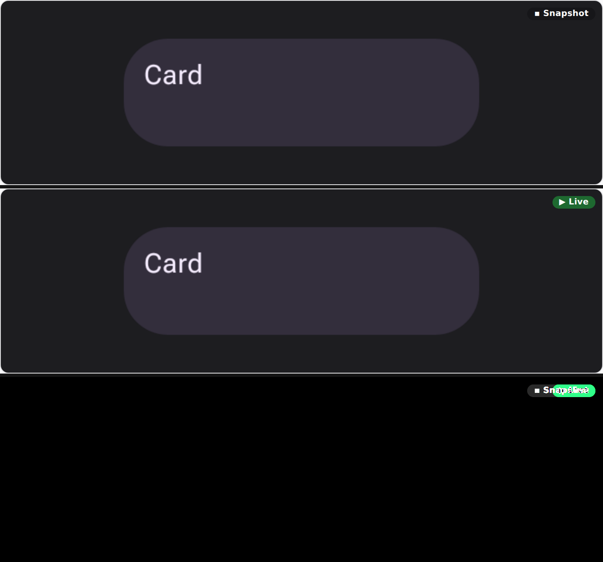 |

### 2. The SVG lane was cropped to drawn content, the PNG lane to the captured frame

`compose/figma-svg` sized its canvas as drawn-content extent + a fixed 16 px margin
(`FigmaSvgModel.DEFAULT_PADDING`), while the PNG is the captured composable frame — the
layout box (which can exceed the drawn extent, e.g. a Button's 48 dp touch target around a
40 dp capsule) plus the sticker's own padding.

The two agreed only by coincidence. `wear-m3` component stickers use 8 dp padding, which at
density 2.0 is exactly 16 px, so all four matched to the pixel; `compose-m3` uses 16 dp at
density 2.625 (42 px), so every sticker's SVG came out 52 px smaller in each dimension and
moved the component by up to 26 px. Round Wear full-screen previews went the other way —
content already fills 454×454, so the SVG grew to 486×486.

**Fix.** When the captured frame's size is known, the exported canvas **is** that frame
(anchored by union, so the pathological "drawn entirely outside the frame" fallback still
keeps its content), with no margin. A device mask defines the frame just as firmly, so a
masked export anchors to the masked rect even without a frame size — which is what the
Android export needs, since its figma-svg extension runs in the capture phase, before the
PNG is on disk, and never sees `frameWidthPx`. Frameless callers (the vector-only /
synthetic path) keep the padded shrink-wrapped canvas; there is no raster for them to agree
with.

| Before | After |
| --- | --- |
| 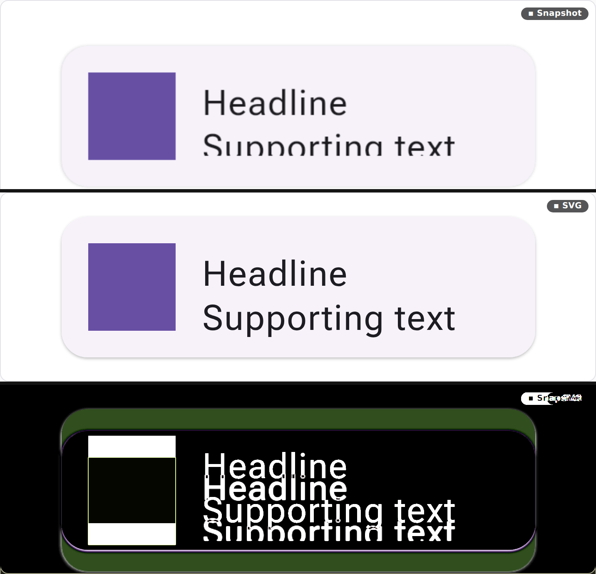 | 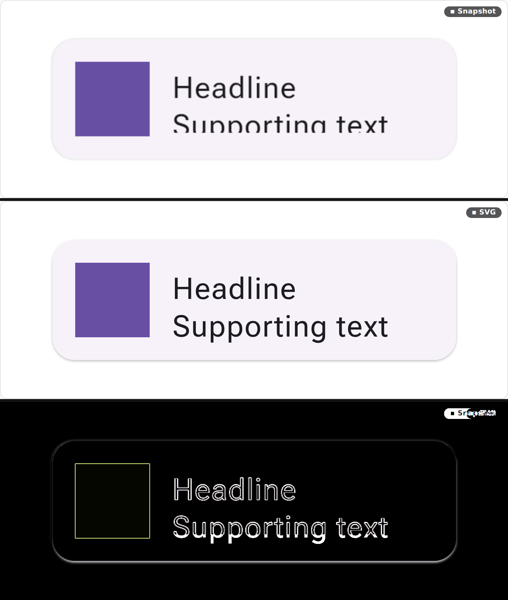 |

Both strips also show the SVG lane *un-clipping* content the raster lanes clip: the
`card-slots` sticker overflows its measured box, so "Supporting text" is cut mid-glyph in the
PNG, in the live stream, and in Wasm — all three agree — while the SVG, rebuilt from the
layout tree, draws the full line. That is a catalog-side bug, not a lane difference, and is
left alone here; the SVG lane just makes it visible.

### 3. The Wasm tier painted a surface the baked sticker does not

`CatalogApp` rendered its sticker `Surface` at `MaterialTheme.colorScheme.surface`, while the
desktop `CatalogStickerFrame` uses `Color.Transparent` ("component stickers render on a
TRANSPARENT surface so each reads as a silhouette on the viewer's backing"). The `CatalogApp`
KDoc claimed parity — "same `Surface` default colour" — but that stopped being true when the
desktop frame went transparent, so a `#FFFBFF` panel appeared behind the component the moment
Wasm was enabled.

**Fix.** The sticker is transparent, matching the desktop frame 1:1. That alone traded one
background mismatch for another: the app cannot render a truly transparent surface (compose-web
paints an opaque base), so it painted its stage checkerboard — which is right only when the
page is in its Transparent mode and wrong on the solid default stage. The viewer now hands the
app its resolved stage backdrop (`stageBg=#rrggbb`, or `checker`), and the app paints that;
a `MutationObserver` on `<html>`'s class re-hands it when the Transparent toggle
flips.

| Before | After |
| --- | --- |
| 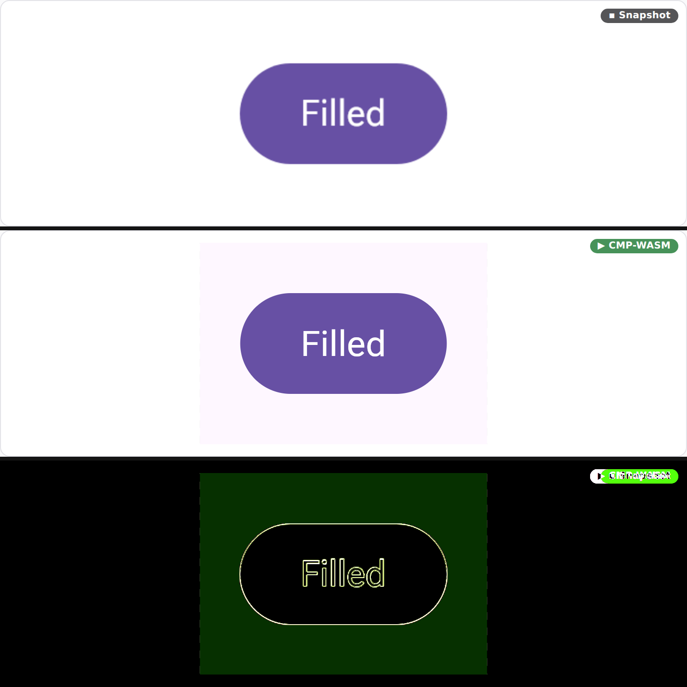 | 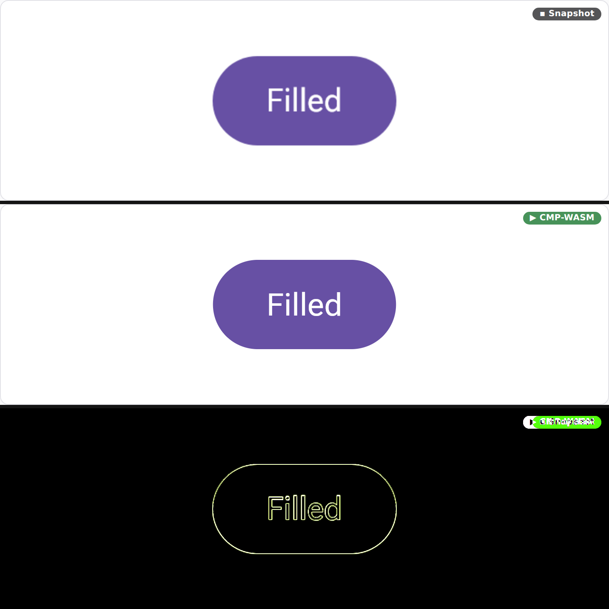 |

## Correction: the Android export is not frameless

An earlier revision of this page claimed the Android figma-svg export runs before the PNG exists
and therefore never sees `frameWidthPx`. **That was wrong.** `ComposeFigmaSvgExtension` runs after
the capture has been written and cropped, so the Android export is frame-anchored exactly like the
desktop one.

Measured, rather than inferred from canvas sizes: packing `:samples:design-catalog-m3-android`
with `--with-semantics` and reading the emitted `previews/<id>.figma.svg` gives a **351×210** canvas
with `translate(0, 0)` against a **351×210** PNG. A frameless export would have shrink-wrapped to
the drawn extent plus a margin — 299 px wide. Hybrid rastering works there too.

The original claim came from reading two coincidences as evidence: a Wear component sticker's
frameless canvas would have been `content + 32 px`, which at Wear's 8 dp padding and density 2.0 is
*exactly* the frame, and a vector `Icon` is vectorised rather than rastered, so its missing
`<image>` meant nothing. Neither observation could distinguish the two cases; the size table above
is the reliable check, and it agrees in every lane.

## The SVG export is background-free

`compose/figma-svg` used to inject the preview's declared `showBackground` colour as the export's
bottom layer — a full-canvas rect, or a device-mask circle for a Wear screen. That is off by
default now, and when a background *is* wanted it is asked for per preview through
`PreviewOverrides.svgBackground`, in one of four modes:

| Mode | What it paints |
|---|---|
| `NONE` (default) | Nothing. The tree's own fills still draw; only the injected layer is dropped. |
| `DEVICE` | The device-mask shape — a `<circle>` for a round Wear face, a vertical stadium for a tall Wear scroll export, the plain frame rect with no mask. Corners outside the mask stay transparent. |
| `CONTENT_SHAPE` | The component's own silhouette: the pill exactly under an `OutlinedButton`, the disc under a circular icon button. |
| `FULL_BLEED` | A plain rect to the corners regardless of any mask — a solid tile for an export that can't rely on the importing canvas. |

`-Dcomposeai.svg.background=<mode>` (or `-PcomposePreview.svgBackground=<mode>` through the Gradle
plugin) sets a daemon-wide default for consumers who want every preview to carry one; `true` and
`false` still work as the pre-modes aliases for `device` and `none`.

`TimeTextScaffoldTemplate_Large_Round` from `:samples:design-catalog-wear-m3`,
packed four times with `bundle pack --with-semantics` under each mode, on a
checkerboard so transparency is visible — the monospace line under each panel is
the layer that mode emitted:

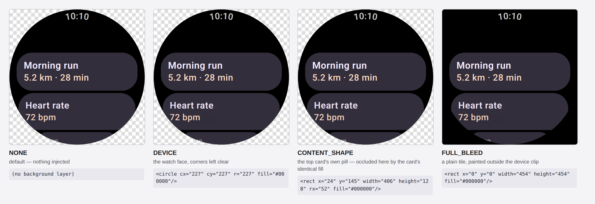

`NONE` and `DEVICE` look nearly identical, which is the argument for the default:
this screen's own root already paints black, so the injected face landed on top
of an identical one the tree drew itself. `CONTENT_SHAPE`'s pill is occluded by
the card's own fill the same way. Only `FULL_BLEED` changes what you see.

The export's product is editable layers, and an injected fill is the opposite: an opaque shape
spanning the whole canvas that a designer has to find and delete before the import works anywhere
but the surface it was baked for. It was also usually invisible. The `compose-m3-android`
supplement's sticker is the clearest case — its SVG carried two stacked full-frame rects, the
injected `#FFFFFF` sitting *underneath* the tree's own `#FEF7FF` `Surface`:

```
before:  <rect ... fill="#FFFFFF"/>        <- injected, fully occluded
         <g id="Root"><rect ... fill="#FEF7FF"/>   <- the sticker's own Surface
after:   <g id="Root"><rect ... fill="#FEF7FF"/>
```

Rendering is unchanged there; the import is one dead layer lighter.

**The one export that keeps its background by default** is the Wear scroll capsule, whose
slice-stitched tree paints no fill of its own — the slices are composited onto the capsule, not
onto a root that draws the watch face, so there is nothing underneath to fall back on. That surface
alone defaults to `DEVICE` instead of `NONE` (`RenderEngine`'s capsule export; a per-render
`svgBackground` or a daemon-wide `composeai.svg.background=none` still turns it off). Below is what
dropping it would have cost — before/after on a light canvas, then before/after on dark. The
cards, their text and the button all carry their own fills and are untouched — what gets hard to
read is the light-grey `TimeText` clock, and only against a light canvas. On dark, before and after
are indistinguishable. That is the case `DEVICE` exists for, and why the capsule opts into it
rather than every component preview inheriting a tile.

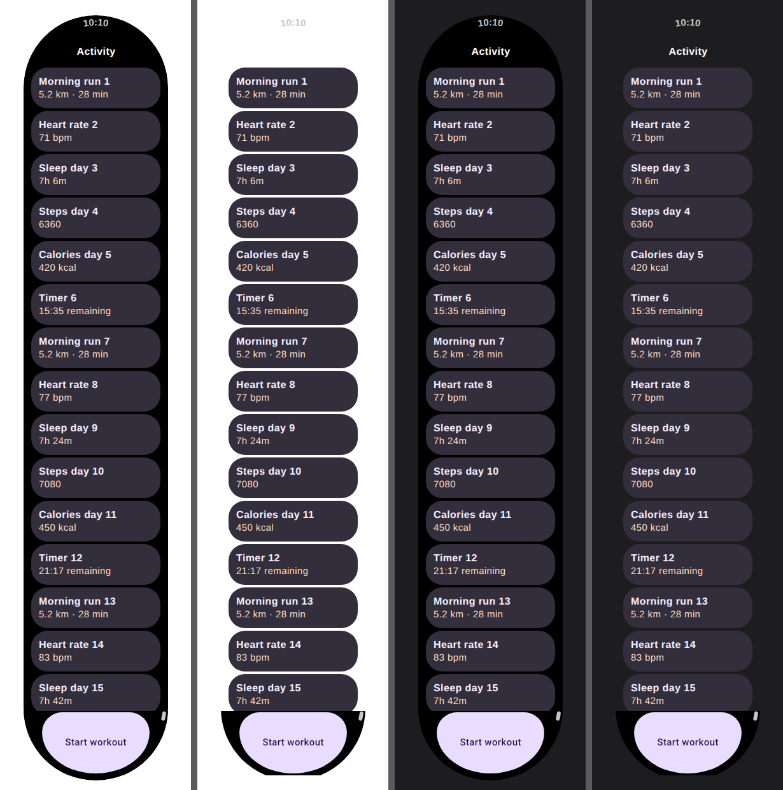

## Reproducing

`renders/lane-parity/` holds the strips above (snapshot / other lane / 6× amplified
difference). To regenerate, stand up the server as at the top of this file and drive the
viewer's `#cp-svg-toggle`, `#cp-live-toggle` and `#cp-lane-select` with a headless browser,
screenshotting `.cp-stage` in each lane; the sizes table comes straight from
`/render/<id>.png` and `/render/<id>.svg` (the SVG's root `width`/`height` and its
`translate`, from which the drawn-content extent inside the PNG frame is recovered).

One measurement gotcha: read `img.naturalWidth` only after the SVG blob has finished
decoding. A probe taken too soon reports the previous PNG's dimensions and makes the SVG lane
look like it matches.
