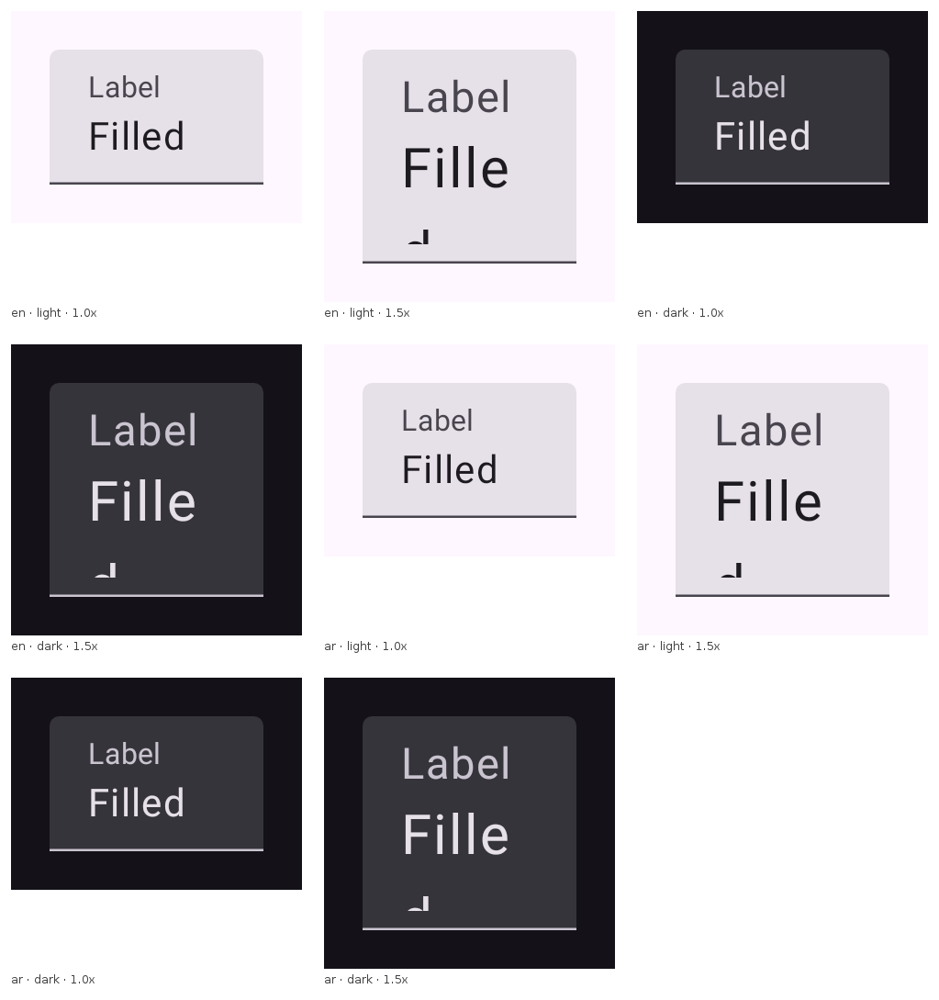
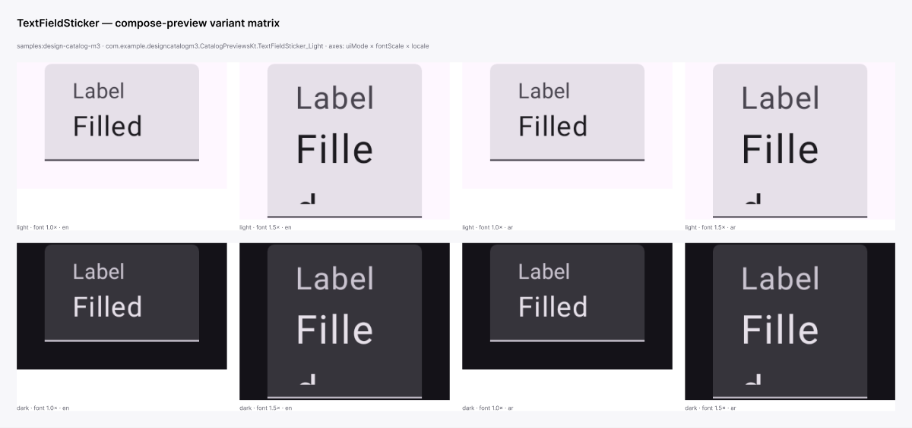
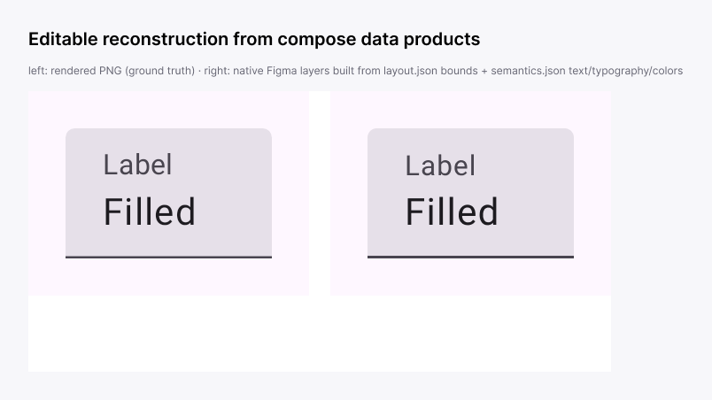

# Figma roundtrip — getting Compose renders into Figma

There are **two** ways a Compose render reaches a Figma canvas, and they serve
different needs. Start here to pick the right one.

| | **`compose/figma-svg`** (canonical) | **Agent MCP push** (this doc, below) |
|---|---|---|
| Output | Editable, layered vectors — one named layer per composable | Rendered variant PNGs (a matrix/sticker sheet) |
| Editability | Full: fills, strokes, corner radius, text are live Figma layers | Raster; text/geometry not editable |
| How it runs | Deterministic data product, in every `--with-semantics` render | Ad-hoc, in a live Figma-MCP agent session |
| Import | design-parity **`figma-plugin`** (native component sets, refresh, override editor) | `upload_assets` + `use_figma` |
| Best for | The real component library / screens as editable Figma | Quick multi-variant review sheets (theme × locale × font-scale) |

**If you want editable Figma layers, use `compose/figma-svg` — not the MCP push
below.** The MCP push predates the exporter; it stays documented because
pushing a *variant matrix* onto a canvas for live design review is a genuinely
different job that the exporter doesn't do.

The render is authoritative for both: pixels and structure come from
`compose-preview`; Figma is a *view* of the code, never the source of truth
(the same stance as the [catalogs](DESIGN_CATALOGS.md)).

## The canonical path: `compose/figma-svg`

The `compose/figma-svg` data product (`FigmaLayeredSvg` in
`:data-layoutinspector-core`, wired up by `ComposeFigmaSvgDataProduct`) emits a
**layered, editable SVG** from the layout-inspector tree + semantics + theme:

- **Every composable is a named `<g id="…">`**, nested as the composables nest —
  so a Figma import lands each component/screen as its own named layer.
- **Container tokens become real vector shapes** — `background` → filled `<rect>`
  (or a `<path>` for non-uniform corners), `border` → stroke, resolved radius →
  Figma's editable corner radius, `CircleShape` → a max-radius rounded rect.
- **Text is editable `<text>`** carrying family/size/weight/colour.
- **Named theme colours** *can* ride along as `<title>` + `data-token` per layer
  (to bind fills to variables from the sibling `figma-variables.json`) — but only
  when the render is given a colour-name map. The normal
  `bundle pack --with-semantics` / catalog path calls `writeSvg` with no map
  today (`colorNames` defaults empty), so shipped `figma/<slug>.svg` carries no
  `data-token` yet; wiring the live `compose/theme` map into the render path is a
  tracked follow-up.
- **Hybrid capture** — components that can't be faithful vectors (`Image`,
  `Icon`, `Canvas`, gradients, charts) are classified opaque and emitted as an
  `<image>` placeholder over a background-free raster crop; everything else stays
  editable vector. A **fidelity harness** scores render-vs-SVG to drive the
  vector/raster split from evidence.

See [`figma-svg-example/`](figma-svg-example/) for the exact document shape (a
Material card, plus a hybrid screen) and the fidelity harness, and
[`design-artifacts-figma-svg/`](design-artifacts-figma-svg/) for how it ships in
the catalog bundles.

**How to get the SVG:**

- **Per preview, on disk:** any `--with-semantics` render drops
  `previews/<id>.figma.svg` —
  `compose-preview bundle pack --module <m> --with-semantics` carries it (look
  for the `figma-svg: N / N preview(s) carried` line).
- **Over HTTP:** `compose-preview serve` exposes `/render/<id>.svg`
  (`ServeFigmaSvg`) — a placed node can be re-fetched to refresh it.
- **In the catalog delivery branches:** `design-artifacts/<system>` ships
  `figma/<slug>.svg` next to the raster `images/<slug>.png`, per sticker.

**How to import it:** the design-parity **`figma-plugin`**
([`packages/figma-plugin`](https://github.com/yschimke/design-parity/tree/main/packages/figma-plugin),
docs: [`FIGMA_IMPORT.md`](https://github.com/yschimke/design-parity/blob/main/docs/design-artifacts/FIGMA_IMPORT.md)
/ [`FIGMA_IMPORT_V2.md`](https://github.com/yschimke/design-parity/blob/main/docs/design-artifacts/FIGMA_IMPORT_V2.md))
imports the catalog as **native Figma component sets**, imports a component as an
**editable SVG**, **places + refreshes** live-rendered previews against the
latest code, routes theme foundations to a **Themes/Tokens** page, lays out
**per-screen pages** from the screen graph, and emits a `design-map.json`
correspondence so design-parity can diff code vs canvas. A plain
`figma.createNodeFromSvg()` also works for a one-off (the group names and
editable radius/text survive), but the plugin is what makes it a maintained,
refreshable library.

## The agent MCP path: variant sheets on a canvas

This is for a live **Figma-MCP agent session** that wants rendered variants
arranged on a canvas for quick review — *not* editable layers.

Evidence from the proven run:



*An 8-cell `render-matrix` contact sheet (uiMode × fontScale × locale) — the
1.5× cells catch real overflow: the field's value text wraps and clips in the
fixed sticker bounds.*



*The same cells pushed through `upload_assets` and arranged into a captioned
auto-layout sheet on the Figma canvas.*

### 1 — render the variant matrix

```sh
compose-preview render-matrix \
  --module samples:design-catalog-m3 \
  --id com.example.designcatalogm3.CatalogPreviewsKt.TextFieldSticker_Light \
  --ui-mode light,dark --locale en,ar --font-scale 1.0,1.5 \
  --contact-sheet --cells-dir --json
```

- `--cells-dir` writes one PNG per cell (`en--light--1.0x.png`, …) and echoes
  each path as `pngPath` in the JSON summary — the files the import step uploads.
  The directory is cleared of stale `.png` files first, so a re-run with narrowed
  axes never leaves an earlier variant behind. `--contact-sheet` is the
  human/PR-comment artifact. Bounded at 24 cells; axes follow the `render_matrix`
  MCP tool exactly.

### 2 — push the PNGs onto the canvas

1. `create_new_file` (or target an existing file key).
2. `upload_assets` with `count = <cells>` → POST each cell PNG (multipart,
   `file=` keeps the filename as the layer name) → each response returns
   `placedOnNodeId`.
3. One or two `use_figma` scripts arrange the placed frames into a titled
   auto-layout grid with per-cell captions and set frame names from the labels.
4. `get_screenshot` on the container to verify.

Notes from the proven run:

- The upload URLs live on `mcp.figma.com`; the sandbox's network allowlist must
  include it or every POST fails at CONNECT with a 403 (separate from enabling
  the Figma MCP connector).
- `use_figma` can fall back to `figma.createImage(bytes)` with base64-embedded
  PNGs (≈5 KB per cell) when raw HTTPS egress is blocked entirely.

### Editable layers by hand (fallback only)

Before `compose/figma-svg` existed, this path also reconstructed editable Figma
nodes by hand in `use_figma` from `previews/<id>.layout.json` (bounds) +
`previews/<id>.semantics.json` (text, typography, colours):



*Left: rendered PNG. Right: native Figma layers rebuilt by hand from the data
products — the prototype that became `FigmaLayeredSvg`.*

That reconstruction is exactly what the exporter now does deterministically, with
hybrid raster, theme tokens, and a fidelity score. **Prefer `compose/figma-svg`.**
Reach for the manual rebuild only when you genuinely can't run the exporter and
need a single frame reconstructed in an ad-hoc session.

## Iteration loop

Both paths compose with the PR machinery: an agent edits catalog code on a
branch, `compose-preview.yml` posts the before/after diff, and once merged the
`design-artifacts` workflow refreshes the delivery branches — including the
`figma/<slug>.svg` vectors. On the Figma side, the plugin's **refresh** re-fetches
a placed node's `/render/<id>.svg` against the latest code, so a designer updates
a whole imported library without re-arranging the canvas; the MCP path refreshes
a raster sheet in place by re-`upload_assets`-ing onto the existing `nodeId`.

## Inbound: design → code (the reverse leg, design-led)

Everything above is **code → Figma**. The reverse leg — a designer changes a
mock in Figma and an agent brings the *code* to match — runs like this:

```
Figma mock (change a component)
  → fat brief committed to the app repo  (reference.png + reference.figma.svg + brief.md/json)
  → @claude comment on a draft PR         (the mention triggers claude.yml)
  → @claude builds the code + renders a @Preview  (before/after evidence on the PR)
  → [CLOSE] publish the built preview + bring it back into Figma  (see below)
  → design-parity posts the parity verdict (built code vs the committed reference)
```

**Trigger.** `claude.yml` fires on `@claude` in an issue/PR **comment**, a PR
review/review-comment, an issue body/title, or the `claude` label — *not* a PR
description mention, and there is no `workflow_dispatch`. So the kick-off opens a
draft PR carrying the brief, then posts an `@claude` **comment** on it.

**Fat brief** (so CI needs no Figma token — it diffs the committed reference):
`reference.png` + `reference.figma.svg` (the node exported as `figma-svg` — the
structural spec), `tokens.json`, a `design-map.json` entry binding the target
`code` handle → `figma:<fileKey>/<nodeId>`, `direction: design-led`, and a
`brief.md`/`brief.json` naming the target module/file/composable.

**Broker.** A designer's plugin can't reach the GitHub API (it's network-locked
to `githubusercontent`), and design-parity's `action/src/github` can only comment
and push branches — so the kick-off (open branch + commit brief + open PR + post
the `@claude` comment) needs a **GitHub App**. Proven once by hand
(`design-briefs/…` brief → PR → `@claude`); the App is the one production piece
still to build.

### Closing the loop — the built preview must come back

The inbound flow is **only complete when the built code returns to Figma.** The
`@claude` session by itself stops at rendered PNGs on the PR — that is *not* the
close. To close it, reuse the outbound leg:

1. **Publish a preview bundle of the built code.** CI runs
   `compose-preview bundle pack --module <target> --with-semantics` on the PR head
   → produces `previews/<id>.figma.svg` (the built code as editable vector) +
   semantics, and
   publishes it: push `figma/<id>.svg` to a `design-artifacts/pr-<n>` branch, or
   stand up `compose-preview serve` (`/render/<id>.svg`, `ServeFigmaSvg`) against
   the PR. This is the "preview bundle available somewhere" step — without it
   there is no artifact for the designer or plugin to consume. (`--module` is
   required in multi-module apps — `bundle pack` fails on ambiguity otherwise;
   the brief already names the target module, so pass it.)
2. **Bring it back into Figma.** The design-parity `figma-plugin` already
   *places + refreshes* a live-rendered preview against `compose-preview serve`
   (`src/live.ts` / `src/render.ts` / `src/previews.ts`) — point it at the PR's
   served preview and the built code lands as **editable figma-svg next to the
   mock**, so the designer confirms the code matches (or diverges).
3. **Parity verdict.** design-parity diffs the built render vs the committed
   reference (`direction: design-led`, `blocksPr: true`) and posts the verdict on
   the PR.

Until step 1 is wired into CI, the close is manual: `bundle pack` the built code
and `upload_assets` the render (raster) or `figma.createNodeFromSvg()` the
`figma-svg` (editable) into the mock's file. The raster push answers "the preview
is back in Figma"; the `figma-svg` push is the real, editable close.

### Design constraint — the only agent runs in CI

The end state is fully plugin-automated, and **the `@claude` CI session is the
only agent in the loop** — it generates code, nothing more. Every other step is
deterministic: the plugin's kick-off *and* import, the GitHub App broker, and the
CI publish. In particular, **the import back into Figma must be a pure function of
the PR's published artifacts, never an agent action.**

Concretely, the import contract:

```
CI on the design-led PR (deterministic):
  compose-preview bundle pack --module <target> --with-semantics  →  previews/<id>.figma.svg
  publish to a predictable ref:  design-artifacts/pr-<n>/figma/<componentId>.svg  (+ manifest)

figma-plugin (deterministic):
  given the PR / componentId → fetch design-artifacts/pr-<n> → place / refresh
```

Same PR → the same byte-stable `compose/figma-svg` → the same import. The plugin
reuses its existing catalog-import path (which already fetches `figma/<slug>.svg`
from a `design-artifacts/<system>` branch over `raw.githubusercontent`), pointed
at `pr-<n>` instead of `<system>`. The agent-driven `upload_assets` /
`use_figma` push used to *prototype* the close is a shortcut for demos — no
interactive agent belongs in the kick-off or the import.
