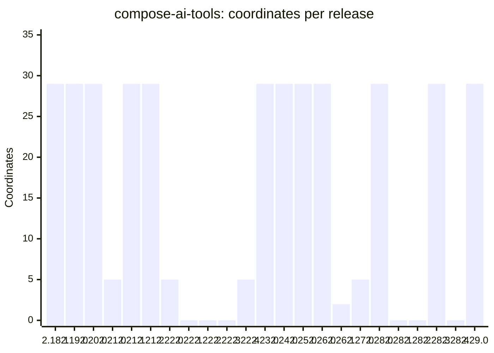
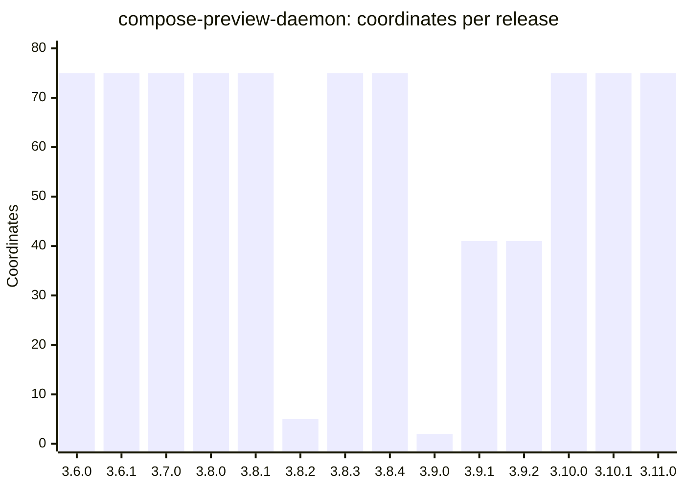
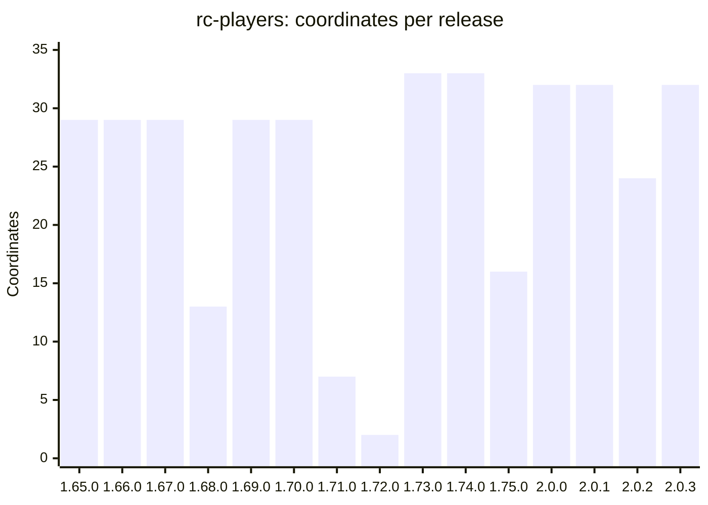
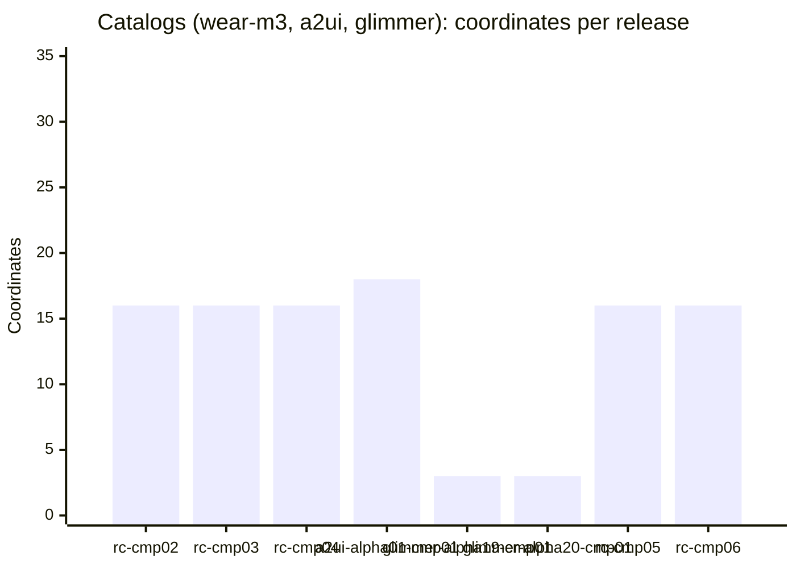

# Maven release footprint

**Status: measurement, as of 2026-10-01.** How many Maven coordinates each release publishes, in
the five repositories that ship under `ee.schimke.composeai`, counted only from the change that
made each one publish what a release changes rather than everything.

This follows [`RELEASE_TRAINS.md`](RELEASE_TRAINS.md), which measured the old shape: 94 modules
on every release, 96.7% of them unchanged rebuilds. Here is what the plan-based publishing
(`.github/scripts/maven-publish-plan.sh` in each repository) ships instead.

## How it was counted

- **Maven Central repositories** (compose-ai-tools, compose-preview-daemon, rc-players,
  compose-preview-server): every artifact directory under
  `https://repo1.maven.org/maven2/ee/schimke/composeai/`, with each version's upload time. A
  release's count is the set of coordinates at the tag's version uploaded between 3 hours before
  the tag and the next tag (capped at 48 hours). The repositories share one group and overlapping
  version numbers, so the time window is what keeps them apart. For compose-preview-daemon the
  count is also limited to the coordinates in `compose-preview-daemon-bom` plus their platform
  variants, which keeps compose-preview-contracts releases at the same versions out.
- **Catalogs** do not publish to Central. Each commit on a `*-cmp-maven` branch of
  `wear-m3-catalog-out`, `a2ui-catalog-out` or `glimmer-catalog-out` is one publish, and its
  count is the POMs that commit adds.
- **A coordinate is one artifact ID.** Each platform variant of a multiplatform module
  (`-jvm`, `-android`, `-iosarm64`, ...) counts separately, because each is uploaded separately.
- **Weekly rates** divide totals by the days from each cutover to 2026-10-01 09:00 UTC: about
  15 days for the three Central repositories that switched on 16 Sep, 6.8 for the catalogs. That
  is a short window; treat the rates as indicative.
- **Two releases are excluded** as broken rather than empty: compose-ai-tools v2.18.0 (the
  publish plan itself failed; fixed by #5487 and #5490) and rc-players v1.64.0 (nothing reached
  Central). Including them gives compose-ai-tools 24 releases at an average of 15.4, and
  rc-players 16 releases at a minimum of 0 and an average of 23.1.

## Summary

| Project | Counted from | Releases | Min | Max | Avg | Median | Releases / wk | Coordinates / wk |
|---|---|--:|--:|--:|--:|--:|--:|--:|
| compose-ai-tools | #5485 (2026-09-16) | 23 | 0 | 29 | 16.1 | 29 | 11.1 | 179 |
| compose-preview-daemon | compose-preview-daemon#123 (2026-09-16) | 14 | 2 | 75 | 59.9 | 75 | 6.5 | 392 |
| rc-players | rc-players#196 (2026-09-16) | 15 | 2 | 33 | 24.6 | 29 | 7.3 | 179 |
| Catalogs (wear-m3, a2ui, glimmer) | wear-m3-catalog#607 (2026-09-24) | 8 | 3 | 18 | 13.0 | 16 | 8.3 | 107 |
| compose-preview-server | compose-preview-server#794 (2026-09-12) | 64 | 0 | 0 | 0 | 0 | 24.0 | 0 |

### Per ISO week

Releases / coordinates. W38 starts at the 16 Sep cutovers and W40 runs only to 1 Oct, so both
are partial.

| Project | W37 | W38 | W39 | W40 |
|---|--:|--:|--:|--:|
| compose-ai-tools | – | 5 / 121 | 16 / 220 | 2 / 29 |
| compose-preview-daemon | – | 7 / 455 | 4 / 159 | 3 / 225 |
| rc-players | – | 5 / 129 | 7 / 152 | 3 / 88 |
| Catalogs | – | – | 6 / 72 | 2 / 32 |
| compose-preview-server | 6 / 0 | 11 / 0 | 41 / 0 | 6 / 0 |

## Per project

### compose-ai-tools

Full set: 29 coordinates. Of 23 releases, 16 shipped all 29, four shipped 5 (the plugin and
config modules), one shipped 2, and six shipped none. The six empty releases (v2.22.1-3,
v2.28.1, v2.28.2, v2.28.4) changed only the CLI, docs, CI or a dependency pin, so publishing
nothing was correct.

### compose-preview-daemon

Full set: 75 coordinates (the BOM's 70 plus 5 platform variants). Ten of 14 releases shipped all
75; the others shipped 41, 41, 5 and 2. The first full releases, v3.6.0-v3.8.1, came before
compose-preview-daemon#144 (17 Sep) moved the publish baseline from git to Maven Central, so some
of them may be full only because of that. Releases since then are still mostly full, probably
because most changes touch `daemon-core`, which the other modules depend on. That was not checked
release by release.

### rc-players

Full set: 29 coordinates, 33 from v1.73.0. Partial releases shipped 13, 7, 2, 16 and 24
coordinates. A changed player rebuilds every platform variant, so even partial releases stay
large.

### Catalogs

None of the catalogs publish to Central. wear-m3-catalog pushes the Remote Compose port
(16 coordinates per publish) to `wear-m3-catalog-out`; a2ui-catalog (18) and glimmer-catalog (3)
started publishing on 26 Sep. m3-catalog publishes no Maven artifacts. wear-m3's Wear Compose port
has not published since 22 Sep, before the cutover. Labels below shorten
`remote-compose 4307936-ps17-cmpNN` to `rc-cmpNN`.

### compose-preview-server

compose-preview-server#794 stopped Maven Central publishing on 12 Sep. None of the 64 releases
since (v3.26.0-v3.89.0) put anything on Maven; releases ship as archives. The
`compose-preview-ui-builder-*` coordinates it used to publish now come from compose-ui-builder
(6 per release) and are not counted here.

## Release log

compose-preview-server is left out: all 64 of its releases published 0 coordinates.

| Project | Version | Released (UTC) | Coordinates |
|---|---|---|--:|
| compose-ai-tools | `2.18.0` | 2026-09-16 22:02 | 0 (excluded, broken) |
| compose-ai-tools | `2.18.1` | 2026-09-17 05:37 | 29 |
| compose-ai-tools | `2.19.0` | 2026-09-20 08:06 | 29 |
| compose-ai-tools | `2.20.0` | 2026-09-20 11:43 | 29 |
| compose-ai-tools | `2.21.0` | 2026-09-20 13:33 | 5 |
| compose-ai-tools | `2.21.1` | 2026-09-20 17:20 | 29 |
| compose-ai-tools | `2.21.2` | 2026-09-22 10:49 | 29 |
| compose-ai-tools | `2.22.0` | 2026-09-22 12:38 | 5 |
| compose-ai-tools | `2.22.1` | 2026-09-22 22:11 | 0 |
| compose-ai-tools | `2.22.2` | 2026-09-22 22:51 | 0 |
| compose-ai-tools | `2.22.3` | 2026-09-23 06:21 | 0 |
| compose-ai-tools | `2.22.4` | 2026-09-24 20:08 | 5 |
| compose-ai-tools | `2.23.0` | 2026-09-24 20:49 | 29 |
| compose-ai-tools | `2.24.0` | 2026-09-24 22:05 | 29 |
| compose-ai-tools | `2.25.0` | 2026-09-25 05:33 | 29 |
| compose-ai-tools | `2.26.0` | 2026-09-25 20:46 | 29 |
| compose-ai-tools | `2.26.1` | 2026-09-26 11:51 | 2 |
| compose-ai-tools | `2.27.0` | 2026-09-26 15:40 | 5 |
| compose-ai-tools | `2.28.0` | 2026-09-27 08:22 | 29 |
| compose-ai-tools | `2.28.1` | 2026-09-27 15:12 | 0 |
| compose-ai-tools | `2.28.2` | 2026-09-27 18:19 | 0 |
| compose-ai-tools | `2.28.3` | 2026-09-27 19:50 | 29 |
| compose-ai-tools | `2.28.4` | 2026-09-28 05:21 | 0 |
| compose-ai-tools | `2.29.0` | 2026-09-30 21:18 | 29 |
| compose-preview-daemon | `3.6.0` | 2026-09-16 10:37 | 75 |
| compose-preview-daemon | `3.6.1` | 2026-09-16 14:32 | 75 |
| compose-preview-daemon | `3.7.0` | 2026-09-16 14:45 | 75 |
| compose-preview-daemon | `3.8.0` | 2026-09-16 20:28 | 75 |
| compose-preview-daemon | `3.8.1` | 2026-09-17 07:28 | 75 |
| compose-preview-daemon | `3.8.2` | 2026-09-17 11:55 | 5 |
| compose-preview-daemon | `3.8.3` | 2026-09-17 17:27 | 75 |
| compose-preview-daemon | `3.8.4` | 2026-09-25 20:10 | 75 |
| compose-preview-daemon | `3.9.0` | 2026-09-26 11:51 | 2 |
| compose-preview-daemon | `3.9.1` | 2026-09-27 18:51 | 41 |
| compose-preview-daemon | `3.9.2` | 2026-09-27 22:21 | 41 |
| compose-preview-daemon | `3.10.0` | 2026-09-30 21:33 | 75 |
| compose-preview-daemon | `3.10.1` | 2026-10-01 04:56 | 75 |
| compose-preview-daemon | `3.11.0` | 2026-10-01 06:55 | 75 |
| rc-players | `1.64.0` | 2026-09-17 05:37 | 0 (excluded, broken) |
| rc-players | `1.65.0` | 2026-09-17 06:37 | 29 |
| rc-players | `1.66.0` | 2026-09-17 18:10 | 29 |
| rc-players | `1.67.0` | 2026-09-19 06:42 | 29 |
| rc-players | `1.68.0` | 2026-09-19 22:18 | 13 |
| rc-players | `1.69.0` | 2026-09-20 16:35 | 29 |
| rc-players | `1.70.0` | 2026-09-22 21:00 | 29 |
| rc-players | `1.71.0` | 2026-09-23 12:13 | 7 |
| rc-players | `1.72.0` | 2026-09-23 20:18 | 2 |
| rc-players | `1.73.0` | 2026-09-24 12:04 | 33 |
| rc-players | `1.74.0` | 2026-09-24 19:30 | 33 |
| rc-players | `1.75.0` | 2026-09-24 22:08 | 16 |
| rc-players | `2.0.0` | 2026-09-27 12:51 | 32 |
| rc-players | `2.0.1` | 2026-09-30 06:09 | 32 |
| rc-players | `2.0.2` | 2026-09-30 15:49 | 24 |
| rc-players | `2.0.3` | 2026-09-30 21:29 | 32 |
| Catalogs (wear-m3, a2ui, glimmer) | `remote-compose 4307936-ps17-cmp02` | 2026-09-24 23:06 | 16 |
| Catalogs (wear-m3, a2ui, glimmer) | `remote-compose 4307936-ps17-cmp03` | 2026-09-25 05:52 | 16 |
| Catalogs (wear-m3, a2ui, glimmer) | `remote-compose 4307936-ps17-cmp04` | 2026-09-25 07:28 | 16 |
| Catalogs (wear-m3, a2ui, glimmer) | `a2ui 1.0.0-alpha01-cmp01` | 2026-09-26 13:15 | 18 |
| Catalogs (wear-m3, a2ui, glimmer) | `glimmer 1.0.0-alpha19-cmp01` | 2026-09-26 13:33 | 3 |
| Catalogs (wear-m3, a2ui, glimmer) | `glimmer 1.0.0-alpha20-cmp01` | 2026-09-26 13:45 | 3 |
| Catalogs (wear-m3, a2ui, glimmer) | `remote-compose 4307936-ps17-cmp05` | 2026-10-01 05:25 | 16 |
| Catalogs (wear-m3, a2ui, glimmer) | `remote-compose 4307936-ps17-cmp06` | 2026-10-01 05:59 | 16 |
