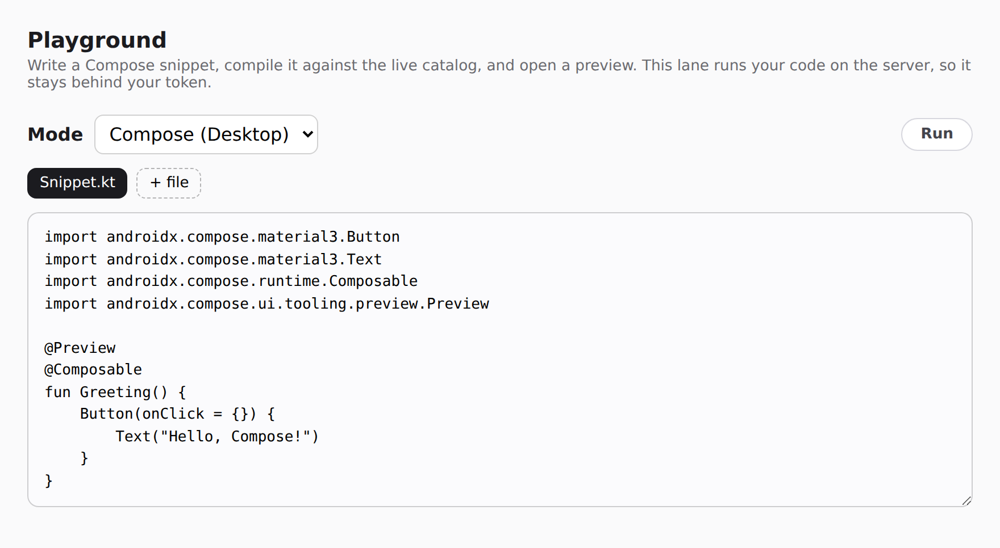
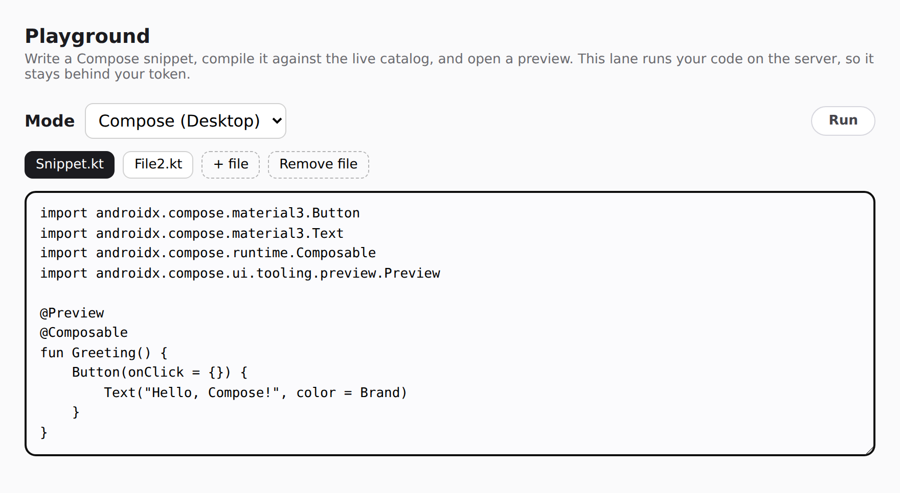
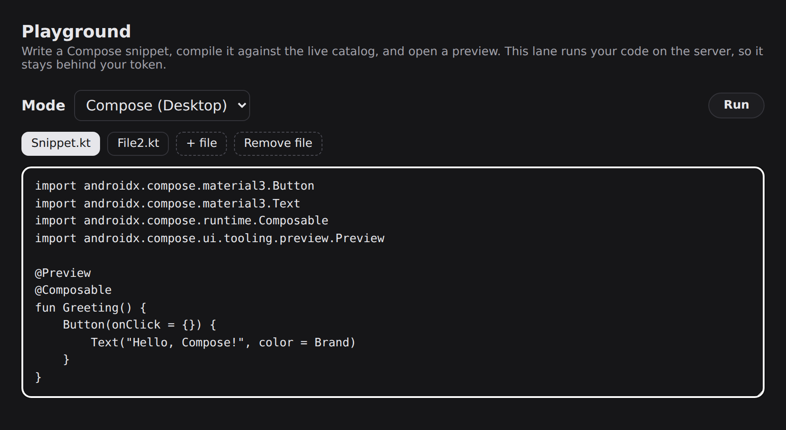
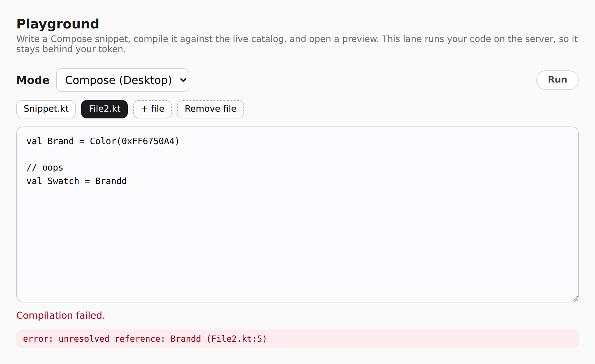
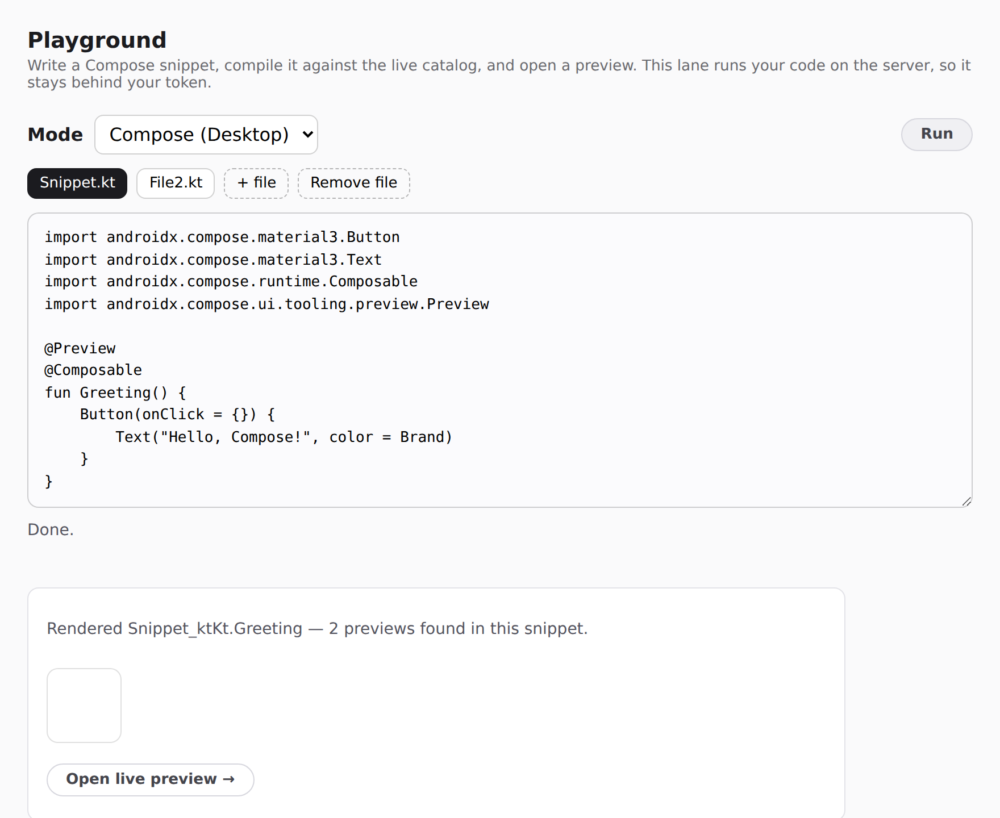

# Playground — a Kotlin/Compose editor over the preview server

Status: **design proposal** (2026-07). Product analysis + architecture for a
hosted "edit Compose, get a live interactive preview" surface, built on the
seams `compose-preview serve` already ships. This document scopes what exists,
what's missing, the REST + handoff contract, the isolation requirements, and a
phased plan. Phases 1–3 (CMP, Android, Remote Compose) and the Phase-4
per-session sandbox ([§6](#6-isolation--the-actual-hard-part)) are built; the
playground remains token-gated by default, and serves under `--public` only on a
sandbox that has passed the startup containment probe. The [§8](#8-open-questions--resolved)
questions are resolved.

> **Thesis.** A Compose playground is mostly the *existing* serve viewer plus an
> editor pane plus an ephemeral, per-session module. The three things that would
> normally be the hard parts — **compiling Kotlin without Gradle**, **rendering a
> preview headlessly**, and **streaming a live, clickable composition** — already
> exist and run in production (`BtaCompileSession`, the desktop/Robolectric
> daemons, the serve `input` WebSocket protocol). The genuinely new work is
> **(1)** a two-stage *compile-then-permalink* flow that keeps a stock one-shot
> editor frontend usable, **(2)** an expiring **preview-token** capability that
> hands a compiled snippet off to a live session, and **(3)** the isolation a
> host needs before it can run a stranger's code. Everything else is wiring seams
> that already exist.

---

## 1. Product analysis

### 1.1 The user story

Someone — a docs author, an agent, a person kicking the tyres on Material 3 —
wants to:

1. Write a Compose snippet in the browser, against **our** component catalogs
   (`compose-m3`, `wear-m3`, …) so `import`s resolve to the real library.
2. Compile it and see errors inline, fast.
3. See it **render**, and then **interact** with it — click a button, watch state
   change, scroll a list — not just look at a static screenshot.
4. Share a **link** to that running preview.

…across three render modes:

| Mode | What it is |
|---|---|
| **Compose (CMP)** | Compose Multiplatform, rendered by the desktop (Skiko) daemon. |
| **Compose (Android)** | Jetpack Compose, rendered by the Robolectric daemon. |
| **Remote Compose** | The snippet emits a `RemoteDocument` byte stream; the browser plays it. Android-authored today, CMP-authored later. |

### 1.2 Prior art

| Tool | What it is | Why it isn't the fit |
|---|---|---|
| **play.kotlinlang.org** (`kotlin-playground` + `kotlin-compiler-server`) | The canonical hosted Kotlin editor. Apache-2.0, both halves. `compose-wasm` target renders Compose **in the browser** via Kotlin/Wasm. | JVM/Wasm only. No Compose **Android** (no Robolectric), no **Remote Compose**, no server-driven **live render** of a JVM composition. Its model is one-shot `POST code → get result`; it has no streamed, clickable session. |
| **Compose Playground / KMP web samples** | Prebuilt CMP-Wasm apps embedded in a page. | Fixed apps; they don't compile *new* snippets. This repo already ships one (`:samples:cmp-wasm-catalog`, served at `/wasm/<system>/`). |
| **This repo's `serve` host** | Trusted catalogs, live daemon-backed sessions, an `input` protocol, `--accept-docs` document permalinks. | Everything except the **editor** and the **compile-arbitrary-source** entry point. That's the gap this doc closes. |

**Verdict.** `kotlin-playground`'s Wasm path already covers "Compose in the
browser, no server." What it structurally cannot do is render the Android
runtime, or a JVM composition on a real Compose renderer, or a Remote Compose
document — which is exactly the ground this repo's daemons already own. So the
build is *not* "reimplement play.kotlinlang.org"; it's "put an editor in front of
the renderer we already run."

### 1.3 Why not just point `kotlin-playground`'s frontend at us (`data-server`)

`kotlin-playground` supports a `data-server` attribute to redirect compilation at
a custom backend — that's a first-class, documented feature, and its backend
contract is small and known (see [§4](#4-the-rest-contract-stock-frontend-compatibility)).
But its whole UI model is **one request in, one result out**: `POST` the code,
render `{text | jsCode | testResults}` inline. Ours is **open a session, stream
frames, send input** — a different transport, not a new result type. Bolting a
persistent clickable canvas into a framework built around one-shot POSTs fights
the framework the whole way.

The **two-stage** decomposition below dissolves that conflict, and in doing so
shrinks the frontend change from *rewrite the transport* to *surface one field in
the response*. That is what makes reusing a stock editor viable again.

---

## 2. Architecture: two stages, one compile

The insight is to **not** make the editor host the interactive preview. Split the
work where the models already split:

```
┌──────────────────────────────────────────────────────────────────────┐
│ STAGE 1 — Playground (one-shot, the editor's native model)            │
│                                                                        │
│  editor ──POST source──▶ /api/{v}/compiler/run                         │
│                            │  BtaCompileSession.compile (Compose plugin)│
│                            │  one headless render (first frame)         │
│                            ▼                                            │
│  { diagnostics, image: data-URI PNG, previewToken: "pg_…" }           │
│                                                                        │
│  editor shows errors + the still frame + an "Open live preview →" link │
└───────────────────────────────────────────┬────────────────────────────┘
                                             │ user clicks (deliberate)
                                             ▼
┌──────────────────────────────────────────────────────────────────────┐
│ STAGE 2 — Preview (the serve viewer we already ship)                  │
│                                                                        │
│  GET /pg/<token>  ── redeem ──▶ stand up / resume a live daemon session│
│      viewer + WS  ◀── frames ──   (desktop or Robolectric)             │
│      input events ──▶ dispatched into the composition (existing proto) │
└──────────────────────────────────────────────────────────────────────┘
```

Two properties fall out of this split:

- **The compile that produces the Stage-1 result is the same compile that would
  bootstrap the Stage-2 session.** So the permalink is nearly free: the `run`
  response just carries a `previewToken`. A stock `kotlin-playground` frontend
  ignores the unknown field; a one-line frontend addition turns it into a button.
  (Zero-fork fallback: put the URL in the `text` output field — ugly, but works
  with the unmodified component.)
- **Session creation is a *redeemed* act, not a per-keystroke one.** Most compiles
  never get a click, so Stage 1 does **not** stand up a streaming session — it
  returns a token. Redeeming `/pg/<token>` is the deliberate, rate-limitable,
  TTL'd step. This is the same capability model `--accept-docs` already uses for
  documents (see [§5](#5-the-preview-token-capability)).

### 2.1 What already exists (and where)

| Capability | Where | Status |
|---|---|---|
| Compile Kotlin, no Gradle, with the Compose plugin + `sourceInformation` | `daemon/core/.../bta/BtaCompileSession.kt`, driven by `JsonRpcServer.compileSources` | **Shipped.** Incremental, content-hashed classpath snapshots, structured diagnostics (`DiagnosticCollector`). |
| Compile arbitrary absolute source paths against a supplied classpath | `compileSources` takes `sources: List<Path>` with no source-set containment | **Shipped.** A snippet written to a temp file is a valid input today. |
| Headless render → PNG (both backends) | `renderer-desktop` (Skiko), `renderer-android` (Robolectric) | **Shipped.** |
| Live, daemon-backed streaming session | `cli/.../serve/ServeLiveSession.kt`, `ServeStreamSession.kt`, per-preview pool | **Shipped.** `compose-m3` (desktop) and `wear-m3` (Android) run live on `preview.coo.ee`. |
| Interactive `input` protocol (click / pointer / rotary / key) | `docs/serve/SESSION-VIEWER-PROTOCOL.md` §`input`, `ServeStreamProtocol.parseClient` | **Shipped.** Dispatched into the live composition; snapshot lane ignores it. |
| Expiring capability permalink (id = 128-bit `SecureRandom`, TTL, `private,no-store`) | `cli/.../serve/ServeDocStore.kt` | **Shipped.** The literal template for the preview-token store. |
| Remote Compose document → browser playback | `--accept-docs`, `ServeDocFormats`, vendored `RcdPlayer` (`cli/src/main/resources/rc-player/`) | **Shipped.** RC-in-browser needs no server round-trip per interaction. |
| Live-seat admission budget (desktop = 1 permit, Android = 2) | `cli/.../serve/LiveSeatLimiter.kt` | **Shipped**, but sized for *trusted catalogs* — see [§6](#6-isolation-the-actual-hard-part). |

### 2.2 What is new

1. **A `PlaygroundSession`** — an ephemeral, per-token module: a temp source dir,
   a resolved compile classpath (borrowed from a chosen catalog's live bundle),
   an output dir, and a daemon handle. Conceptually a bundle-backed session
   (`ServeBundleDaemon`) whose classes come from a just-compiled snippet instead
   of a fetched `.bundle`.
2. **The REST shim** — enough of the `kotlin-compiler-server` contract that a
   stock editor frontend talks to us ([§4](#4-the-rest-contract-stock-frontend-compatibility)).
3. **The preview-token store + `/pg/<token>` redeem route** ([§5](#5-the-preview-token-capability)).
4. **Isolation** — the part that gates going public ([§6](#6-isolation-the-actual-hard-part)).

---

## 3. The three modes → three permalink targets

The modes differ only in Stage 2 — what the token redeems to:

| Mode | Compile → | Stage-2 target | Per-interaction cost | Seat cost |
|---|---|---|---|---|
| **Compose (CMP)** | desktop daemon, `ImageComposeScene` | **live streaming session** | server re-render per event | 1 permit |
| **Compose (Android)** | Robolectric daemon | **live streaming session** | server re-render per event | 2 permits |
| **Remote Compose** | compile+run → `.rc` document | **document permalink** (`/d/<id>`) | **none** — played client-side | **0** (no daemon) |

**Remote Compose is the architectural standout, and should ship to any
public audience first.** An `.rc` document carries its own state machine
(`data/remotecompose/connector`: `RemoteOverridableState`,
`RemoteComposeController`), so once it reaches the browser the server is out of
the loop — no live seat, no re-render, no round-trip. The two JVM modes each pin
a live daemon for the session's lifetime; RC hands over bytes and lets go. Its
serving side is already public-safe (the vendored player runs in the *viewer's*
browser); only *producing* the document runs snippet code on the server, and that
is the same isolation problem all three share.

**On "CMP Remote Compose in future":** separate *authoring* from *playback*. The
browser `RcdPlayer` is already platform-neutral — it plays a byte stream and does
not care that the document was authored through Android APIs. So RC-in-browser
works for a playground **now**; what is Android-bound is the *authoring* side of
`data/remotecompose`. The playground's RC mode does not have to wait on
CMP-authored Remote Compose — it can offer Android authoring today and pick up
CMP authoring when the connector does. (There is also an AndroidX
Compose-embedded player, `:third-party-rc-embedded-player`, used for CI fidelity
diffs; the browser player is the one the playground uses.)

---

## 4. The REST contract (stock-frontend compatibility)

To let an unmodified `kotlin-playground` component talk to us, we implement the
subset of the `kotlin-compiler-server` contract its frontend actually calls. The
frontend (`src/config.js`) builds **versioned** paths — `/api/{version}/compiler/…`
— even though the upstream controller is mounted at unversioned `/api/compiler/…`;
we mount the shim at the versioned path the frontend emits.

| Path (as emitted by the frontend) | Method | We answer it with |
|---|---|---|
| `/api/{version}/compiler/run` | POST | BTA compile → diagnostics + first-frame PNG (`data:` URI) + `previewToken`. |
| `/api/{version}/compiler/highlight` | POST | BTA diagnostics reshaped to the highlight schema (we compile anyway). |
| `/versions` | GET | The single Kotlin/Compose version this host offers. |
| `/api/{version}/compiler/complete` | POST | **Deferred.** BTA compiles; it does not complete. Returns `[]` in v1. Real completion needs a Kotlin analysis backend — out of scope until there's demand. |

Request body is `{ args, files: [{ name, text, publicId }], confType }`; the
`confType` selects the mode ([§3](#3-the-three-modes--three-permalink-targets)).

The response carries the diagnostics in **both** shapes so neither client is
second-class. Our own frontend reads a flat `diagnostics` list (`PlaygroundDiagnostic`);
a stock `kotlin-playground` frontend reads `errors` — and that field is **not** a
renamed flat list, it's upstream's **map keyed by file name** whose entries nest
their position under `interval: { start, end }`, with an uppercase `severity`. So
`errors` is a genuine *projection* of the same diagnostics (`PlaygroundErrorsWire`),
not an alias — a straight `diagnostics` → `errors` rename would look compatible
while rendering nothing in the stock editor. On top of that the response adds two
fields the upstream frontend ignores and ours surfaces: `image` (first-frame
`data:` PNG) and `previewToken`.

> **On reusing the frontend at all.** Implementing this contract is what keeps a
> stock editor an option; it is not a commitment to ship theirs. `kotlin-playground`
> is itself a CodeMirror wrapper, and a bespoke editor (CodeMirror/Monaco + our
> own response shape, no contract to track) may win once completion and
> mode-specific UI matter. The contract is cheap enough to keep the door open;
> the decision of *which* editor ships is deferred and does not block Stage 1.

---

## 5. The preview-token capability

Modelled directly on `ServeDocStore` — the same safety properties, a different
payload:

- **Id is the capability.** 128-bit `SecureRandom`, base64url, prefixed `pg_`.
  Unguessable; a link is safe to hand to one person without listing it.
- **Expiring.** A short TTL (minutes). After expiry `/pg/<token>` 404s without
  disclosing whether the token ever existed.
- **Bounded.** Count + total-memory caps; a burst evicts nearest-expiry first, as
  `ServeDocStore` does. A token holds a temp source dir + compiled classes, so the
  cap also bounds disk.
- **Single redemption target.** A token names *one* compiled snippet and its mode.
  Redeeming stands up (or resumes) exactly that session.

A token is minted in Stage 1 *after* a clean compile (a compile error returns
diagnostics and **no** token). The Stage-1 render and the Stage-2 session share
the compiled output, so redemption never recompiles.

---

## 6. Isolation — the actual hard part

Nothing above changes the one constraint the serve host is built around, stated
in [`docs/public-preview-server.md`](../public-preview-server.md): *"Neither ever
lets untrusted code run on the server."* Trust is fail-closed; `--revisions`
(which runs Gradle) is off on public boxes; unverified bundles serve as baked
PNGs with no re-render. **A playground inverts that premise** — its whole point is
to execute code a stranger wrote.

Concretely: `BtaCompileSession` compiles **in-process**, and a live session loads
the result into a long-lived daemon JVM. On JDK 17+ there is no `SecurityManager`;
a snippet gets filesystem, sockets, `System.exit`, process spawn, and unbounded
heap, in a JVM other sessions may share. **RC mode does not dodge this** — its
*serving* side is safe, but *producing* the `.rc` still runs the snippet on the
server.

`--live-seats` (`LiveSeatLimiter`) is **admission control, not a sandbox** — it
bounds concurrent daemons for *trusted* catalogs; it does not contain hostile
code. A public playground therefore needs a genuinely disposable per-session
sandbox:

- its own process/container, **killed** after a hard wall-clock TTL;
- **no outbound network** (or a strict egress allowlist);
- **read-only / ephemeral** filesystem, quota-bounded;
- **memory + CPU caps** (cgroup), so one snippet can't starve the box;
- **one snippet per JVM** — never hot-swap a stranger's classes into a shared,
  long-lived daemon.

### 6.1 What is built (Phase 4, `--playground-sandbox`)

Half the list was already true and unremarked: every playground lane — the
Stage-1 first frame, the RC capture, and the Stage-2 live session — spawns a
**fresh daemon subprocess over that snippet's own classes**
(`SubprocessRenderSessions.openBundleDaemon`, `ServeBundleDaemon.materializePlaygroundSnippet`).
A stranger's classes are never hot-swapped into a shared, long-lived daemon;
"one snippet per JVM" is the shape the code already had. What Phase 4 adds is
the *containment around that child*, plus the evidence that it works.

[`PlaygroundSandbox`](../../cli/src/main/kotlin/ee/schimke/composeai/cli/serve/PlaygroundSandbox.kt)
is a pure policy type that produces three things for each snippet JVM:

| Requirement | How |
|---|---|
| Own process, killed at a hard TTL | Already one JVM per snippet; `hardTtlSeconds` rides the daemon descriptor and the spawner arms a `destroyForcibly` watchdog — no cooperation needed from a wedged snippet. |
| No outbound network | The jail's network namespace: `bwrap --unshare-net` or `unshare --net`. |
| Read-only / ephemeral FS | `bwrap` binds the host read-only with a tmpfs `/tmp`, and the snippet's work dir is the **only** writable path — and that dir is deleted when its preview token drops. |
| Memory + CPU caps | cgroup (`MemoryMax` / `CPUQuota` / `TasksMax`) on the `systemd`/`strict` profiles, **plus** JVM-level caps on every active profile (`-Xmx`, `-XX:ActiveProcessorCount`, `-XX:+ExitOnOutOfMemoryError`). |
| One snippet per JVM | Structural: each lane opens its own subprocess daemon over one snippet's classes. |

Profiles, chosen with `--playground-sandbox`:

| Profile | Jail | Egress | FS | cgroup caps | `--public` |
|---|---|---|---|---|---|
| `none` (default) | — | — | — | — | refused |
| `unshare` | `unshare(1)` user+net+pid ns | ✓ | ✗ (host FS visible) | ✗ | refused |
| `bwrap` | `bwrap(1)`, cleared env | ✓ | ✓ | ✗ (JVM caps only) | refused |
| `systemd` | `systemd-run --scope` | ✗ | ✗ | ✓ | refused |
| **`strict`** | `systemd-run --scope … bwrap …` | ✓ | ✓ | ✓ | **eligible** |
| `custom:<argv>` | operator-supplied | ? | ? | operator's job | eligible on a clean probe |

A transient **scope** takes cgroup resource properties but *not* service exec-context
settings (`PrivateNetwork`, `PrivateTmp`, `ProtectSystem`, `NoNewPrivileges`) — passing
those to `--scope` fails unit creation outright. So `systemd` owns resource control alone
and delegates isolation to `bwrap`; `strict` is the composition, and the only built-in a
`--public` host can run.

Knobs: `--playground-sandbox-memory-mb`, `--playground-sandbox-cpus`,
`--playground-sandbox-pids`, `--playground-sandbox-ttl`, and
`--playground-sandbox-ro <path>[,…]` for caches a render legitimately reads with
no network to fetch them (the Robolectric `android-all` cache, the downloadable
font cache — **prewarm these before going public**; a cold Robolectric inside an
empty netns cannot fetch its `android-all` jar).

### 6.2 The gate is a probe, not a flag

The `--public` refusal has *not* become "you passed `--playground-sandbox`, off
you go". A profile name is a claim: `bwrap` on a kernel with user namespaces
disabled, or a `custom:` wrapper with a typo in it, both claim everything and
contain nothing. So at startup a `--public` host runs
[`PlaygroundSandboxProbe`](../../cli/src/main/kotlin/ee/schimke/composeai/cli/serve/PlaygroundSandboxProbe.kt):
a throwaway JVM launched **through the same jail argv a snippet gets**, which
measures and reports back

- **egress blocked** — every connect to a routable address fails;
- **filesystem contained** — a canary the host wrote outside the jail's bind set
  is invisible;
- **process isolated** — the serve host's own pid is absent from `/proc`;
- **work dir writable** — the jail isn't so tight that a render couldn't run.

`PlaygroundPublicGate` admits the lane only on a clean report, and fails closed
in every other direction: no profile, no report, a jail that wouldn't launch, or
any single failing check all keep the playground disabled with an actionable
log. That also means `unshare` — which blocks egress but leaves the host
filesystem visible — is a fine local rehearsal profile and is **refused** under
`--public`, by measurement rather than by a hard-coded list.

One property the probe *cannot* measure is resource capping: a snippet inside a
perfectly sealed `bwrap` can still spin CPU-bound threads or fork until the box
starves, and `-Xmx` bounds only heap while `-XX:ActiveProcessorCount` merely
sizes JVM pools. So admission has a second condition beyond the probe — the
profile must actually carry cgroup caps. `unshare` and `bwrap` are therefore
refused under `--public` and pointed at `strict`; a `custom:` jail is taken at
its word on caps (they're the operator's to supply, and the startup log says so)
but must still pass the probe.

### 6.3 Residual: the compiler still runs in-process

`BtaCompileSession` compiles the snippet **in the serve JVM**. That compile does
not *execute* snippet code (no annotation processors, no `init` blocks — only
the Kotlin + Compose compiler plugins we ship), and the request body is capped
(`MAX_PLAYGROUND_BYTES`), so it is a resource-exhaustion surface rather than an
execution one. Jailing the compiler too — a compile subprocess per request,
sharing this same `PlaygroundSandbox` — is the natural follow-up, tracked in
[#3090](https://github.com/yschimke/compose-ai-tools/issues/3090).

---

## 7. Phased plan

Each phase is independently shippable and useful on its own.

1. **Phase 1 — token-gated, CMP, single snippet (in progress).**
   The `/api/{v}/compiler/run` shim → `BtaCompileSession` against `compose-m3`'s
   live-bundle classpath → first-frame PNG + `previewToken` → `/pg/<token>`
   redeems to the existing desktop live session with the existing `input`
   protocol. Gated (`--playground`, refused under `--public`). Almost entirely
   wiring over shipped parts; proves the loop feels right before any sandbox work.

2. **Phase 2 — the Android backend.** Same loop, Robolectric daemon, 2 permits.
   Compose Android snippets against `wear-m3` / an Android catalog classpath.

3. **Phase 3 — Remote Compose mode.** Compile+run → `.rc` → hand off to the
   existing `/d/<id>` document permalink and `RcdPlayer`. Reuses `ServeDocStore`,
   `ServeDocFormats`, `rc-player`. No live seat. **This is the first mode safe to
   expose to a wider (still gated) audience**, because its serving side already is.

4. **Phase 4 — per-session sandbox (shipped).** Namespace/cgroup isolation, no
   egress, read-only FS, memory/CPU caps, a hard wall-clock TTL enforced by kill,
   one snippet per JVM — configured with `--playground-sandbox` and gated on a
   startup probe that proves the jail contains a snippet before `--public` is
   allowed to serve it. See [§6.1](#61-what-is-built-phase-4---playground-sandbox)
   and [§6.2](#62-the-gate-is-a-probe-not-a-flag).

5. **Editor decision (settled).** We ship **our own** minimal editor — a
   dependency-free page with a mode selector, a file strip, and the result pane —
   *and* keep the stock `kotlin-playground` REST contract ([§4](#4-the-rest-contract-stock-frontend-compatibility))
   working, since honouring it costs little and keeps a stock frontend an option.
   Owning the page is what made per-mode UI (the three modes), the multi-file
   strip, and the "which preview did it draw" note straightforward; a
   CodeMirror/Monaco upgrade stays open for when completion matters.

### 7.1 Latency note

Do **not** size expectations from the stage-0 numbers in
[`docs/daemon/baseline-latency.md`](../daemon/baseline-latency.md) (≈9 s desktop
`render` cold) — those are per-process Gradle forks, not the daemon path. The
resident daemon renders at p50 ≈ 1.9 s warm (`/status.json` `renderStats`), and
the stage-2 in-process BTA compile targets < 1 s warm on desktop. The playground
rides the daemon path, so the warm edit→pixel loop is in that range, not the
cold-fork range.

---

## 8. Open questions — resolved

Each of these is now settled in code, with the test that pins it (issue #3017).

### 8.1 Multi-file snippets — **shipped**

A snippet is a **list of files compiled as one module**, not one buffer. Every
file in the `run` request is staged into the same temp source dir and handed to a
single `compileSources`, so files reference each other's declarations; the editor
grows a file strip (`+ file` / `Remove file`) and posts the whole list.

| One file (unchanged default) | Two files, cross-referencing |
|---|---|
|  |  |



A diagnostic names the file it belongs to (`file:line`) and clicking it switches
the editor to that file — with several buffers open, "unresolved reference at
line 5" says nothing about where to look:



Pinned by `PlaygroundCompileServiceTest` ("every file in a multi-file snippet
reaches one compile"), the `serve-playground · multifile` state in the
preview-harness page snapshots, and a browser e2e that splits a snippet across
two files and compiles it on a real daemon.

### 8.2 `@Preview` discovery vs. an entrypoint — **discovery, deterministically**

Discovery won (it reuses `PlaygroundPreviewDiscoverer` and the render pipeline's
id shape). Multi-file made the follow-on question real: a snippet can now declare
several `@Preview`s while exactly **one** drives the first frame and the Stage-2
session. The orchestrator therefore picks the **lowest id in sorted order** — a
ClassGraph scan has no guaranteed order, and a preview that changed between two
runs of the same snippet would be baffling — and the response carries both
`previewId` (what was drawn) and `previews` (everything found), so the editor can
say which one it rendered instead of silently choosing.



### 8.3 Token TTL + redemption count — **many within the TTL**

Many, matching `ServeDocStore`: a redeemed token keeps working until it expires,
so refreshing the viewer tab doesn't burn the link. `PlaygroundRedeemServiceTest`
("a live token redeems to a registered session and re-redeem reuses it") pins
both halves — the second redemption reuses the session rather than standing up a
second one.

### 8.4 Classpath source per mode — **one canonical classpath per mode, for now**

A snippet compiles against the catalog its mode was configured with
(`--playground-bundle` for CMP, `--playground-android-bundle` for Android/RC).
Snippet-selectable catalogs stay out of v1 deliberately: each additional catalog
is another liveBundle to resolve and hold open at startup, another set of live
seats to account for, and a per-request choice the `--public` gate would have to
reason about. The seam is ready when demand is (`catalogClasspath` is already a
`(PlaygroundMode) -> Classpath?` function), so this is a wiring change plus a
request field, not a redesign.
