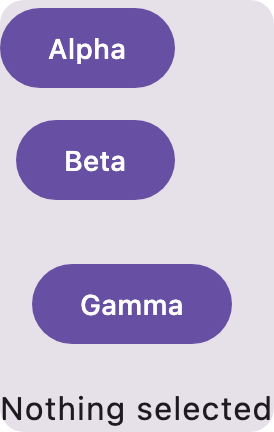
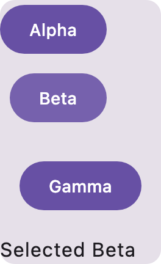

# Reusable composables with explicit parameters

`ScreenDocument.functions` declares reusable composables. A `ScreenFunction` has a name, an ordered
parameter list and one root node. `ScreenNode.function` calls a definition, using ordinary arguments
and checked handlers. It is a document construct, so its component ID is empty; the function body
still calls real catalog components whose recorded signatures are validated normally.

`ScreenParameter.Value` declares a concrete qualified value type. `ScreenParameter.Callback`
declares an ordinary `() -> Unit` callback. `ScreenValue.ParameterRead` reads the current function's
parameter and must claim its actual declared classifier; callback reads cannot fill composable
slots, value-returning callbacks or scalar parameters. Calls must supply every parameter exactly
once and cannot invent parameters. Definitions emit once as private `@Composable` functions, with
the opt-ins their bodies require.

Functions have their own lexical scope. They cannot implicitly capture screen state, a caller's
row, or its layout receiver. The caller passes current values and callbacks explicitly; a function
can forward those to another function. Direct and indirect recursive definitions are refused,
including definitions that the root never calls. Names and value types are validated before source
generation; generated row identifiers use bounded numeric suffixes to avoid capture and growing
identifier lengths across many loops. Function names also cannot collide with preview annotations
or wrappers emitted for this export; those names remain available when the corresponding previews
are absent.

## Real generated-source proof

The functional test discovers Material 3, generates and compiles a Card containing a typed row
loop, and calls one `RowChoice` composable for every row. The function takes its caption, a Modifier
and a callback. Each caller supplies 0, 8 or 16 dp padding and a callback closing over its own row.
The compiled screen runs at densities 1 and 2, verifies each button's actual horizontal inset,
then physically clicks Alpha, Beta, Gamma and Alpha again. Every click selects its own row's value.

[Exact generated Kotlin](../evidence/screen-functions/RepeatedScreen.kt.txt)

Before clicking:



After clicking Beta:



All 61 screen-model tests and 575 discovery tests pass, as does WASM compilation. The direct-loop
and reusable-function functional tests both pass, each compiling generated source and running two
density cases. Source and all captures are committed beside these images.

```sh
./gradlew :screen-model:jvmTest :screen-model:compileKotlinWasmJs :gradle-plugin:preview-discovery:test
./gradlew :gradle-plugin:functionalTest \
  --tests '*ScreenGeneratorCompileFunctionalTest.reusable composables*' \
  --tests '*ScreenGeneratorCompileFunctionalTest.typed repetition*'
```

Value parameters currently use concrete non-generic, non-nullable types. Callbacks have no value
parameters and return Unit. Composable slot parameters, receiver parameters, generic/nullable types,
per-instance state and callbacks with event values need further model support. The UI-builder
consumer now projects semantic components and authored loops through this model in
[compose-preview-server#708](https://github.com/yschimke/compose-preview-server/pull/708), behind its
default-off `uiBuilderRemoteCompose` build flag. The existing WASM Code pane and hosted MCP share
that export path. This generator change is additive and remains usable without an editor or server.
