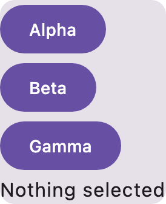
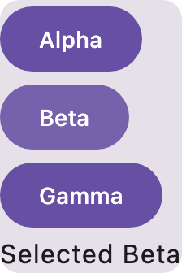

# Typed repetition in generated Compose

`ScreenNode.repetition` emits an eager `forEach` over authored, typed rows. The template stays in
the node's ordinary slots map, so serialization and editor traversal retain the same hierarchy.
The repetition node introduces no layout: its caller supplies a Column, Row or other container
when spacing and modifiers are needed.

`ScreenRepetition.fields` declares each field's qualified value type, including when there are no
rows. Every row supplies exactly those fields. `ScreenValue.RowRead` reads the innermost row's field
and must claim the declared type; the existing component-record checks then verify that value
against its destination parameter. Nested repetition evaluates its row initializers in the outer
scope, then replaces that scope while emitting the inner template. Row reads can also be captured
by checked state-assignment callbacks, preserving each instance's value after composition.

The generated row class and lambda identifiers are allocated by the generator. Authored field keys
do not become Kotlin identifiers. Allocation avoids state, component and package names, and imported
expressions are qualified if a generated local would capture them. Row count is limited to 10,000
and node emission to 128 indentation levels. Invalid types, missing/extra fields, mismatched reads,
unresolved template components and conflicting selection/component semantics refuse the complete
artifact. Empty data still validates its template.

The current row declaration carries concrete, qualified, non-function value types. Generic,
nullable and function-valued row fields need further type-model support. Repetition is eager;
lazy-list keys and per-instance retained state are not implied by this API. Declaration-only
experimental type opt-ins are not represented, so empty-row field types must be usable without
additional type-level markers.

## Real compilation and interaction

`ScreenGeneratorCompileFunctionalTest` discovers real Material 3 records, generates a Card holding
three repeated Buttons and a state label, compiles the exact source and clicks Alpha, Beta, Gamma,
then Alpha again at densities 1 and 2. Each callback selects its own row's value. This runs the
production generator, not the UI builder's earlier isolated source prototype.

[Generated source](../evidence/screen-repetition/RepeatedScreen.kt.txt)

Before interaction:



After clicking Beta:



Validation: 63 screen-model JVM tests, 575 preview-discovery tests, WASM compilation and the real
compile/interaction functional test pass. Kotlin formatting passes. The two generator publications
can be staged together with compose-preview-server's explicit local-dependency workflow; no release
is required to integrate the browser/server consumer.

The serializable document comes from the contracts `screen-document` artifact. To test unpublished
contract changes, stage `:screen-document` with that same server script, then point both this build
and its included plugin build at the generated manifest:

```sh
COMPOSE_AI_LOCAL_DEPENDENCIES=/absolute/path/to/local-dependencies.properties \
  ./gradlew --no-configuration-cache --init-script scripts/local-dependencies.init.gradle \
  :screen-model:jvmTest :screen-model:compileKotlinWasmJs \
  :gradle-plugin:preview-discovery:test \
  :gradle-plugin:functionalTest --tests '*ScreenGeneratorCompileFunctionalTest'
```

The init script overrides only coordinates listed in the manifest using actual Maven publications.
The environment variable carries the selection into the included build's plugin classpath; it is
not read by normal builds. No checkout substitution or `mavenLocal()` repository is involved.

```sh
./gradlew :screen-model:jvmTest :screen-model:compileKotlinWasmJs :gradle-plugin:preview-discovery:test
./gradlew :gradle-plugin:functionalTest --tests '*ScreenGeneratorCompileFunctionalTest.typed repetition*'
```

The shared generator also supports [reusable composables with explicit parameters](SCREEN_FUNCTIONS.md),
including calls from a loop that forward row values and callbacks. The UI-builder consumer
projects its semantic loops and components through this model in
[compose-preview-server#708](https://github.com/yschimke/compose-preview-server/pull/708), behind a
default-off build flag. Unsupported runtime lists and callback/slot types remain explicit limitations.
