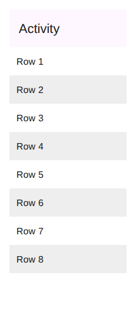
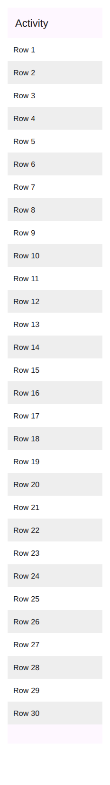
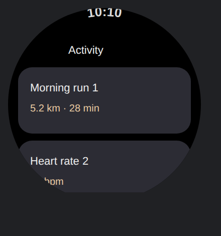
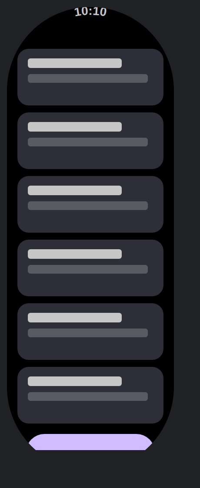
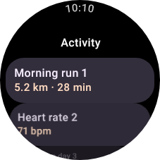
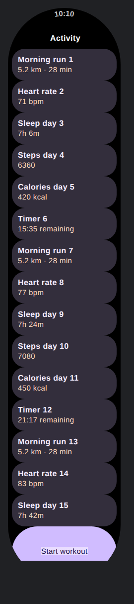

# Representing scrolling screens in the layered SVG export

Status: **mobile validated (experiment landed); Wear capsule clip + reduce-motion landed and covered
end-to-end on real captured geometry — a round-watch device preview is grown by measurement into a
tall capsule (`WearScrollSvgGrowthTest`); driving the same loop from the daemon harness against a
Wear target is the remaining step.**

## Problem

The `compose/figma-svg` export (and its sibling `compose/semantics-wireframe`) is built from the
layout-inspector + semantics tree captured for **one rendered frame** at the preview's viewport size
(see [`ComposeFigmaSvgDataProduct`](../../data/layoutinspector/connector/src/main/kotlin/ee/schimke/composeai/daemon/ComposeFigmaSvgDataProduct.kt)
and [`FigmaSvgModel`](../../data/layoutinspector/core/src/main/kotlin/ee/schimke/composeai/data/layoutinspector/FigmaSvgModel.kt)).

A `LazyColumn` / `LazyRow` / Wear `TransformingLazyColumn` is **virtualised**: only the items in (or
just adjacent to) the visible viewport are composed, so only those have a `LayoutNode`. The capture
walks the live `LayoutNode` tree, so today a scrolling screen exports **only its on-screen rows** —
everything scrolled off is absent.

PNG already has a scrolling story — `@ScrollingPreview(modes = [LONG, GIF])` drives
`SemanticsActions.ScrollBy` and stitches per-viewport raster slices into one tall PNG / animated GIF
(`ScrollSliceStitcher`, `renderScrollPreview`). That path is **raster**: all of its reference points
(overlap-shift alignment, EdgeButton detection, pill clip) operate on pixel rows, so it can't produce
a *layered, editable* SVG. **This document is about the SVG path only. PNG keeps LONG/GIF.**

## Mobile: expand the device vertically ✅ validated

For a phone-style `LazyColumn`, the fix is exactly the intuition "just make the device taller":
render the preview at an **expanded viewport height** so every item lays out in a single composition,
then run the *existing* figma-svg export over that tree. No scroll-and-stitch, no re-tree-merging —
the layered SVG carries the whole list, each row an editable `<g>` at full fidelity.

### Evidence

Experiment: [`RenderEngineFigmaSvgScrollTest`](../../daemon/desktop/src/test/kotlin/ee/schimke/composeai/daemon/RenderEngineFigmaSvgScrollTest.kt)
renders a realistic mobile screen — a Material 3 `Scaffold` with a pinned top app bar ("status bar")
and a bottom navigation bar ("bottom buttons") around a 30-row `LazyColumn`
(`LazyColumnListPreview`) — through the real desktop `RenderEngine` and counts the `Row N` layers in
the emitted `compose-figma.svg`:

| Render | Viewport | Rows in SVG | SVG height |
| --- | --- | --- | --- |
| Viewport-only (today) | 200 × 520 | **9** (visible + prefetch) | 552 px |
| Expanded (overshoot) | 200 × 4000 | **30** | 4032 px |
| Expanded, sized-to-content | 200 × ~1517 | **30** | ~1647 px |

| Viewport-only (`compose/figma-svg` today) | Full page (expanded, sized-to-content) |
| --- | --- |
|  |  |

The full-page export bookends the whole list with the pinned top app bar and the bottom navigation
bar — a designer sees the entire screen as one editable layer tree.

### The one nuance: size the height to the content

Overshooting the height works for content coverage but leaves a **trailing band**: a
`Surface`/`Scaffold` that `fillMaxSize()`s paints its background across the *entire* tall viewport,
and (for a `Scaffold`) the bottom bar is *pinned to the bottom of the frame*, so an over-tall frame
leaves a big gap between the last row and the bottom bar. The export must render at a height that
matches the content.

**Grow-by-remaining (preferred).** The scroll container's `VerticalScrollAxisRange` reports
`remaining = maxValue − value` — the pixels of content below the fold, which is *exactly* the extra
content-area height needed to show the rest. So:

1. Render at the base viewport height `H`; read `remaining` from the captured scroll node.
2. If `remaining > ε`, set `H += ceil(remaining)` and re-render.
3. Repeat until `remaining ≤ ε`.

Because the top/bottom chrome are fixed height, adding `remaining` to the frame height adds exactly
`remaining` to the content area — so the list now fits, `remaining → 0`, and a pinned bottom bar
tucks directly under the last row with no gap. It converges in one step for fixed-height rows (a
second pass covers content whose height changes as it reflows at the new size). Bounded by
`@ScrollingPreview.maxScrollPx` and a small iteration cap for infinite/very-tall lists.

This needs no scroll dispatch and no structural analysis of the Scaffold — just the one scalar the
scroll semantics already expose, read after each measured render.

### Implementation (mobile) — landed for both backends, exposed in the preview server

- **Data product** `compose/figma-svg-long` — a `requiresRerender = true` kind
  ([`ComposeFigmaSvgLongDataProductRegistry`](../../data/layoutinspector/connector/src/main/kotlin/ee/schimke/composeai/daemon/ComposeFigmaSvgDataProduct.kt)),
  mirroring `render/scroll/long`. A `data/fetch` for it returns `RequiresRerender("figma-svg-long")`,
  so the daemon queues a per-preview re-render in that mode; the SVG (plus its own hybrid
  `figma-raster/` crops) lands in a dedicated `<previewId>/figma-long/` subdir, isolated from the
  viewport export whose per-node crops would otherwise collide (Compose reassigns node ids per
  render).
- **Producer** — `RenderEngine.render` dispatches `renderMode == "figma-svg-long"` to
  `runScrollSvgScenario`, which runs the growth loop (sizing by **measured geometry** — the deepest
  composed descendant of the scroll node — because the LazyList scroll-range estimate is unreliable),
  renders once at the settled height into an **isolated** output base so the tall render never
  overwrites the preview's normal-size `compose/semantics` / wireframe / PNG, and copies out the
  layered SVG. Reuses `ComposeFigmaSvgDataProducer.writeSvg` unchanged; no change to `FigmaSvgModel`
  / `FigmaLayeredSvg`. **Both backends** implement it: desktop grows one `ImageComposeScene` via
  `setUp`/`renderOnce`; Android (Robolectric) builds a fresh `createAndroidComposeRule` per probe
  height (the test rule forbids a second `setContent`) and grows the `h{n}dp` qualifier, then
  re-enters `render()` at the settled height so the always-on `ComposeFigmaSvgExtension` emits the
  SVG. Both measure off the unmerged semantics root.
- **Preview server** — [`ServeRenderHost.renderScrollSvg`](../../cli/src/main/kotlin/ee/schimke/composeai/cli/serve/ServeRenderHost.kt)
  fetches `compose/figma-svg-long` (inlining any hybrid rasters, cached like the viewport SVG), and
  the HTTP server serves it at **`GET /render/<id>.svg?scroll=long`** (`full` / `page` accepted too)
  alongside the existing `.png` / `.svg` lanes.
- **Remaining**: **override-aware** full-page renders (the `data/fetch` re-render is keyed by
  `(previewId, kind)` and doesn't yet carry the live `uiMode` / `device` / locale / theme / knob
  overrides — the same limitation the scroll PNG products have, so `renderScrollSvg` caches on the
  preview id alone until it's threaded through); the interactive web-viewer "Full-page SVG" link (a
  fast-follow — the viewer's SVG links are built by a client-side state machine that needs the
  Electron preview-harness for visual evidence); and the **Wear** geometry below.

## Wear: grow tall, flatten the items, clip to a capsule

"Just make it taller" doesn't work for Wear **unchanged**, for three reasons:

1. **Round device crop.** A round Wear preview is masked to the inscribed circle (`roundClip`).
   A tall frame has no meaningful circle — the mask would clip the list to a lens.
2. **`ScreenScaffold` chrome is pinned, not scrolled.** `TimeText` sits at the top, the `EdgeButton`
   is revealed at the bottom only when the list reaches its end, the `ScrollIndicator` hugs the right
   edge. None of these belong "stacked" with the list; they frame it.
3. **`TransformingLazyColumn` scales items toward the edges.** Items curve/shrink near the top and
   bottom of the round face (`SurfaceTransformation`). Captured in place they'd be at varying,
   wrong-for-a-flat-list scales.

### The realisation: the same mobile "grow tall" pass, plus two knobs

Each of the three problems is answered by one small change layered onto the *mobile* grow-tall pass
— so the Wear path reuses the entire `figma-svg-long` growth loop rather than a bespoke
scroll-and-split scheme:

1. **Capsule clip instead of the circle.** The grown frame is masked to a vertical **stadium**
   (top half-circle of radius `width/2`, straight sides, bottom half-circle) — the vector analogue
   of the raster `applyWearPillClip`, emitted as a single `<rect rx=width/2>`. Implemented as
   [`FigmaSvgCapsuleClip`](../../data/layoutinspector/core/src/main/kotlin/ee/schimke/composeai/data/layoutinspector/FigmaSvgModel.kt);
   a `roundClip` request on a frame that's taller than it is wide (the grown scroll frame)
   auto-selects it, so the always-on `ComposeFigmaSvgExtension` keeps passing `roundClip = isRound`
   and the tall render gets the stadium with no extra plumbing.
2. **`ScreenScaffold` pins the chrome for us.** Because `TimeText` pins to the top of the frame and
   the `EdgeButton` is revealed at the frame bottom once the list is fully composed, growing the
   frame tall naturally lands `TimeText` inside the top arc and the `EdgeButton` inside the bottom
   arc — the "top chrome / list / bottom chrome" split falls out of the scaffold's own pinning,
   no separate start/end capture needed.
3. **`LocalReduceMotion(true)` flattens the list.** Providing Wear's `LocalReduceMotion` during the
   grown render (the same knob the PNG LONG path uses to kill slice-seam ghosting) removes the
   `SurfaceTransformation` edge scaling, so every `TransformingLazyColumn` item composes at natural
   size and stacks sequentially exactly like the mobile list. The local is resolved reflectively via
   the request classloader ([`WearReduceMotionLocal`](../../renderers/android/src/main/kotlin/ee/schimke/composeai/renderer/WearReduceMotionLocal.kt)),
   so neither `data-layoutinspector-core` nor `daemon:android` needs a compile dep on
   `androidx.wear.compose`, and it's a no-op for non-Wear scrollables.

The result is a layered SVG whose top and bottom keep the round-watch framing (clock arc,
`EdgeButton`) while the middle is a clean, unscaled, editable list — a designer reads and edits the
whole screen without the fisheye. This is a simpler realisation than the originally-proposed
top/bottom scaffold split, and it reuses the mobile grow-and-size-to-content loop verbatim.

| Old circle clip on the round face (list lens-clipped) | Capsule clip on the grown, flattened frame |
| --- | --- |
|  |  |

*(Both rendered through the real `FigmaSvgModel` + `FigmaLayeredSvg` and rasterised; the capsule
frame carries the full stacked list — cards, `TimeText` arc, and the revealed `EdgeButton` pill —
inside the stadium mask.)*

### What's landed vs. what remains

- **Landed (backend-agnostic, unit-tested in `data-layoutinspector-core`):** the `FigmaSvgCapsuleClip`
  shape + its `<rect rx>` renderer, and the tall-frame auto-selection so a `roundClip` on a grown
  frame becomes a capsule.
- **Landed (Android render path):** the classloader-aware `WearReduceMotionLocal` seam, and its
  provision during the daemon's grown Wear render + its scroll-measure probes
  ([`RenderEngine`](../../daemon/android/src/main/kotlin/ee/schimke/composeai/daemon/RenderEngine.kt),
  gated on a round device requested taller than wide — i.e. the `figma-svg-long` re-entry).
- **Landed (real-geometry end-to-end coverage — the whole extraction, magic and all):**
  [`WearScrollSvgGrowthTest`](../../renderers/android/src/test/kotlin/ee/schimke/composeai/renderer/WearScrollSvgGrowthTest.kt)
  starts from a normal round-watch **device preview** — the same screen shape as `:samples:wear`'s
  `ActivityListLongPreview` (`TimeText`, an "Activity" `ListHeader`, `TitleCard` rows, and a "Start
  workout" `EdgeButton`) on a square `wearos_large_round` (227×227dp) — whose `TransformingLazyColumn`
  renders with the real Wear item scaling (`SurfaceTransformation` / `transformedHeight`), rows curving
  and shrinking toward the round face's edges. It *grows it by measurement* (the daemon's
  `runScrollSvgScenario` loop, sharing the same
  [`ScrollContentMeasure`](../../renderers/android/src/main/kotlin/ee/schimke/composeai/renderer/ScrollContentMeasure.kt))
  until every row composes. The **height is derived, never hardcoded**. It asserts the two ends: the
  square device preview masks to the inscribed **circle** and shows only a virtualised subset of rows;
  the extracted tall frame masks to the **capsule** and carries **every** row, flattened by
  `LocalReduceMotion(true)`. It lives in `:renderer-android` — **not** `:daemon:android` — so the Wear
  dependency (`wear-compose-foundation` + `-material3`) comes from the module being rendered, on its
  **test** classpath only; the daemon stays wear-free and reaches `LocalReduceMotion` reflectively,
  exactly as it does against a user's app in production. `RenderEngine`'s growth loop now calls the
  same shared `ScrollContentMeasure` rather than a private copy.

  Two Wear-specific layout quirks the fixture works around (both artefacts of growing a round-face
  screen tall, not of the export): the round-face **curve-in insets** (`ScreenScaffold` content
  padding and `ListHeaderDefaults.minimumTopListContentPadding`) are a *fraction of screen height*, so
  they balloon on a grown frame — the fixture drops them and pins device-sized insets, and top-aligns
  the list (whose default arrangement centres content). And the **`EdgeButton`** only reveals at full
  size once the list is scrolled to its end — impossible in a grown frame that already shows every row
  without scrolling — so it's placed as the final list item instead, seated below the last card; its
  custom-drawn crescent fill (which the vector export can't read) is backed by a `Modifier.background`
  token so it exports as an editable rounded-rect fill rather than bare text.

  | Device preview (round, scaled) | Automagically extracted tall screenshot (flat, every row) |
  | --- | --- |
  |  |  |

- **Remaining:** driving the **daemon's own** `figma-svg-long` growth loop end-to-end against a Wear
  target in a `:daemon:harness` real-mode run (the loop + measure + export are now covered on real
  geometry above in `:renderer-android`; the daemon-side wiring would want a Wear target module
  supplying `wear-compose` on the spawned classpath rather than the daemon); registering a Wear scroll
  `@Preview` with the preview-harness so the CI visual-diff bot diffs it on every change; and the same
  **override-aware** re-render gap the mobile path still has.

## Non-goals

- No change to the PNG scroll path (`render/scroll/long`, `render/scroll/gif`).
- No merging of per-scroll-offset trees for mobile — the expanded single-pass render makes that
  unnecessary. (Tree-merging would only be needed if a list genuinely can't be given a viewport tall
  enough to compose it all; that's the safety-cap tail, out of scope here.)
