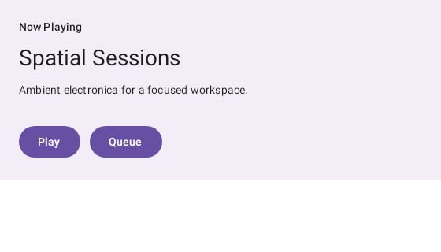

# Preview support for Jetpack Compose for XR (spatial UI)

Design + research notes for rendering `androidx.xr.compose` spatial composables through this repo's
`@Preview` pipeline. This is the "tracked elsewhere" follow-up that [`GLIMMER_PREVIEW.md`](GLIMMER_PREVIEW.md)
scopes out of the Glimmer work (Glimmer is the *display-glasses* toolkit; this is the *headset /
spatial* toolkit — different package, different rendering model).

Reference sample: [`:samples:xr-spatial`](../../samples/xr-spatial).

## What "XR spatial previews" are

[Jetpack Compose for XR](https://developer.android.com/develop/xr/jetpack-xr-sdk/ui-compose)
(`androidx.xr.compose`, `1.0.0-alpha14`) adds two surfaces on top of ordinary Compose:

- **`androidx.xr.compose.subspace`** — a *3D* layout system. `Subspace { … }` opens a partition of
  3D space; inside it you place `SpatialPanel`, `SpatialRow`/`SpatialColumn`/`SpatialBox`,
  positioned with `SubspaceModifier` (`width`/`height`/`offset`/`rotate`/`depth`). A `SpatialPanel`
  hosts ordinary 2D Compose content on a panel floating in space.
- **`androidx.xr.compose.spatial`** — *spatial affordances* you sprinkle into a normal 2D tree:
  `Orbiter` (floats a control strip anchored to a panel edge), `SpatialElevation` (raises content
  toward the viewer), `SpatialDialog` / `SpatialPopup` (push the parent panel back in z and present
  an elevated dialog/popup).

### The capability gate (why this matters for previews)

Both surfaces are gated on **spatialization being enabled**, surfaced through
`LocalSpatialCapabilities.current.isSpatialUiEnabled`. Spatialization is only on in **Full Space**
on an Android XR device, backed by a Jetpack XR `Session` + SceneCore/OpenXR runtime.

- In **Home Space**, on a **phone/tablet**, and **anywhere without an XR `Session`**, the
  composition local defaults to `SpatialCapabilities.NoCapabilities` (verified in the AAR:
  `LocalSpatialCapabilities`'s default reads `LocalComposeXrOwners`, and falls back to
  `NoCapabilities` when there is no session). `isSpatialUiEnabled` is then `false`.
- **`Subspace { … }` content is *ignored* when spatialization is off** — the body is skipped
  entirely.
- **`spatial` affordances fall back to 2D**: `Orbiter` lays its content out inline against the
  chosen edge, `SpatialElevation` draws its content with no z-offset, `SpatialDialog`/`SpatialPopup`
  degrade to a plain `Dialog`/`Popup`. This is the documented "reuse your spatial components in your
  2D UI" behaviour.

## Rendering model in this repo

This repo renders `@Preview`s **offline** — Robolectric (Android) / `ImageComposeScene` (Desktop).
There is **no** Jetpack XR `Session` and no SceneCore/OpenXR runtime in either backend, and there
is no realistic path to one (SceneCore needs the device's OpenXR stack; a Robolectric shadow of the
full spatial scene graph is out of scope). So:

| Composable | Offline render result | Same as… |
| --- | --- | --- |
| 2D content destined for a `SpatialPanel` | renders normally | Studio `@Preview`, phone |
| `Orbiter { … }` | 2D fallback — content inline at the edge | Studio `@Preview`, Home Space |
| `SpatialElevation { … }` | 2D fallback — content drawn flat | Studio `@Preview`, Home Space |
| `SpatialDialog` / `SpatialPopup` | 2D `Dialog`/`Popup` fallback¹ | Studio `@Preview`, Home Space |
| `Subspace { SpatialPanel { … } }` | **empty frame** — body ignored | Home Space on a phone |

¹ Dialog/Popup content renders into a separate window, which the root-capture path doesn't grab —
the same limitation any offline Compose preview has for `Dialog`, not XR-specific.

**This is not a gap we can close by special-casing the renderer** — it is the *correct* behaviour.
What Android Studio's own `@Preview` shows for an XR app in Home Space is exactly this 2D fallback;
the true 3D placement only appears in Full Space on an XR device or the XR emulator. The repo's
[constraints](AGENTS.md) forbid per-feature renderer branches anyway, and there is no metadata an
override extension could supply to fabricate a spatial scene graph offline.

### Recommended authoring pattern

The Jetpack XR guidance — author your app UI as ordinary 2D Compose, then *place* it spatially — is
also the previewable pattern:

1. **Preview the panel's 2D content directly.** The composable you pass into a `SpatialPanel` has no
   XR dependency; a plain `@Preview` of it captures exactly what the panel shows.
2. **Preview the `spatial` affordances for their 2D fallback** to verify the Home Space / phone
   layout (`Orbiter` strips, `SpatialElevation` cards).
3. **Keep the real `Subspace { … }` layout in the sample as reference code, un-`@Preview`'d** — a
   `@Preview` of it would only ever capture a blank frame offline, which is a poor artifact (it
   looks like a render bug). `:samples:xr-spatial`'s `SubspaceXrLayout` documents this inline.

## `:samples:xr-spatial`

An Android **library** module (no `applicationId` needed; mirrors `:samples:android-library` /
`:samples:xr-glimmer`):

- `SpatialContent.kt` — XR-free 2D content (`NowPlayingPanel`, `TransportControls`) — the unit that
  goes inside panels/orbiters.
- `SpatialPreviews.kt` — the `@Preview`s: the panel content, an `Orbiter` top-control strip, a
  `SpatialElevation` card. All capture their 2D fallback.
- `SubspaceDemo.kt` — `SubspaceXrLayout`: the genuine `Subspace { SpatialPanel { … } }` + `Orbiter`
  on-device code, deliberately **not** `@Preview`'d, with the rationale documented inline.

### Build config

- `androidx.xr.compose:compose`'s AAR declares **`minCompileSdk = 36`** (and `minAgp = 8.9.1`), so
  the module compiles against `compileSdk = 36` — the repo default from `composeai.android-conventions`,
  satisfied by the installed platform-36. Unlike `:samples:xr-glimmer` (Glimmer needs platform-37),
  **no SDK-37 bump is required**.
- Robolectric is pinned to **`sdkVersion.set(35)`**. The repo's toolchain is JDK 17, and Robolectric
  4.16.1 needs JDK 21+ for an SDK-36 sandbox; the 2D fallback path is pure Compose drawing with no
  API-36 platform symbol at render time, so SDK 35 captures it cleanly. This is the same escape
  hatch `:samples:remotecompose` and `:samples:android-alpha` use to render compileSdk-37 modules
  under JDK 17. Drop the override when the repo toolchain moves to JDK 21.

### Render it

```
./gradlew :samples:xr-spatial:composePreviewRenderAll
```

PNGs land under `samples/xr-spatial/build/compose-previews/renders/`.

## Recovering the real layout offline — it works (`SubspaceLayoutPoseTest`)

The interesting question is whether the *real* subspace layout (panel poses/sizes computed by the
framework) can be harvested offline and projected to 2D ourselves — geometry-true previews without
reimplementing the layout. **It can**, with no headset, no OpenXR, and no SceneCore native code. The
proof-of-concept is [`SubspaceLayoutPoseTest`](../../samples/xr-spatial/src/test/kotlin/com/example/samplexrspatial/SubspaceLayoutPoseTest.kt);
the recipe is entirely public API plus **one Robolectric shadow**:

1. **Fake runtime off-device.** `androidx.xr.runtime:runtime-testing` +
   `androidx.xr.scenecore:scenecore-testing` provide `FakeSceneRuntimeFactory` /
   `FakeRenderingRuntimeFactory`. Register them for `ServiceLoader` (a `META-INF/services/` file per
   `SceneRuntimeFactory` / `RenderingRuntimeFactory` interface) and `Session.create(activity)`
   returns `SessionCreateSuccess` on a plain JVM under Robolectric. `FakeSceneRuntime` defaults to
   `SpatialCapabilities(63)` = all capabilities.
2. **Flip the one gate.** `Subspace` only takes its spatial path when
   `packageManager.hasSystemFeature("android.software.xr.api.spatial")` (`ManifestFeature
   .FEATURE_XR_API_SPATIAL`) is true — Robolectric reports `false`, so shadow it on with
   `shadowOf(pm).setSystemFeature(…, true)`. **That was the whole blocker.** The session and
   `LocalComposeXrOwners` then auto-wire from the activity (the `LocalComposeXrOwners` default
   computes `getOrCreateXrOwnerLocals(activity)` from `LocalContext`), so no internal/reflection
   session-injection is needed — an earlier dead end that probed the locals *above* `Subspace` (where
   the host hasn't installed them) mis-diagnosed this as internal-only.
3. **Read the public spatial-semantics tree.** `onSubspaceNodeWithTag(tag).fetchSemanticsNode()` →
   `SubspaceSemanticsInfo.poseInRoot` (`Pose`, dp) + `.size` (`IntVolumeSize`, dp) + children.

For a `SpatialColumn` of a 200dp panel over a 160dp panel the test recovers, offline:

```
column: poseInRoot=(0, 0, 0)    size=(560 x 360)
top:    poseInRoot=(0, 80, 0)   size=(560 x 200)
bottom: poseInRoot=(0, -100, 0) size=(560 x 160)
```

i.e. the genuine framework-computed stack (top above bottom, column = sum of children).

### Example output

`:samples:xr-spatial`'s `NowPlayingSpatialPreview` (a `SpatialColumn` of two tagged
`SpatialPanel`s) rendered by `composePreviewRenderXr` — each panel's real content rasterised to its
`<id>.png` at the panel's true size, next to the [`scene.json`](xr-spatial/scene.json) that places
them:

| `now-playing` (560×320) | `transport` (560×96) |
| --- | --- |
|  |  |

**Verdict / path forward:** a real **subspace-layout projector** is feasible — render each panel's
2D content (Robolectric, as the committed `@Preview`s already do), then composite the panels at
their recovered `poseInRoot`/`size` through a chosen preview camera. **This is now built** in
[`:renderer-xr`](../../renderers/xr): `composePreviewRenderXr` recovers each tagged panel's pose +
size **and** its live content `View`, rasterises that view to its `<id>.png` texture at the panel's
true size, and emits the `scene.json` the VS Code 3D viewer composites (see
`SPATIAL_SCENE_CONTRACT.md`). `SubspaceLayoutPoseTest` still proves the geometry is recoverable and
stands as the **canary** that flags when the alpha XR testing stack shifts. **Fragility mitigation** (the
honest cost of leaning on alpha `*-testing` libs + a private system-feature string): the canary test
fails loudly on a stack change, and a future `compose-preview doctor` check can assert the fake
runtime still loads and `Subspace` still composes before any projector feature relies on it.

- **True 3D spatial capture.** Rendering the actual `Subspace`/`SpatialPanel` 3D layout with real
  shading/compositing needs the SceneCore renderer. The Android Studio **XR emulator** runs the real
  SceneCore/Compose-XR stack on a desktop GPU, but it is **not** an OpenXR host (Google: "OpenXR is
  not supported on the emulator"), is **Canary-channel + GPU-mandatory**, and exposes no documented
  spatial frame-capture / head-pose-injection hook — so it's a manual dev aid, not a deterministic CI
  capture path.
- **An `@SpatialPreview` meta-annotation / spatial device spec.** Studio uses an "XR" device preset
  in the preview picker. We could add a meta-annotation in `:preview-annotations` that pins a wide
  spatial-panel device spec, but — unlike `@FocusedPreview`/`@AmbientPreview` — it would carry no
  renderer behaviour (there's no spatial scene to drive offline), so it would be sugar over a shared
  `device =` string. Left out until there's behaviour to attach; the sample uses a shared
  `SPATIAL_PANEL_DEVICE` const instead.
