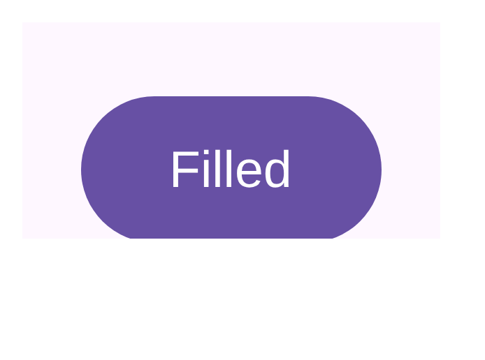

# Editable `compose/figma-svg` vectors in the design-catalog bundle

The design-catalog delivery branches (`design-artifacts/compose-m3`, `…/wear-m3`, …) now ship, per
sticker, **both** the raster PNG (in `images/`) and the layered **`compose/figma-svg`** vector (in
`figma/<slug>.svg`) — so a designer imports the PNG for a pixel reference or the SVG for a real
editable component.

The SVG isn't a flattened screenshot: fills, strokes, corner radii, and text are live layers named
after the Compose nodes. The daemon already produces it during the catalog's `--with-semantics`
render; this pipeline just carries it into the bundle (`previews/<id>.figma.svg`) and copies it onto
the branch, exactly as it does the schematic `wireframes/`.

## Example — M3 `FilledButton` sticker

`figma/<slug>.svg`, rendered here from the actual bytes carried by
`compose-preview bundle pack --module :samples:design-catalog-m3 --with-semantics`:



The [committed SVG](filled-button.figma.svg) is a handful of editable layers — the M3 primary pill
as `<rect … rx="52.5" fill="#6750A4"/>` and the label as editable `<text>Filled</text>` in Roboto
Medium — not a raster. The `bundle pack` summary confirms the carry:

```
  semantics:     1 / 1 preview(s) carried as previews/<id>.semantics.json
  layout:        1 / 1 preview(s) carried as previews/<id>.layout.json
  fonts:         1 / 1 preview(s) carried as previews/<id>.fonts.json
  figma-svg:     1 / 1 preview(s) carried as previews/<id>.figma.svg
```

Fonts are named (`sans-serif` / Roboto), not embedded — Figma ships Roboto, so imports match; a
follow-up can wire the `composeai.figma.embedFonts` flag into the catalog render for self-contained
SVGs if we want browser-preview parity on the branch.
