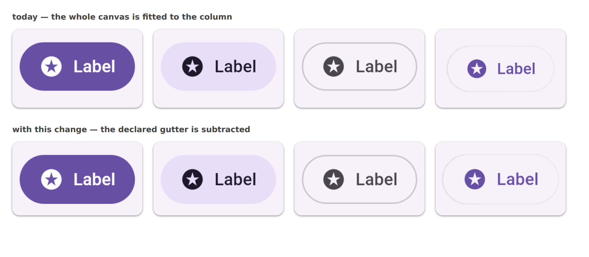

# Subtracting a capture gutter on the sheet

The measurement behind
[m3-catalog#179](https://github.com/yschimke/m3-catalog/issues/179), and what this change does
about it.

## The complaint

`@CaptureGutter` (#4445) moved a shadow's room out of the component tree and into the capture, so
the component measures what it always measured and only the canvas grows. That fixed the
*measurement*. It did not fix what a reader sees, because every consumer of a sticker sheet fits
the **whole canvas** to its column:

| render | canvas | component | drawn in a 213px column |
| --- | --- | --- | --- |
| `button-filled__ideal__default__light` | 249×126 | 249×126 | 213.0px |
| `button-tonal__ideal__default__light` | 249×126 | 249×126 | 213.0px |
| `button-outlined__ideal__default__light` | 249×126 | 249×126 | 213.0px |
| `button-elevated__ideal__default__light` | **271×150** | 249×126 | **198.1px** |

7.0% smaller, for a reason that has nothing to do with the design — the one emphasis that casts a
shadow.

## The picture

Real Chromium, the real `serve.css`, m3-catalog's own renders at 2.625 density in a 213px column.
Top band is what the sheet draws today; bottom band is the same four cards with the declared gutter
subtracted, which is what this change makes the sheet do.

The elevated card's shadow is still there in the bottom band: the window that lines the box up with
its neighbours does **not** hide its overflow (`.cp-crop--bleed`). Clipping it would crop the very
shadow the gutter was captured to keep (#4445, and m3-catalog#102 before it) — the shadow spills
into the grid's gap, which is where a shadow belongs.

## How to reproduce the picture

1. Render m3-catalog's button stickers: `./gradlew :catalog:composePreviewRender
   -PcomposePreview.filter=FilledButton,TonalButton,OutlinedButtonSticker,ElevatedButtonSticker`.
2. Lay the four PNGs out in `.cp-imgwrap` cards at `--cp-card-w: 213px` with this repo's
   `serve.css`, once as plain `` and once with the elevated one in a
   `` window whose
   image is sized `width:108.8353%;left:-4.4177%;top:-8.7302%` (249/271, −11/249, −11/126).
3. Screenshot at `deviceScaleFactor: 2`.
