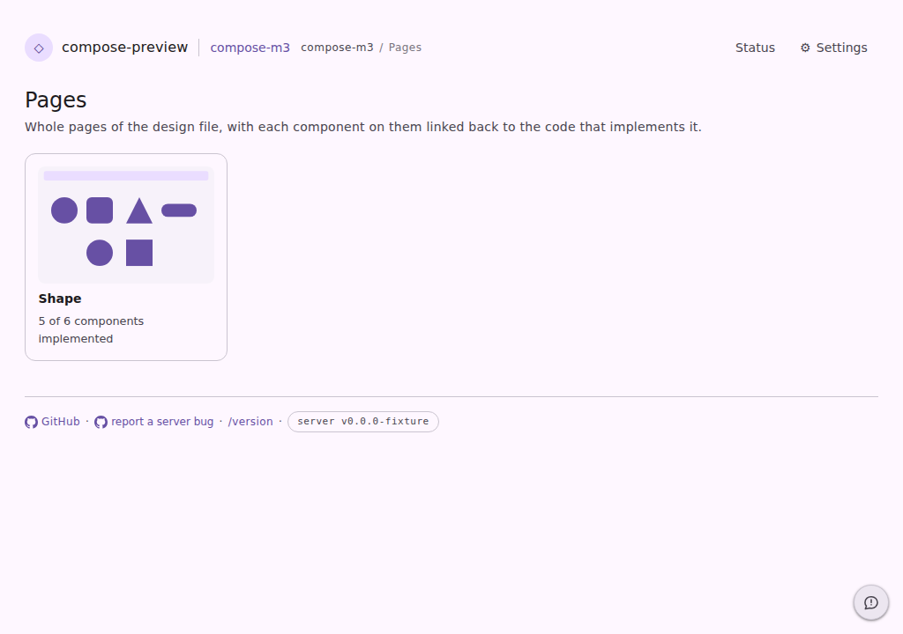
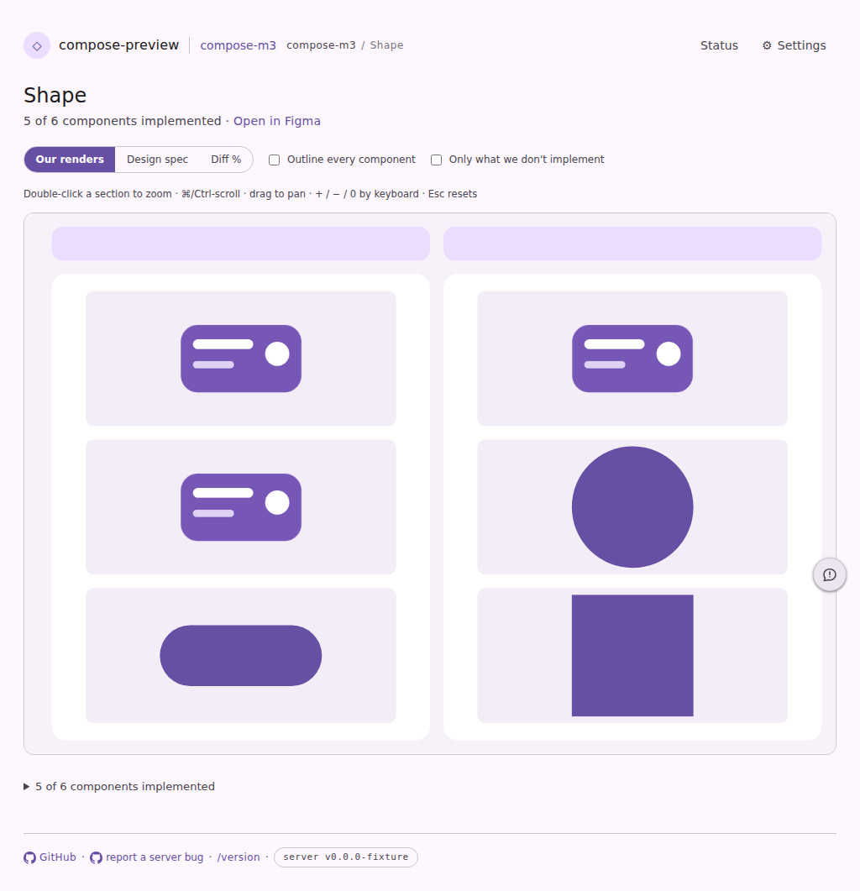
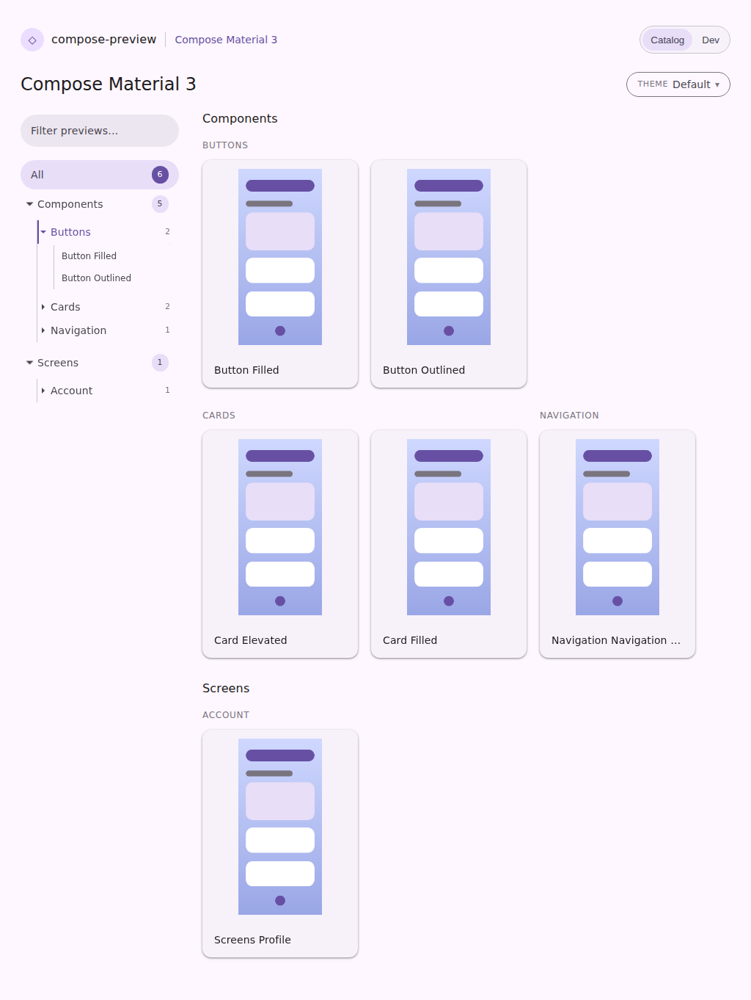
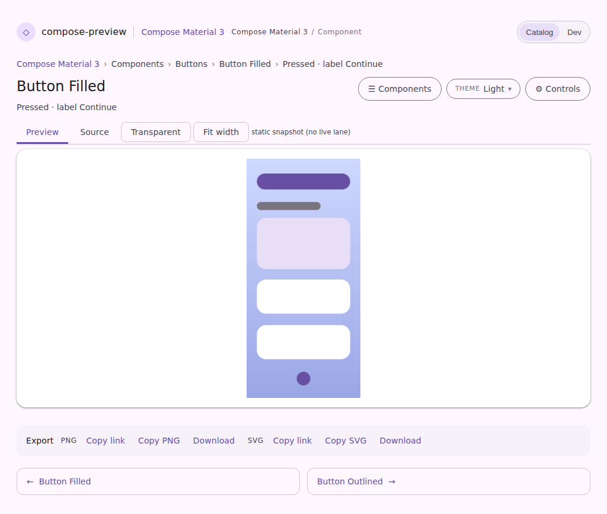
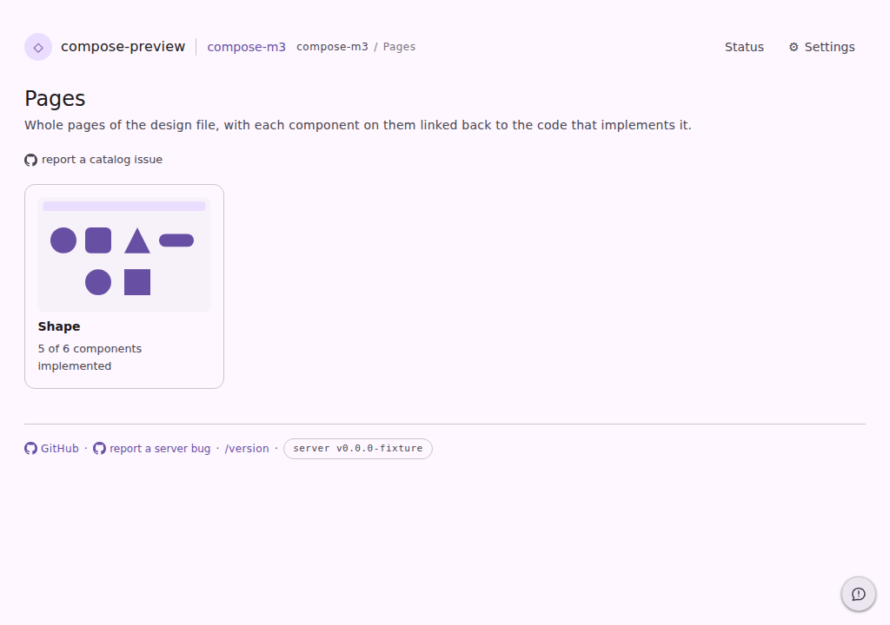
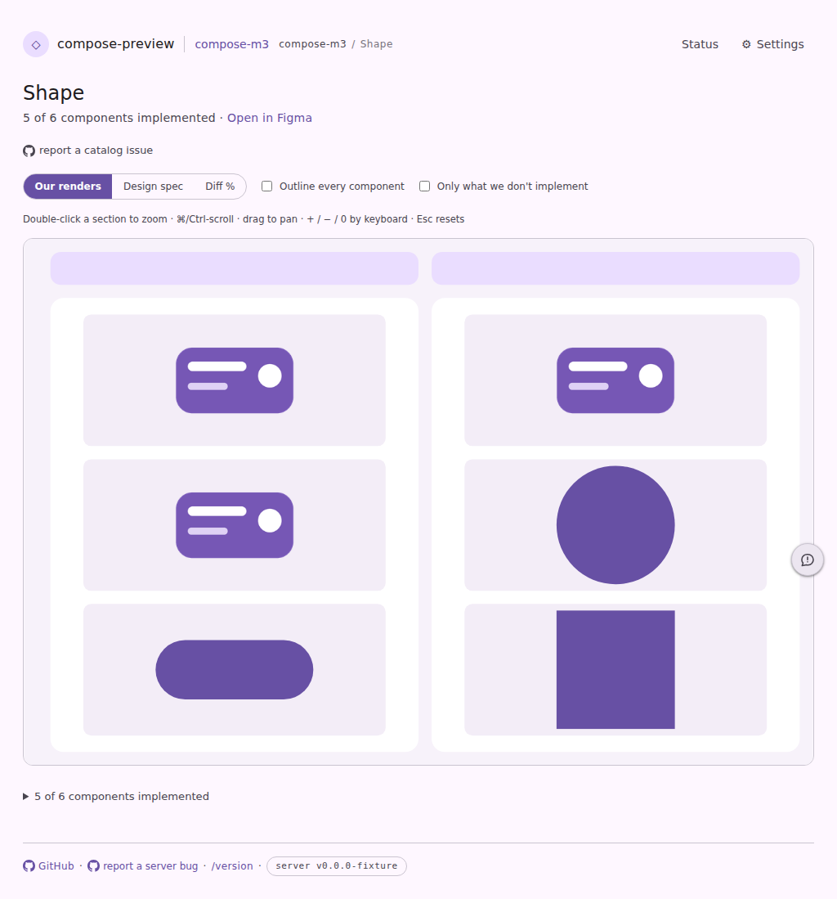
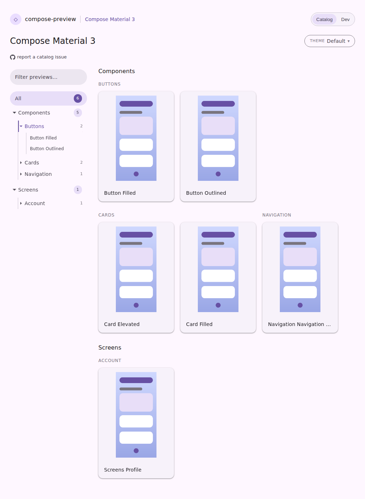
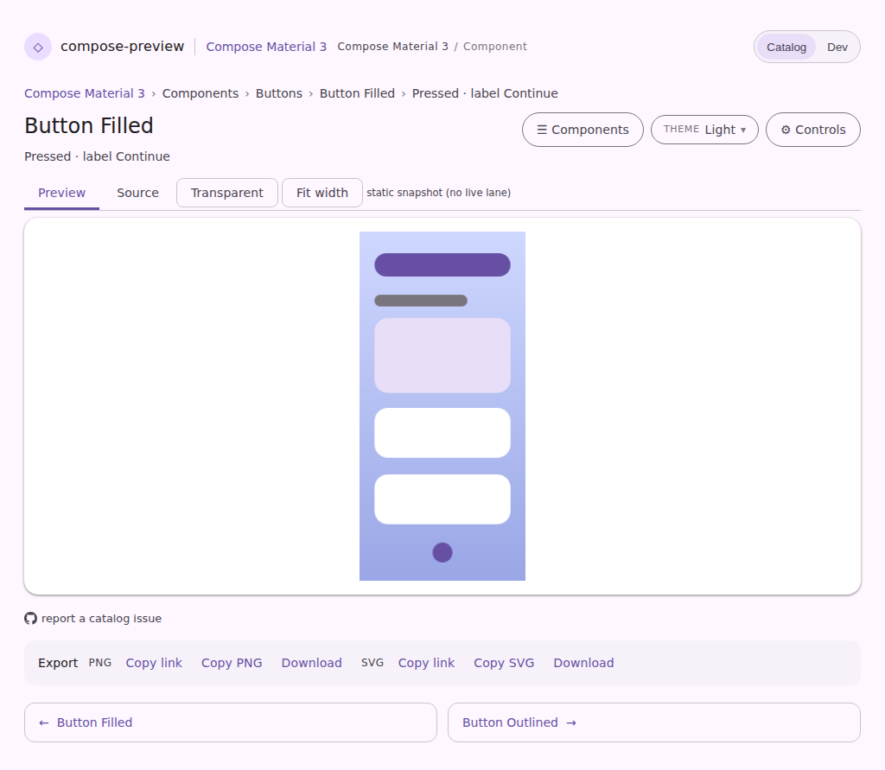

# Every catalog surface can be reported against its own catalog

Issue [#4704](https://github.com/yschimke/compose-ai-tools/issues/4704): filed from
`https://wear.preview.coo.ee/pages` — "Should allow reporting catalog bugs from figma pages …
But only the preview server option is available."

The floating launcher offers two trackers, and its catalog half is
[`ServeWeb.reportIssueHtml`](../../../../cli/serve/src/main/kotlin/ee/schimke/composeai/cli/serve/ServeWeb.kt)'s
`#cp-report`, which
[`reportLauncher.ts`](../../../../cli/serve-web/src/chrome/reportLauncher.ts) unhides and completes
on the pages that carry one. Only the surfaces drawing a single preview did — plus the comparison
wall, which got a page-scoped one of its own in
[#4289](https://github.com/yschimke/compose-ai-tools/issues/4289). A design page, the pages index,
the motion browser and the catalog landing carried none, so a report about somebody's design system
had nowhere to go but the preview server's tracker, which owns none of it.

Catalog mode was worse than that: it drops the site footer and the launcher with the rest of the
site chrome, and it stripped the per-preview report too — so the streamlined component browser had
**no** reporting affordance at all.

Every shot is a committed page fixture (light theme, production CSS + JS), captured with Playwright
through the page harness:

```sh
UPDATE_SERVE_WEB_FIXTURES=true ./gradlew :cli:serve:test --tests '*ServeWebFixtureTest*'
HARNESS_THEME=light npm --prefix preview-server/preview-harness run harness:pages
```

| Pair | Fixture | What changed |
| --- | --- | --- |
| `pages-index-{before,after}.png` | `serve-design-page-index` | the pages index gained "report a catalog issue", scoped to *these design pages* |
| `design-page-{before,after}.png` | `serve-design-page` | one sheet gained the same, scoped to *this design page* |
| `catalog-mode-landing-{before,after}.png` | `serve-component-browser-catalog` | Catalog mode's landing gained it, scoped to *this catalog* — the first reporting route that mode has ever had |
| `catalog-mode-component-{before,after}.png` | `serve-component-browser-component` | Catalog mode's component page keeps the per-preview report; the dev affordances beside it stay dropped |

## Before









## After









The report these surfaces file is **page-scoped**, exactly as the wall's is: it names the page URL,
the catalog build and the tool version, and drops the preview-shaped rows and the parity-locator
fence, because a page showing every component singles out none. A single preview's own defect keeps
the better route it already had — the viewer and the focused comparison both file against that exact
preview, and Catalog mode's component page now does too.

Every shot above is a committed baseline, so a later change to any of these rows is diffed by the PR
bot without anyone remembering to look.
