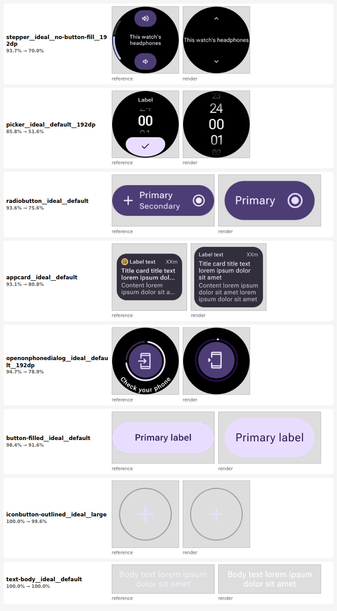
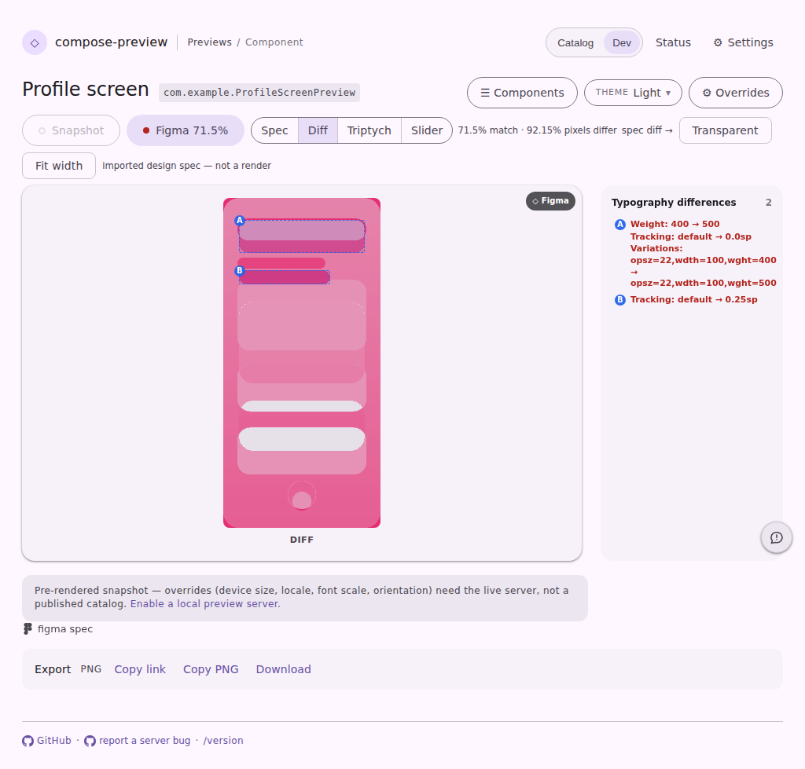

# The comparison score, measured over drawn content (#4290)

The match percentage on `/compare`, on the spec chip and in the parity table used to average each
pixel's cost across the **whole canvas**. On a component sheet with a lot of blank sheet around it —
and on a 384×384 round watch screen, which is mostly black in both frames whatever is drawn on it —
the empty backdrop was most of the average, so almost every pair landed in the nineties and the
number stopped separating anything. Issue #4290 is the report: *"So different, but marked as 93%."*

The score is now the share of the pair's **content** that agrees: the same cost, divided by the
pixels either frame drew detail on plus wherever the two disagree. A pixel more than half the
luminance range out of place is also charged in full rather than in proportion to its own tone, so a
control that lost its fill costs what an absent control costs instead of a fifth of one.

## The pairs the issue was filed from

wear-m3-catalog's published references against its published renders, scored with the shipped
`format-compare.js` before and after. Left is the imported Figma reference, right is the render.

The top row is the pair from the issue: a stepper whose reference has two filled buttons, a level
indicator arc and wrapped text, against a render with two hairline chevrons, no fills and a line of
text running off the screen. It published at **93.7%**. It now reads **70.0%**. The pairs that
genuinely agree — the outlined icon button, the body text — stay where they were.

## The spec lane, same page, same frames

`serve-viewer-path` · `spec-diff`, captured by `npm run harness:snapshot`. Nothing about the page
changed except the number the chip and readout carry.

### Before

### After

The readout puts the two numbers side by side, which is what makes the old one indefensible: 92.15%
of the pixels in that frame differ, and the verdict beside it read **90.3% match**. It now reads
**71.5%**.

## What it does to a real catalog

All 186 published wear-m3-catalog pairs, scored both ways:

| | min | p10 | p25 | median | p75 | p90 |
| --- | --- | --- | --- | --- | --- | --- |
| before | 21.9 | 50.6 | 93.7 | 97.3 | 99.8 | 100.0 |
| after | 4.0 | 17.7 | 78.9 | 91.1 | 98.5 | 100.0 |

The compare wall's `good / warn / bad` bands (90 / 75) split those 186 rows **159 / 5 / 22** before
and **115 / 38 / 33** after — the triage band the wall was built for barely existed under a score
that could not leave the nineties, so those thresholds were left alone. The spec lane's verdict
bands could not be: 99.5 / 97 only ever made sense against that compressed range, and they are now
95 / 85, taken from the distribution above.

The published `match` numbers in `references/index.json` on each `design-artifacts/<system>` branch
were minted by the old metric and stay stale until the next `design-artifacts` run republishes them.
The lane recomputes live on entry, so a chip and its readout can disagree until then — the same
already-handled condition as a chip whose render has moved off the published theme.
