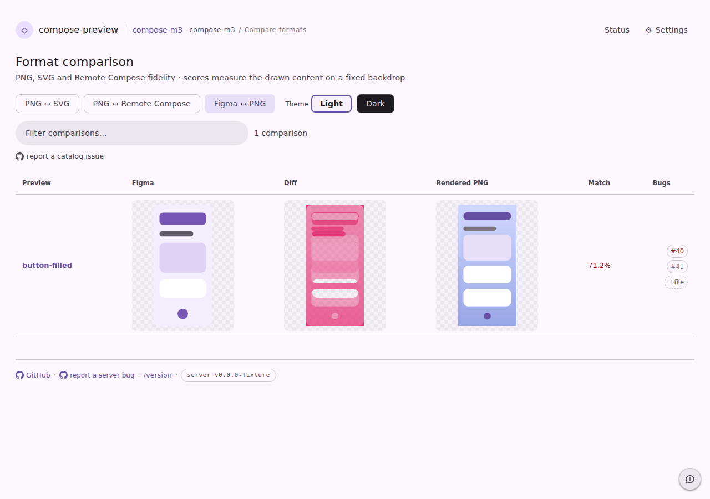
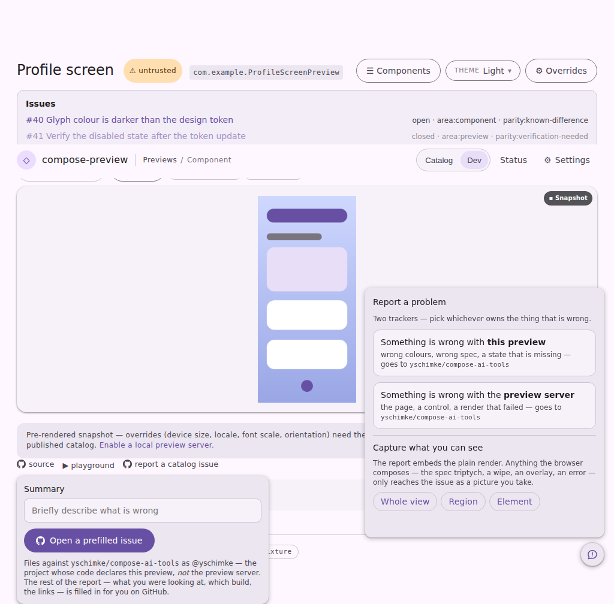
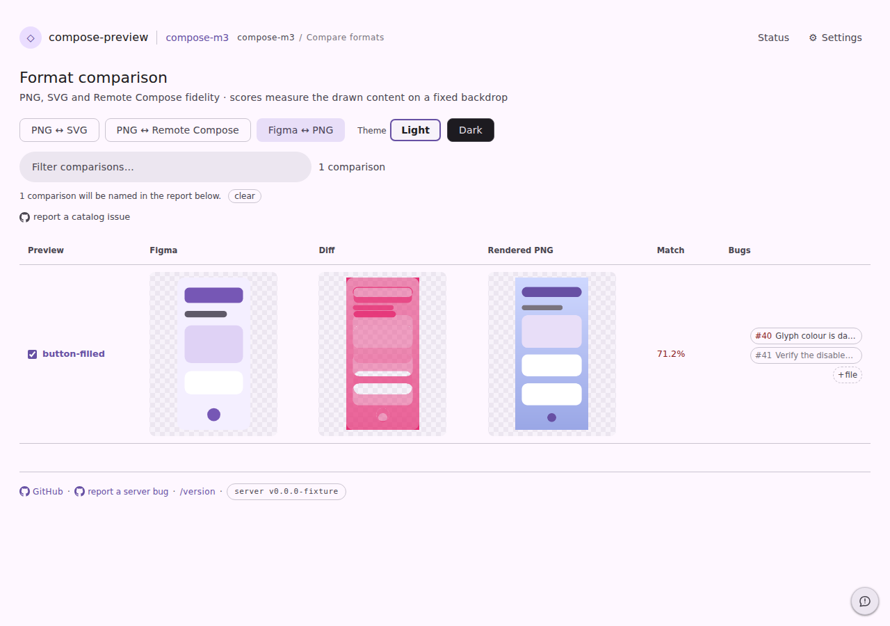
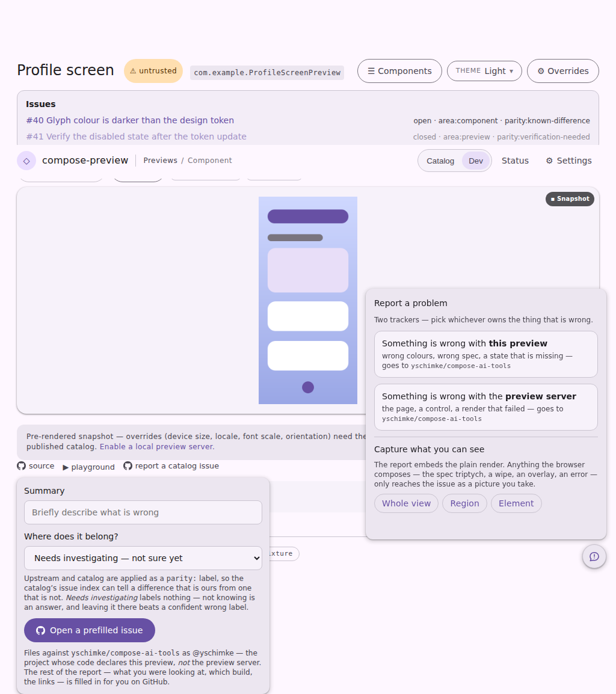

# The Bugs column says what is filed, and rows can be reported together

Two changes to `/<system>/compare?format=reference`, both about the same gap: the wall could tell
you that something was filed, and could file one more thing, but neither half said *what*.

- **The Bugs pill carries the issue title.** It was the number alone, with the title on the
  tooltip — so "does someone already know about this difference?" could only be answered by
  hovering or opening every pill on the wall.
- **Rows can be ticked and reported together.** The wall's own report is page-scoped and carries no
  locator, so an umbrella issue filed from it reached the Bugs column of none of the rows it was
  about. Ticking rows gives it one `compose-parity-locator/v1` block each.

The report form also gained a third question — **Where does it belong?** — offered on the viewer,
the focused comparison and the wall. Upstream and catalog file a `parity:` label and are restated in
the issue body; the default, "not sure yet", labels nothing, so an unclassified report stays
unclassified instead of claiming a triage state nobody reached.

Every shot is the committed page fixture, production CSS and JS, captured through the page harness:

```sh
UPDATE_SERVE_WEB_FIXTURES=true ./gradlew :cli:serve:test --tests '*ServeWebFixtureTest*'
npm --prefix preview-server/preview-harness run harness:pages
```

| Pair | What changed |
| --- | --- |
| `wall-wide-{before,after}.png` | the wall at 1280px: `#40` / `#41` → `#40 Glyph colour is da…` / `#41 Verify the disable…`, a picker beside the row's name, and the line that says what the report will name |
| `report-form-{before,after}.png` | the catalog report form gained "Where does it belong?" between Summary and the button |

## Why the wide shot

At the harness's default 1024px the three picture panels, the preview column, `Match` and the pills
already come to within about 10px of the content width, so `serve.css` drops the titles below
1100px and the default capture legitimately shows the number-only fallback — unchanged by this
change, which is the other thing worth diffing. The titled column is captured by the
`serve-format-compare-picked` state, which shoots the same fixture at 1280 with a row ticked, so
both halves stay under the visual-diff bot rather than only the one that fits.

## Before





## After




