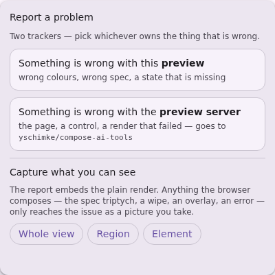
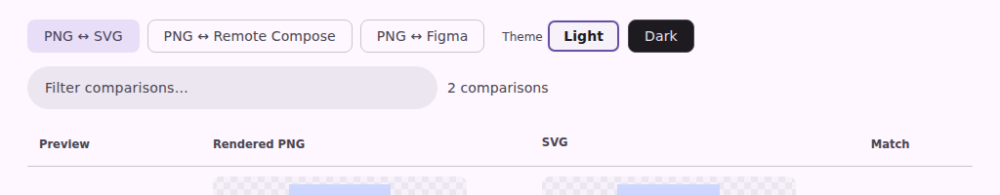
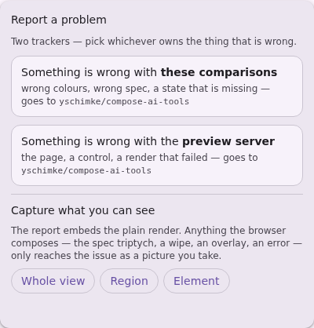
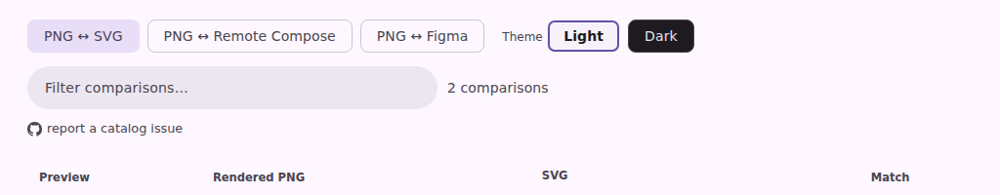

# The comparison wall can be reported against its own catalog

Issue [#4289](https://github.com/yschimke/compose-ai-tools/issues/4289): filed from
`/wear-m3-catalog/compare?format=reference` — "preview server opens up a bug report, but no
action trying to open against a catalog."

The floating launcher offers two trackers, and the catalog half is
[`ServeWeb.reportIssueHtml`](../../../cli/src/main/kotlin/ee/schimke/composeai/cli/serve/ServeWeb.kt)'s
`#cp-report`, which
[`reportLauncher.ts`](../../../cli/serve-web/src/chrome/reportLauncher.ts) unhides and completes
on the pages that carry one. The comparison wall carried none — and `.cp-fab-choice`'s
`display: grid` out-specified the UA's `[hidden]` rule, so the entry was drawn anyway, wired to
nothing and naming no repository. Pressing it did nothing, which is exactly what the report says.

Both shots are the committed page fixture
(`vscode-extension/preview-harness/fixtures/pages/serve-format-compare.html`, light theme,
production CSS + JS), captured with Playwright through the page harness:

```sh
UPDATE_SERVE_WEB_FIXTURES=true ./gradlew :cli:test --tests '*ServeWebFixtureTest*'
HARNESS_FIXTURE=serve-format-compare npm --prefix vscode-extension run harness:snapshot
```

| Pair | What changed |
| --- | --- |
| `launcher-{before,after}.png` | the launcher's catalog half: a dead "Something is wrong with this **preview**" naming no repository → a live "Something is wrong with **these comparisons** — goes to `yschimke/compose-ai-tools`" |
| `wall-links-{before,after}.png` | the wall's controls gained the "report a catalog issue" affordance the launcher points at |

## Before





## After





The wall's report is **page-scoped**: it names the page and the lane its query selects, the catalog
build and the tool version, and drops the preview-shaped rows — the page shows every comparable
component and singles out none. A single row's own defect keeps the better route it already had:
its reference opens the focused Reference / Diff / Actual page, whose report names that exact
preview and reference.

The state is now a committed baseline of its own (`serve-format-compare-report-menu`, alongside the
viewer's), so every later change to this panel is diffed by the PR bot without anyone remembering
to look; `contract · the report launcher offers a catalog only where one can be filed` in
`pages-snapshot.spec.mjs` pins the CSS half, which no DOM-only test can see.
