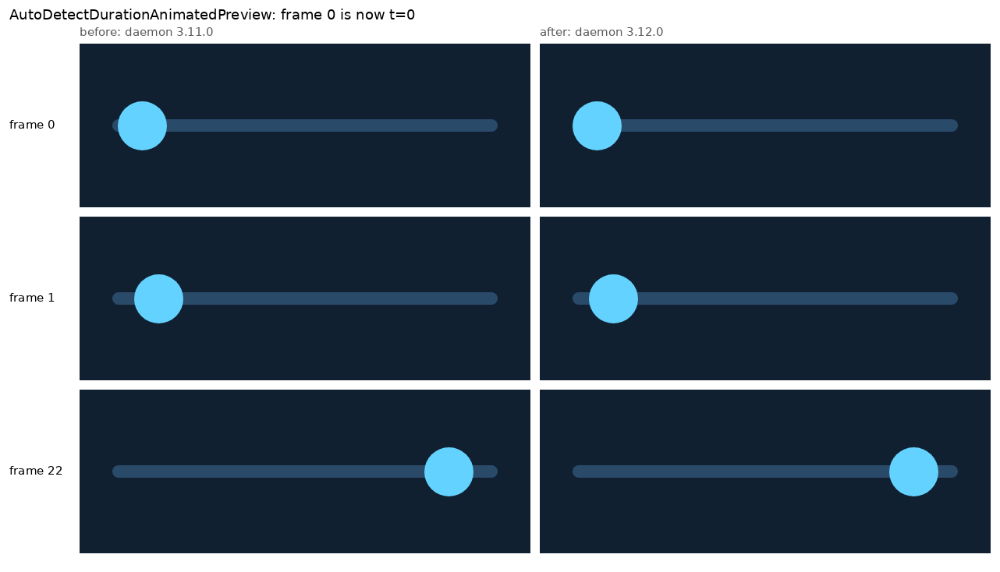
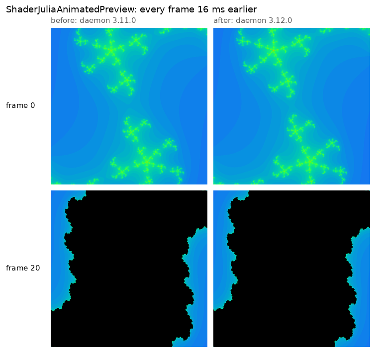

# Desktop `@AnimatedPreview` phase shift in compose-preview-daemon 3.12.0

Evidence for yschimke/compose-ai-tools#5670, which bumps `composeai-preview-daemon` 3.11.0 → 3.12.0.
The preview diff bot flagged three `:samples:cmp` animated GIFs (`AutoDetectDurationAnimatedPreview`,
`ShaderJuliaAnimatedPreview`, `ShaderRaymarchAnimatedPreview`). They are not a regression. Every frame
now lands exactly 16 ms (one test frame) earlier in the animation, and frame 0 is the animation's
`t = 0`.





## Both lanes are deterministic

Run at `d5b375b` with the daemon pin set locally, three `--rerun` renders per version:

```
scripts/agent-gradle.sh --max-workers=2 :samples:cmp:composePreviewRender --rerun \
  --preview AutoDetectDurationAnimatedPreview --preview ShaderJuliaAnimatedPreview \
  --preview ShaderRaymarchAnimatedPreview
```

| Preview | 3.11.0 (3/3 runs) | 3.12.0 (3/3 runs) |
| --- | --- | --- |
| AutoDetectDuration | `e2f41874…` | `2316b2e6…` |
| ShaderJulia | `8a9e6ffa…` | `6ae8bd56…` |
| ShaderRaymarch | `513930f8…` | `ad4a3369…` |

The 3.11.0 hashes match the `compose-preview/main` baseline and the 3.12.0 hashes match the PR's CI
render byte for byte. The slider thumb centre in AutoDetect sits at x = 80, 101, 121, … px before
and x = 73, 94, 114, … px after. 73 px is the track start (16 dp padding plus a 12 dp radius at
2.625×), and the 7 px offset is 16 ms of the 164 dp / 1000 ms sweep.

## Why

compose-preview-daemon#198 runs `DesktopRendererMain.main` on the AWT EDT, and that includes
`renderAnimatedPreview`'s `runSkikoComposeUiTest` block. CMP 1.11.1's `SkikoComposeUiTest.setContent`
only calls `waitForIdle()` when it is called **off** the UI thread. With `mainClock.autoAdvance =
false`, that wait renders the scene once at the current clock time, which is `t = 0`.
`BaseComposeScene.render` flushes the queued effects first (so the `InfiniteTransition`'s
`LaunchedEffect` parks in `withFrameNanos`) and then sends a frame at 0 ns. That frame fixes the
transition's start time at 0.

- **3.11.0, off the EDT:** the start time was fixed at 0. The renderer's `advanceTimeByFrame()` then
  moved to 16 ms before capturing frame 0, so frame 0 showed 16 ms of progress.
- **3.12.0, on the EDT:** `setContent` skips the wait, so no frame runs at 0. The first frame is the
  16 ms one from `advanceTimeByFrame()`, the transition starts there, and frame 0 shows 0 ms of
  progress.

`DesktopAnimatedRenderer` says frame 0 should be "read at (near) its start value", so 3.12.0 is the
output it intends.

## Unrelated issue found while measuring (present in both versions)

`mainClock.advanceTimeBy(frameInterval)` rounds up to whole 16 ms frames. The 33 ms default step
actually advances 48 ms, and the shaders' 50 ms step advances 64 ms, while the GIF delays still say
33 ms and 50 ms. Desktop animated GIFs therefore play about 1.45× (and 1.28×) too fast. The 40-frame
shader loops cover 2560 ms of a 2000 ms period, so they are not seamless. The fix belongs in
compose-preview-daemon (`advanceTimeBy(frameInterval, ignoreFrameDuration = true)`), not here.
