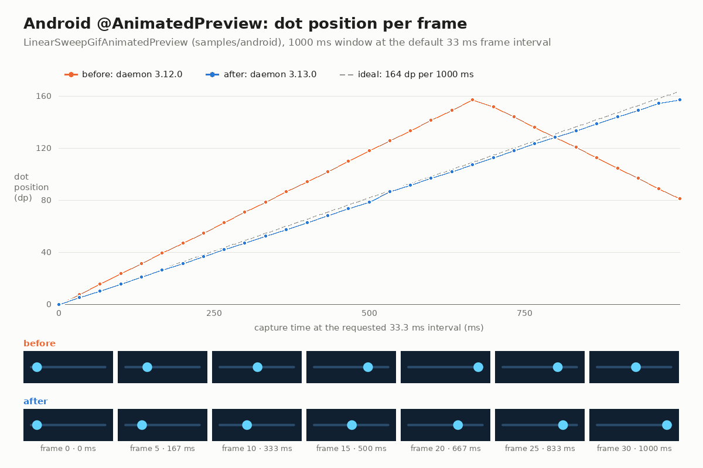
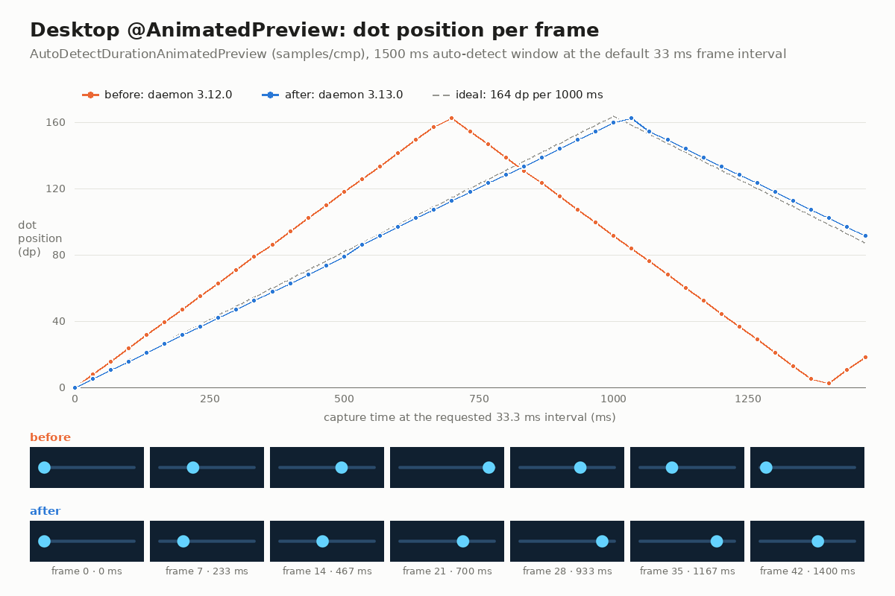
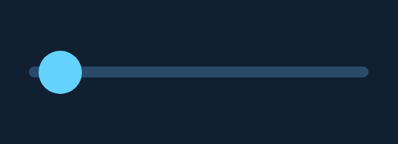

# Motion timing and Android APNG in compose-preview-daemon 3.13.0

Evidence for the pull request that bumps `composeai-preview-daemon` 3.12.0 → 3.13.0 and turns on
`animatedPreviewApngSupported` for the Android discover task.

Before 3.13.0 both renderers advanced an `@AnimatedPreview` capture in whole 16 ms test frames, so
the default 33 ms interval moved the animation 48 ms per frame. Captures played about 1.45× fast,
and a 1000 ms window covered about 1450 ms of animation. Daemon 3.13.0 advances each capture by the
exact interval: compose-preview-daemon#203 fixed desktop and #206 fixed Android. It also spreads GIF
delay rounding so the delays sum to the captured timeline (#204), writes APNG frames as changed
regions with per-frame delays (#207), and lets the Android renderer honour
`@AnimatedPreview(format = Apng)` (#208).

## Per-frame motion

Both samples sweep a dot across its 164 dp track in 1000 ms at constant speed, so the dot's position
on each frame gives the capture's real clock. The dashed line is the ideal position at the requested
interval.





| Preview (33 ms interval) | Lane | Step per frame, 3.12.0 | Step per frame, 3.13.0 | Ideal | Track end reached, 3.12.0 → 3.13.0 |
| --- | --- | --- | --- | --- | --- |
| `LinearSweepGifAnimatedPreview` | Android | 20–21 px (7.8 dp) | 13–14 px (5.2 dp) | 5.4 dp | frame 20 → frame 30 (667 ms → 1000 ms) |
| `AutoDetectDurationAnimatedPreview` | Desktop | 20–21 px (7.8 dp) | 13–14 px (5.2 dp) | 5.4 dp | frame 21 → frame 31 (700 ms → 1033 ms) |

Pixels are at density 2.625 (578 px for 220 dp). In both lanes the step drops by the factor
48 / 33 ≈ 1.45, and the dot now reaches the end of the track when the animation does.

## GIF delays

Frame counts are unchanged. Only the delays change. GIF stores delays in whole centiseconds, so 3.12.0
wrote 30 ms for every 33 ms frame and lost 3 ms per frame. 3.13.0 writes a 3/3/4 cs pattern
(30, 40, 30, 30, 40, …) that sums to the captured time:

| Preview | Frames | Delay sum, 3.12.0 | Delay sum, 3.13.0 |
| --- | --- | --- | --- |
| `AutoDetectDurationAnimatedPreview` (desktop, 1500 ms window) | 45 | 1350 ms | 1490 ms |
| `LinearSweepGifAnimatedPreview` (Android, 500 ms hold + 1000 ms) | 31 | 2370 ms | 2460 ms |
| `FadeInBoxAnimatedPreview` (Android) | 46 | 2820 ms | 2950 ms |
| `RuntimeShaderAnimatedBlobPreview` (desktop, 50 ms interval) | 40 | 2000 ms | 2000 ms |

At a 50 ms interval the delays were already exact. The shader frames still change: 3.12.0 advanced
48 ms per frame (three ticks), and 3.13.0 advances exactly 50 ms. 39 of 40 frames differ.

The GIFs side by side. A GIF plays at its stored delays, so the "before" copies run visibly fast:

| | 3.12.0 | 3.13.0 |
| --- | --- | --- |
| Android `LinearSweepGifAnimatedPreview` |  |  |
| Desktop `AutoDetectDurationAnimatedPreview` |  |  |

## Android `@AnimatedPreview(format = Apng)`

`LinearSweepApngAnimatedPreview` is the same sweep with `format = MotionFormat.Apng`. On main,
discovery downgraded the request: the Android renderer could only encode GIF, so the plugin warned
and named the output `…-5ddec584.gif`. On this branch it is named `…-5ddec584.apng` and holds an
APNG (`acTL` present, 31 frames, delays 500 ms then 33.3 ms each, 2466.7 ms in total).

| 3.12.0: request written as GIF | 3.13.0: APNG (display copy, `.apng.png`) |
| --- | --- |
|  |  |

The `.apng.png` suffix follows the display-copy convention the preview diff publishes (see
`../apng-display-copy/`), because a browser only plays an APNG served as `image/png`.

## Reproducing

Before is `origin/main` at `69e5855` with `samples/android/.../MotionTimingPreviews.kt` copied in.
After is this branch. Commands:

```
scripts/agent-gradle.sh :samples:cmp:composePreviewRender --rerun \
  --preview AutoDetectDurationAnimatedPreview --preview 'RuntimeShaderAnimated*'
scripts/agent-gradle.sh :samples:android:composePreviewRender --rerun \
  --preview 'LinearSweep*' --preview FadeInBoxAnimatedPreview
```

Two `--rerun` renders of the after side produced byte-identical files: `9e12c545…`, `f1a7ce29…`,
`1c2a30ab…`, `20d57fe0…` and `30597883…`.
