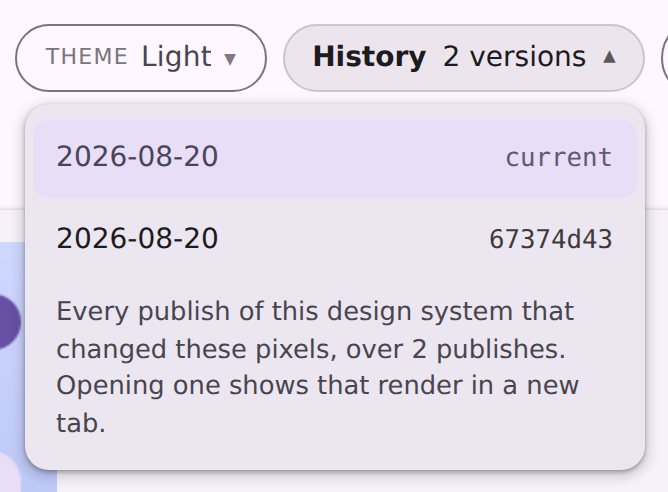

# Render history for the design catalogs

`<cp-history-menu>` has shipped on every viewer page for a while, and it already models exactly the
right thing: [`PreviewHistory`](../../../cli/src/main/kotlin/ee/schimke/composeai/cli/serve/PreviewHistory.kt)
collapses a delivery branch into one entry per distinct render, keyed by blob sha.

On the design catalogs it drew nothing at all. Two reasons, both of them the same mistake — the
lane only ever knew the *baseline* branch layout:

1. **Nothing published a manifest.** The viewer fetches
   `design-artifacts/<system>/history.json`; that branch family has never written one, so the fetch
   404'd and the element rendered `nothing`. Only `compose-preview/main` published a manifest.
2. **Even given one, no entry could be addressed.** `renderUrlAt` hard-required a `renders/` path,
   while these branches store `images/<slug>/<variant>.png`. Every version failed the check, the
   menu fell below its two-entry floor, and it drew nothing a second time.

## Before / after

The same manifest — generated from the real `design-artifacts/wear-m3-catalog` branch — rendered
through the committed `serve-viewer-history` fixture against the old and new
`serve-components.js`. Nothing else differs between the two shots.

### Before


### After



The two entries are `current` and `67374d43`, over "2 publishes" — which is the same answer
[the revision-run markers](../revision-render-runs/README.md) give for that preview, arrived at
independently: those read GitHub's path-scoped commit feed, this reads the branch's own git log.

## Generated from the real branch

`compose-preview inspect history-manifest --layout images` over a `--filter=blob:none` clone of
`design-artifacts/wear-m3-catalog`:

```
482 previews, 655 versions, 0 unstable
```

| versions per preview | previews |
| --- | --- |
| 1 | 348 |
| 2 | 97 |
| 3 | 35 |
| 4 | 2 |

482 matches the `current` inventory in that branch's `preview-index.json` exactly, so every
published preview got a timeline. The media player entry reads:

```json
"media-playerscreen__ideal__default__192dp": {
  "path": "images/media-playerscreen/ideal__default__192dp.png",
  "observations": 2,
  "versions": [
    { "commit": "4a74bc43…", "sourceSha": "fda4c66e", "commits": 1 },
    { "commit": "0b43bf10…", "sourceSha": "67374d43", "commits": 1 }
  ]
}
```

`fda4c66e` and `67374d43` are precisely the two commits that byte-hashing all twelve published
renders of that preview identified as the points where the pixels moved.

## Why no `baselines.json` on this layout

A baseline branch needs that sidecar because `renders/<module>/<basename>` says nothing about which
preview a file belongs to. A design catalog needs nothing: the id the viewer addresses a preview by
*is* its path flattened, which is what
[`ServeCatalogStore.previewIdFor`](../../../cli/src/main/kotlin/ee/schimke/composeai/cli/serve/ServeCatalogStore.kt)
already computes for the routes. The manifest builder reuses that function rather than restating
the rule — a manifest keyed any other way is one the menu silently finds nothing in, which is the
failure this whole change exists to remove.
