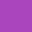

# Real dragged interaction

`resting.png` and `dragged.png` are the desktop daemon's rendered output for the same
`InteractionStateSquare` fixture. The only difference is the addressable
`@OverrideVariant(interaction = Dragged)` drive: a held 24 dp horizontal touch drag changes the
fixture from its resting red to the purple state produced by `collectIsDraggedAsState()`.

| Resting | Held drag |
| --- | --- |
|  |  |

The pair is regenerated by
`OverrideIntegrationTest.interactionVariantsExportTheStateTheyName`; its transient output is under
`daemon/desktop/build/dragged-interaction-evidence/`.
