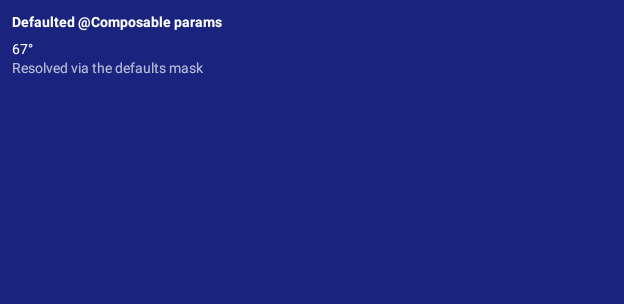

# Evidence: defaulted-parameter Glance previews

Before/after for the fix that made the Glance lane resolve a `@Preview` whose value
parameters all declare defaults.

## Before — no image exists

There is no "before" PNG to show, and that is the defect. With the sample preview added
and the renderer unchanged, `:samples:android:composePreviewRenderAll` fails and the
preview produces an `.error.json` instead of a render:

```
Per-preview render errors (from .error.json sidecars):
  - com.example.sampleandroid.AppWidgetPreviewsKt.DefaultedGlanceWidgetPreview:
    NoSuchMethodException: com.example.sampleandroid.AppWidgetPreviewsKt.DefaultedGlanceWidgetPreview
```

The exception names a function that is plainly there. `getDeclaredComposableMethod(name)`
builds the exact JVM signature it looks for out of the argument types the caller passes —
with none, only `(Composer, int)` — and a fully-defaulted composable compiles to
`(realParams…, Composer, changed…, default…)`.

## After

`DefaultedGlanceWidgetPreview`, with both declared defaults applied (and `temperature`
coming from `WeatherGlanceContent`'s own default):



Its parameterless sibling `NativeGlanceWidgetPreview`, unchanged by the fix — the shape
that always worked, kept alongside so the sample suite covers both:


