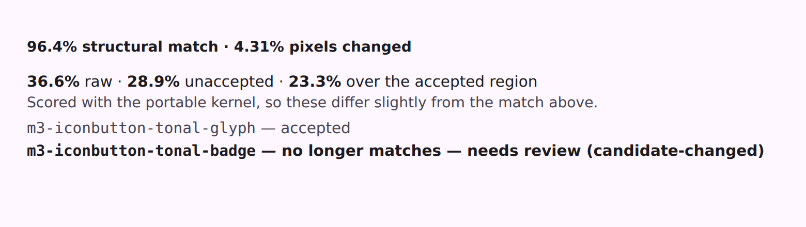
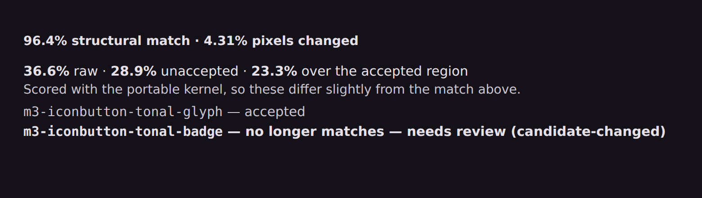
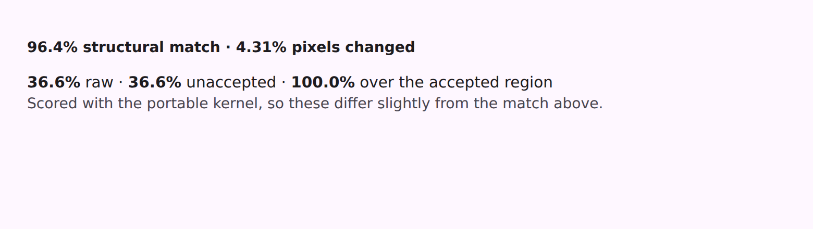
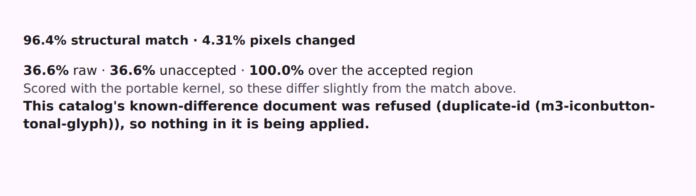
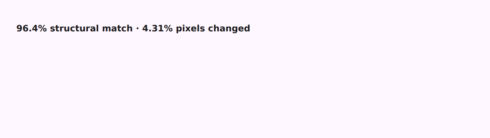
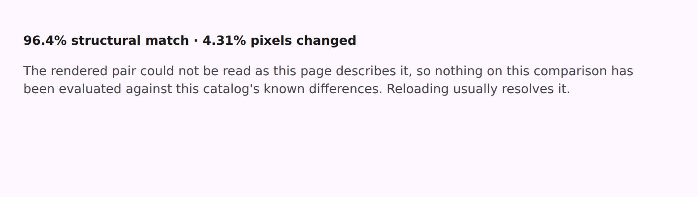

# The acceptance band, on a real evaluation

What a focused comparison says once its catalog has accepted something. Three numbers and a row per
acceptance — and the pictures below are the actual `known-differences.js` bundle running the actual
engine, not a mock of what it would look like.





## What is in the picture

The synthetic catalog behind it has **two** acceptances over one comparison, which is the case a
single aggregate verdict cannot express:

| Acceptance | Recorded | This render | Status |
| --- | --- | --- | --- |
| `m3-iconbutton-tonal-glyph` | the glyph, drawn red | still red | `valid` — accepted |
| `m3-iconbutton-tonal-badge` | the badge, drawn blue | now green | `invalidated: candidate-changed` |

So the band shows one quiet row and one loud one. The loud row is the point of the whole model: a
known difference that has stopped matching what was recorded suppresses **nothing**, and says so,
rather than going on hiding a region nobody has looked at since.

The three numbers are `raw` (the pair as though nothing had been accepted — never hidden), then
`unaccepted`, then the accepted region's own match. None is the difference of the others: `accepted`
is a regional measurement on the same scale, and reading `unaccepted` against `raw` is what gives a
signed "what did acceptance buy".

**The result line above the band and `raw` disagree, deliberately.** Acceptance is measured with the
portable kernel — an exact area average both engines can reproduce — while the result line still
comes from the browser's own `drawImage` filter, which no offline engine can. The band says so in as
many words. The two converge when the versioned rebaseline
([D3](../../parity-batches/00-decisions.md#d3--the-score-rebaseline-is-versioned-and-when)) makes the
portable path the live scorer, which is a change of its own with regenerated baselines and a release
note.

## The two states that are reported by an absence

The band's hard cases are not the ones with a verdict in them — they are the ones where the engine
answers by *leaving something out*, and a reader that takes an absence for "nothing to say" hides
the finding while looking perfectly healthy. Both of these shipped wrong and are shown here before
and after, because the "before" is the argument for the state existing at all.

### A document refused wholesale

A duplicated id rejects the **document**: the engine returns no `statuses`, and reports
`duplicate-id` attributed to the first spelling seen — so the failure carries an id, exactly like a
per-record refusal that does have a row to appear in.

| Before | After |
| --- | --- |
|  |  |

Read the "before" carefully: `100.0% over the accepted region` above an empty list. Every number is
correct and the picture is a lie — it is what a comparison whose acceptances all applied cleanly
looks like, on a comparison where **nothing** was applied.

### A comparison that could not be fetched

With no pair the engine runs its validation-only pass, and every in-scope acceptance comes back
`out-of-scope` — the same token a record authored for another comparison gets, and the one the band
hides itself for.

| Before | After |
| --- | --- |
|  |  |

So a transient 503 on the render lane, or a reference whose bytes no longer match the digest the
page was built from, was indistinguishable from a catalog that has accepted nothing here.

Dark-theme shots of all four sit beside these as `*-dark.png`.

## How these were made

```
# variant ∈ {band, refused, stalled}; the bundle and output path are both overridable, which is how
# the "before" halves above were shot against the previously committed bundle.
node build-band-harness.mjs band /path/to/known-differences.js /tmp/band.html
node shoot-band.mjs /tmp/band.html /tmp/band     # writes /tmp/band-light.png and -dark.png
```

`build-band-harness.mjs` generates the four rasters, resolves the canonical plane with the same
`resolvePlane` the page uses, hashes the artifacts, and writes a page carrying the committed
`serve.css` and the committed `known-differences.js` with a `fetch` stub in front of them. Nothing
about the engine is stubbed — the numbers in the picture were computed by the bundle that ships.

`referenceSha256` in the harness is the **real** digest of the reference bytes the page serves. It
has to be: the adapter hashes what it fetched and checks it against the digest the page hands it, so
a harness declaring a placeholder photographs the stalled band rather than the band.

A live server would have done as well and costs far more to stand up here: the band only renders on a
catalog that has published a `parity/known-differences.json`, and no catalog has yet, because the
publish path shipped in the same batch as the thing that reads it.
