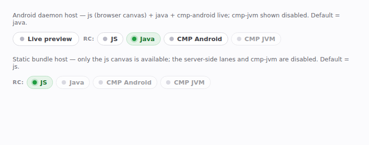
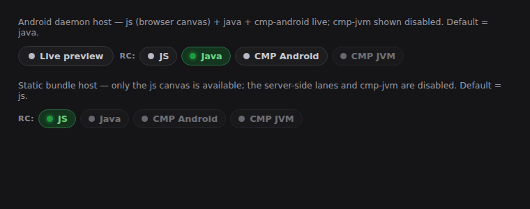

# Remote Compose backend selector (`compose-preview serve`)

> **Superseded.** This records the chip row as it shipped. The viewer now picks a renderer from a
> single combo box (`#cp-lane-select`) beside one chip that names the current player and toggles it
> live — same players, same `rcPlayer=<wire>` wiring, one control instead of six. The current
> surface is captured by the `serve-viewer-rc-players` page fixture. The tables below still describe
> which player is which and where each one runs.

The viewer's per-preview **RC renderer selector** — a chip row that chooses which Remote Compose
player draws a preview's captured `ir/<id>.rc` document. It replaces the former single "RC (browser)"
toggle with the full set of backends the offline `rc-compare` pipeline diffs, surfaced live:

| Chip | Player | Where it runs |
| --- | --- | --- |
| **JS** | vendored `RC.RcdPlayer` | client-side `<canvas>` (no daemon) |
| **Java** | `remote-player-view` `RemoteComposePlayer` (`RemoteComposePlayerKind.VIEW`) | server-side, Android daemon |
| **CMP Android** | vendored embedded `RcPlayer` (`RemoteComposePlayerKind.EMBEDDED`) | server-side, Android daemon |
| **CMP JVM** | embedded player over Skiko | **not available yet** — no draw path, always disabled |

The server-side chips ride the render as `rcPlayer=java` / `rcPlayer=cmp-android`; the JS chip drives
the in-browser canvas lane; `cmp-jvm` is present-but-disabled so it lights up automatically once its
Skiko draw path lands. A host reports its enabled subset via `ServeHost.enabledRcPlayersFor`, so the
selector only offers lanes that actually re-render.

## Rendered selector

The images below are the exact chip markup + CSS the viewer emits (`ServeWeb.viewerPage`), rendered
in the headless Chromium shipped in the agent environment. Two host shapes are shown: a daemon-backed
Android host (js + java + cmp-android live, cmp-jvm disabled, default = java) and a static bundle host
(only the js canvas, default = js).

### Light

### Dark

