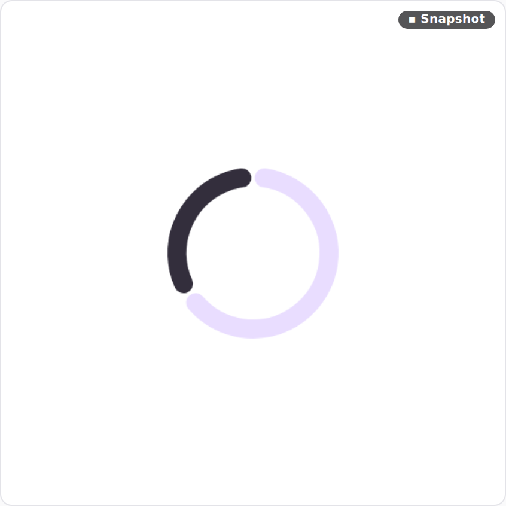

# In-browser Remote Compose canvas lane — visual evidence

The viewer's **RC (browser)** toggle renders a preview's captured Remote Compose
document (`GET /render/<id>.rc`) client-side in a `<canvas>` using the vendored
player (`/rc-player/bundle.js`), with no Robolectric daemon — and Remote Compose
knob edits apply live via `setNamed*Override` + `repaint()`.

| Baked snapshot (daemon-rendered) | Client-side canvas (browser, no daemon) |
|---|---|
|  |  |

The two match: the browser reproduces the daemon render from the same document.

## Reproducing

This surface is a browser canvas the `@Preview` PNG pipeline can't reach, so it's
verified with a Playwright driver against a real `compose-preview serve` process
(`rc-canvas-lane.e2e.mjs`):

```bash
# 1. a bundle dir with a preview PNG + its captured document:
#    <root>/remotem3/previews/CircularProgressRemote.png
#    <root>/remotem3/ir/CircularProgressRemote.rc
./gradlew :cli:installDist
cli/build/install/*/bin/compose-preview serve --bundles <root> --port 8799 --public &

# 2. drive the viewer: click #cp-rc-btn, wait for #cp-rc-canvas, assert non-blank
node rc-canvas-lane.e2e.mjs 8799
```

The script asserts the canvas paints (non-transparent, non-white pixels) after
the toggle, and captures the two screenshots above.
