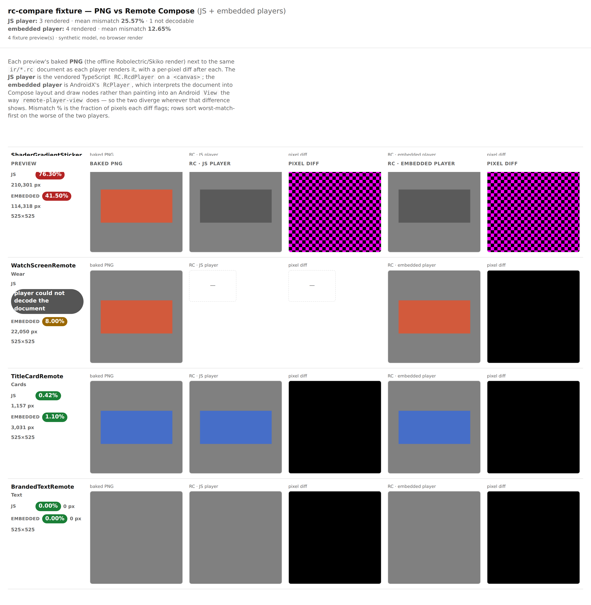
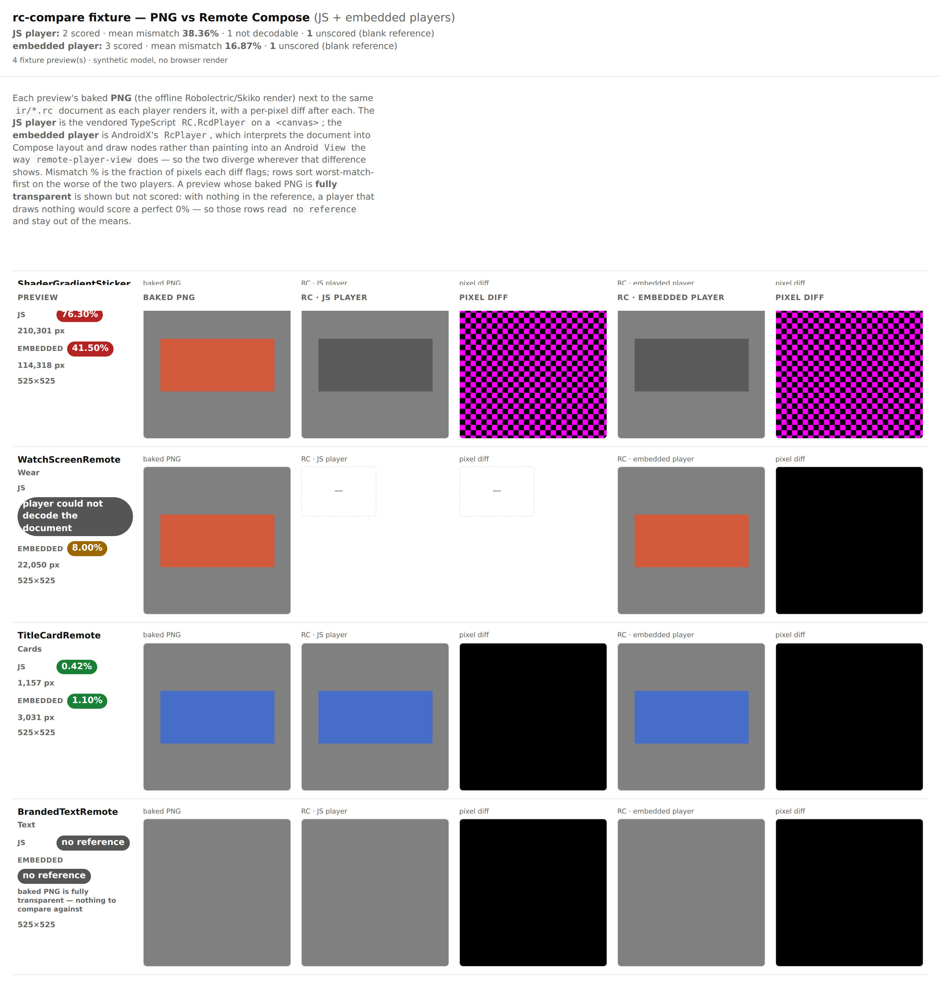

# rc-compare — blank baked reference

Evidence for the guard that stops `rc-compare.html` from scoring a preview whose **baked PNG is
fully transparent**.

## The problem

Both the baked capture and each player's render are flattened onto the same mid-grey before
`pixelmatch` runs (see [`rc-compare-pixels.mjs`](../../../../scripts/design-artifacts/rc-compare-pixels.mjs)
for why). When the baked capture carries no opaque pixel at all, "the player drew nothing" and "the
player matched the reference exactly" are *the same pixels* — so the diff is empty and the row scores
**0.00%**, in a green "good" band, for a comparison that never happened. It also drags the catalog's
mean mismatch down, making the parity numbers look better than they are.

This is not hypothetical: `BrandedTextRemote` and `IconRemoteButton` bake to fully transparent PNGs in
the `remote-m3` catalog ([#2931](https://github.com/yschimke/compose-ai-tools/issues/2931)).

## Before

`BrandedTextRemote` (bottom row) reports **0.00% / 0 px** on both players and is counted in both
means — JS mean **25.57%**, embedded mean **12.65%**.



## After

The same row reads **no reference** on both lanes, carries the reason inline, sorts to the bottom
rather than the top, and is excluded from both means — which rise to the truthful JS **38.36%** and
embedded **16.87%**, with `1 unscored (blank reference)` called out in the header.



## Regenerating

Both pages come from the committed fixture, not from a catalog render — no bundle, no browser render
lane, no catalog job (those take 8–38 min depending on how many systems are in scope):

```sh
node scripts/design-artifacts/rc-compare-fixture.mjs --out /tmp/fixture
# then open /tmp/fixture/rc-compare.html, or screenshot it
```

The fixture covers a close match, a diverging one, a document only one player could decode, and the
blank reference, so any future change to the page can be captured the same way.
