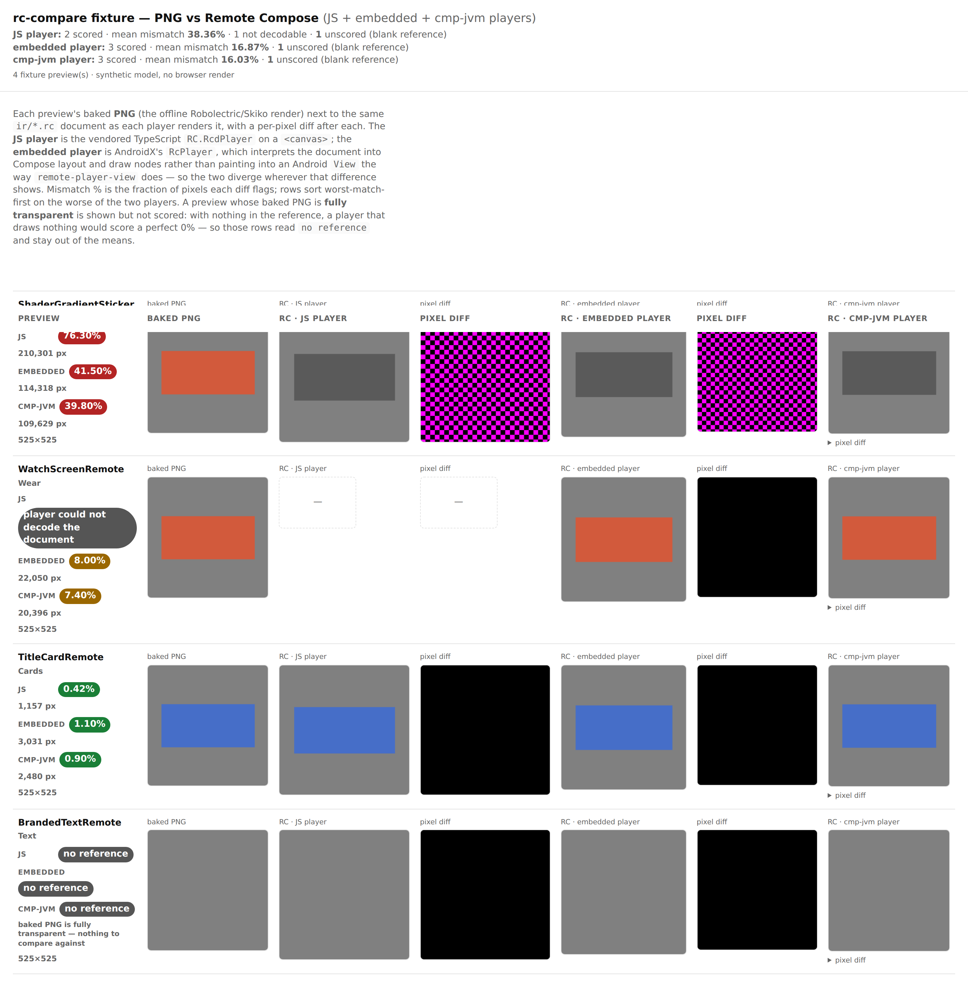
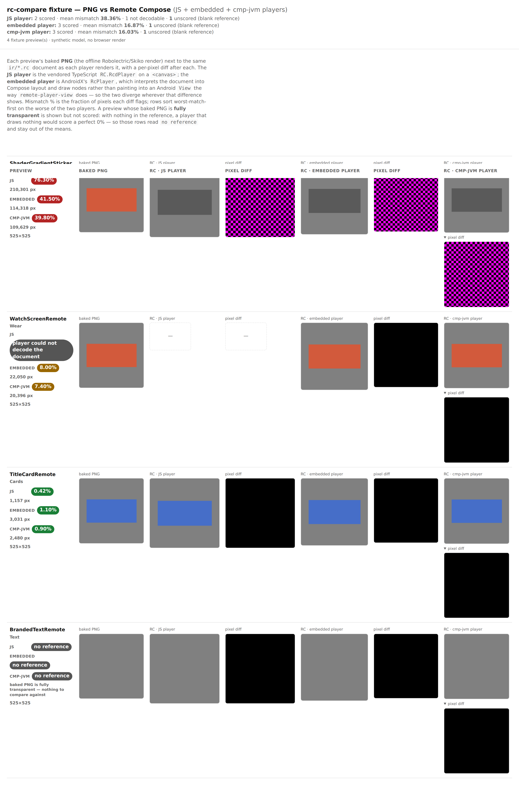

# rc-compare — the cmp-jvm desktop-player lane in CI

Evidence for `rc-embedded-jvm-lane`, the opt-in input that adds a **fourth** lane to the published
`rc-compare.html`: the same captured `ir/*.rc` document rendered through the Compose Desktop / Skiko
embedded player (`:third-party-rc-embedded-player-jvm`), beside the baked PNG, the vendored
TypeScript `RcdPlayer`, and AndroidX's Compose-embedded `RcPlayer`.

It rides on the machinery the Robolectric lane already introduced. `--stage-embedded` now runs once
if *either* lane is on and writes the `<id>.rc` + `manifest.json` both harnesses read; the jvm
harness fills `rc.jvm.output`, and `rc-compare.mjs --embedded-jvm` reads it back. The jvm player
links libGL and draws offscreen, so its Gradle test runs under `xvfb-run` with the libGL the
`desktop-render` deps step installs (that step now also fires on this input).

## Compact by design — one extra column, not two

The point of the layout choice: the JS and embedded lanes each take **two** columns (the render and
its full pixel diff, always shown). The cmp-jvm lane takes **one** — the render, with its pixel diff
collapsed into a `▶ pixel diff` disclosure directly beneath the cell. A reviewer scanning the page
sees a fourth render inline without a fourth full-height diff column pushing everything sideways; the
diff is one click away when a row actually diverges.

Compact (default — the cmp-jvm diff folded):



Expanded (the cmp-jvm `▶ pixel diff` disclosures opened):



The score chips in the left summary column carry all four readings per row (`JS`, `EMBEDDED`,
`CMP-JVM`), and the page header gains a `cmp-jvm player:` summary line. A row whose baked PNG is
fully transparent still reads `no reference` in every lane and stays out of the means.

## How these images were produced

`rc-compare.html` is a visual surface with no runnable capture path in a headless container for the
real per-document renders (they need the `design-artifacts/remote-m3` bundle plus Skiko), so this
evidence is the page emitter run over the checked-in fixture model — the same
`rc-compare-fixture.mjs` the embedded lane uses, now extended with the cmp-jvm lane so any future
change to the page gets before/after evidence for this column for free:

```sh
cd scripts/design-artifacts
npm ci
node rc-compare-fixture.mjs --out /tmp/rc-fixture   # writes rc-compare.html + fixture images
# screenshot /tmp/rc-fixture/rc-compare.html with the bundled Playwright
```

The real per-document renders come from CI: the `remote-m3` catalog — the only tier shipping
`ir/*.rc` — sets `rc-embedded-jvm-lane: true`, so the diff bot's published page scores every document
through the desktop player against its baked PNG.

## Why the fourth lane earns its keep

Scoring the same document through a *third* independent player makes a divergence attributable one
step further: a row where only the cmp-jvm column is off points at the desktop draw seam
(text/image/skiko) rather than the shared expression evaluator both embedded players run, or the
TypeScript player. It also exercises the platform-neutral draw path off Android for real — a file
that only compiles as "neutral" but mis-renders on the JVM shows up here as a diff, not a green pass.

## Cost, and why it is opt-in

Same posture as the Robolectric lane: this is Gradle/Skiko work, not Node, so it defaults to off. A
runner without the desktop deps, or a harness that fails to load the Skia natives, degrades to a page
without the cmp-jvm column and a `::warning::` rather than failing the render this job exists to
publish.
