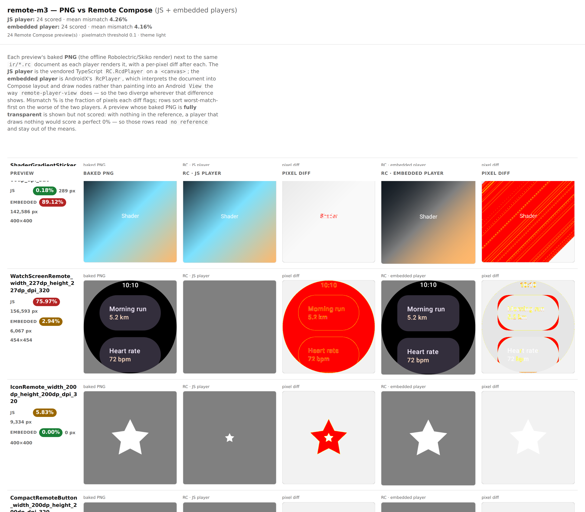

# rc-compare — the embedded-player lane in CI

Evidence for `rc-embedded-lane`, the opt-in input that turns the published `rc-compare.html` into a
three-way page: baked PNG vs the vendored TypeScript `RcdPlayer` vs AndroidX's Compose-embedded
`RcPlayer`.

The driver has supported `--stage-embedded` / `--embedded` since the lane was vendored, but nothing
ran them — `design-artifacts-reusable.yml` invoked `rc-compare.mjs` with neither, so every published
page was two-lane. This wires the three steps together behind an input.

## Produced by running exactly what the workflow runs

Against the real `design-artifacts/remote-m3` bundle, on this machine:

```sh
node rc-compare.mjs --bundle bundle.png --player <rc-player>/bundle.js \
  --out out --stage-embedded /tmp/rc-in           # staged 24 document(s)

./gradlew :third-party-rc-embedded-player:testDebugUnitTest --no-daemon \
  -Prc.embedded.input=/tmp/rc-in -Prc.embedded.output=/tmp/rc-out
                                                  # BUILD SUCCESSFUL in 3m 3s; 24 PNGs, 0 errors

node rc-compare.mjs --bundle bundle.png --player <rc-player>/bundle.js \
  --out out --system remote-m3 --title remote-m3 --embedded /tmp/rc-out
                                                  # 24/24 rendered, mean mismatch 4.26%
```

Result: **JS mean 4.26%, embedded mean 4.16%**, 24 scored in both lanes, 0 blank references.



## Why the third lane earns its keep

Scoring the same document through two independent players is what makes a divergence *attributable*.
The first screen of this run already shows both directions:

| preview | JS | embedded | reading |
|---|---|---|---|
| `WatchScreenRemote` | **75.97%** | 2.94% | JS player draws nothing — the document is fine ([#2930](https://github.com/yschimke/compose-ai-tools/issues/2930)) |
| `IconRemote` | 5.83% | **0.00%** | JS player renders the star far too small |
| `ShaderGradientSticker` | 0.18% | **89.12%** | the reverse — embedded player loses the gradient's colour |

Without the second player, the first two rows look like catalog problems and the third looks like a
clean pass.

## Cost, and why it is opt-in

This is the only part of the workflow needing a Gradle/Android toolchain — the rest is Node. The
harness run above took **3m 3s** for 24 documents, against total `design-artifacts` run times of
8–38 minutes. Cheap, but it requires an Android SDK on the runner, so it defaults to off and a
runner without one (or a harness failure) degrades to the usual two-lane page with a `::warning::`
rather than failing the render.
