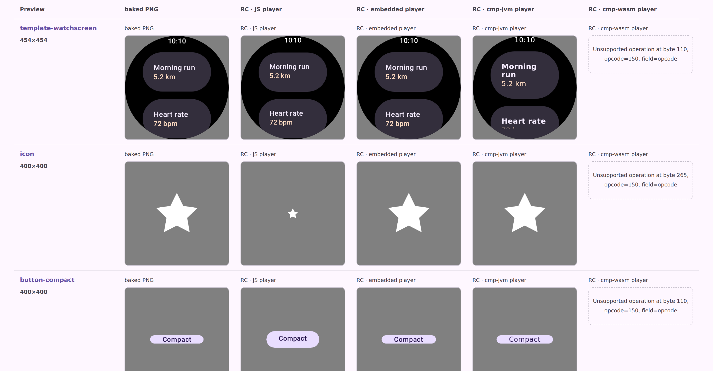
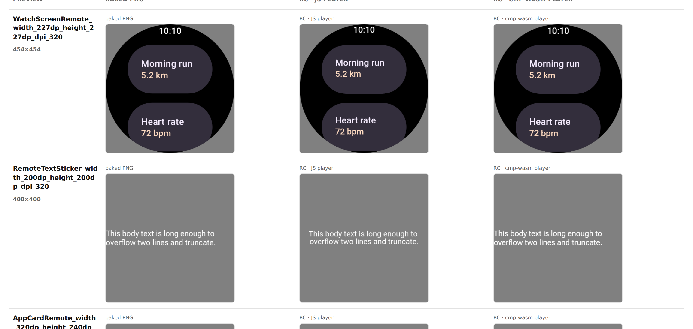

# rc-compare: moving the CMP/Wasm parity guard off the publish job

Evidence for the change that stopped the CMP/Wasm pixel comparison from blocking publication of
`design-artifacts/remote-m3`, and put a delta check on the pull request instead.

## What went wrong

`design-artifacts.yml` ran on every push to `main`, and its remote-m3 job failed at
`Enforce required CMP/Wasm lane` on every run from 7 Aug 2026 14:09 UTC onwards, so
`Publish to design-artifacts/remote-m3` was skipped every time. The lane rendered fine — the last
failing run before this change reported:

```
CMP/Wasm: 27/27 rendered, 0 temporarily allowed, 5 failed.
- CompactRemoteButton      2.17% exceeds 1% without a reviewed tolerance
- CustomShapeRemoteButton  3.71%
- FilledRemoteButton       3.54%
- NamedLabelRemoteButton   3.92%
- RemoteTextSticker        1.58%
- WatchScreenRemote: reviewed tolerance no longer needed — measured 0.94%
```

(run [31220580281](https://github.com/yschimke/compose-ai-tools/actions/runs/31220580281))

Every document rendered; five text-bearing rows sat above an absolute 1% bar. The bar ran *after*
the change that moved them had merged, so it never stopped the regression — it only stopped the
catalog being republished, freezing the public page on the 3 Aug render for five days.

## Before — the published page, five days stale

`https://preview.coo.ee/remote-m3/compare?format=rc`, captured 8 Aug 2026. Every cmp-wasm cell is an
error, from player bugs fixed on 4 and 7 Aug (`ComponentValue` opcode 150 in
[#3244](https://github.com/yschimke/compose-ai-tools/pull/3244), text lookups in
[#3461](https://github.com/yschimke/compose-ai-tools/pull/3461), font resolution in
[#3468](https://github.com/yschimke/compose-ai-tools/pull/3468)) that the frozen branch predates —
the gate hiding four days of fixes to punish one regression it had already let through.



## After — the same corpus through the current player

Same 24 documents from the published bundle, rendered by `rc-player-wasm` at
`1410e67`, driven by `rc-compare.mjs` in headless Chromium on this container. 24/24 render, mean
mismatch 0.56%, and the lane exits 0 with the pixel numbers reported rather than enforced.



## The replacement guard

`rc-compare-regression.mjs`, run by the `CMP/Wasm Parity` job in `ci.yml`, renders the published
corpus through the PR's player and compares each row to the baseline published beside it. Verified
against real data in-session:

```
$ node rc-compare-regression.mjs --baseline <published summary> --current <local run>
CMP/Wasm parity vs baseline: 0 regression(s), 24 improvement(s), 0 unchanged (±0.25 pp), 0 new, 0 dropped.
✓ …AppCardRemote…: now renders
…

$ node rc-compare-regression.mjs --baseline <local run> --current <second local run>
CMP/Wasm parity vs baseline: 0 regression(s), 0 improvement(s), 24 unchanged (±0.25 pp), 0 new, 0 dropped.
```

The second command is the noise control: two independent local runs over the same corpus produce
identical mismatch percentages for all 24 rows, so the 0.25 pp delta has real headroom. The
0.26% → 2.17% jump on `CompactRemoteButton` that this job exists to catch is nearly eight times it.

## What it costs

Measured on this container rather than estimated:

| Step | Time |
| --- | --- |
| `rc-compare.mjs` over 24 documents (render, diff, page) | **41 s** |
| `:rc-player-wasm:wasmPlayerDist`, warm | **7 s** |
| `:rc-player-wasm:wasmPlayerDist`, cold with Gradle cache hits | ~3 min |

The comparison itself is cheap; the job's cost is the cold Kotlin/Wasm build and the Chromium
download, which is why it reads the shared `buildfetch-cache` (the player compiles come back
`FROM-CACHE`). Nothing here re-renders the catalog, so there is no Android/Robolectric time in it at
all.

The job runs `continue-on-error` and posts a sticky PR comment with the report: it makes the delta
visible and leaves the merge decision to a human, rather than blocking on a number that depends on a
delivery branch the PR does not control.
