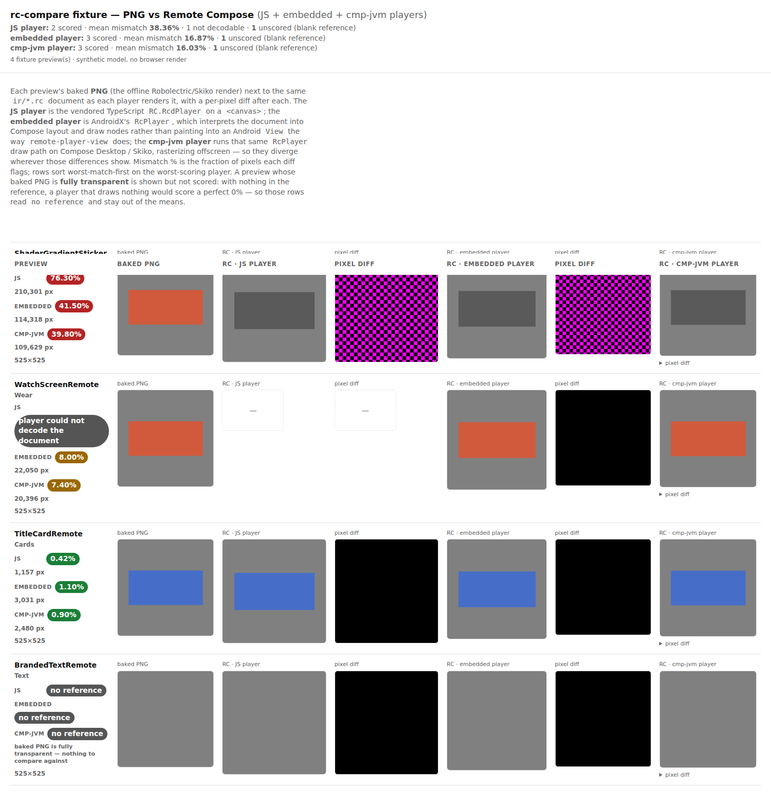
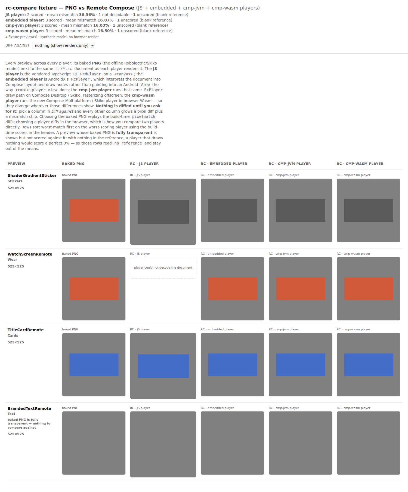
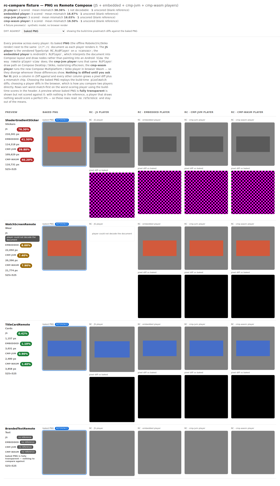
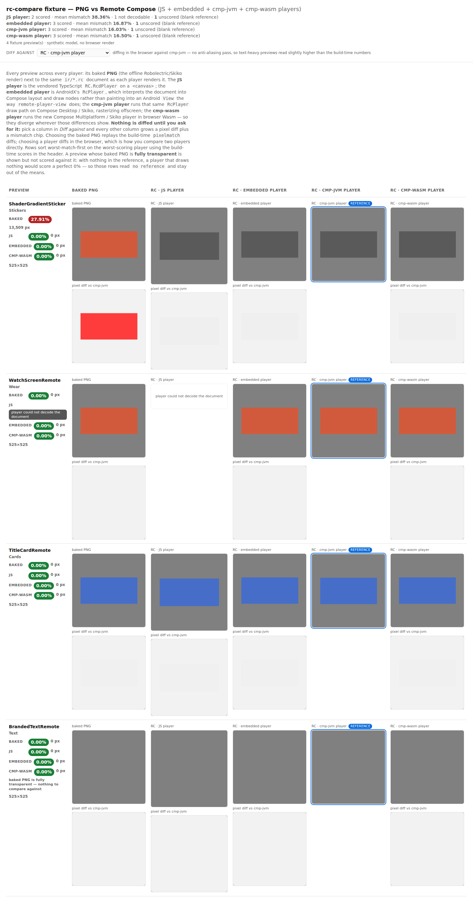

# rc-compare — all players side by side, diffing opt-in

`rc-compare.html` used to be a diff page that happened to show renders: every player lane arrived
paired with a pixel diff against the baked PNG, always rendered, always on screen. Two consequences.
The page grew two columns per lane until the cmp-jvm lane had to fold its diff into a `<details>`
just to fit — and the *only* question it could answer was "how far is this player from the baked
PNG?". "How far is cmp-wasm from cmp-jvm?" — the two players most likely to drift apart from each
other — had no answer on the page at all.

Now the page opens as a plain wall of **every** player's render, one column each, **nothing
diffed**. Diffing is a choice: pick a column in **Diff against** and every *other* column grows a
pixel diff beneath its render plus a mismatch chip in the row's meta cell.

## Before — diffs forced, one lane per two columns



## After — default state: all players, no diffs

Five columns for five lanes (baked + JS + embedded + cmp-jvm + cmp-wasm), and the reference picker
sitting on `nothing (show renders only)`.



## After — `Diff against: baked PNG`

The build-time answer, unchanged in substance from the old page: the driver's own `pixelmatch` PNGs
and its exact percentages, replayed. No pixels are computed in the browser on this path, so it works
even from a `file://` open where canvas readback is blocked. `BrandedTextRemote` still reads
`no reference` — a fully transparent baked capture is nothing to score against.



## After — `Diff against: RC · cmp-jvm player`

The question the old page could not ask. Nothing precomputes a player-vs-player diff, so the page
computes it on a `<canvas>` using pixelmatch's YIQ metric at the driver's threshold (minus its
anti-aliasing pass, which makes browser numbers read slightly *high* on text-heavy previews — the
toolbar says so). The baked column is now just another lane being scored: it reads 27.91% against
cmp-jvm on the diverging fixture row, while the three players agree with each other at 0.00%.

Note the blank-reference row: against a *player* it scores normally, because two player renders are a
real comparison even when the baked capture is empty. The `no reference` short-circuit is scoped to
the baked lane, not to the whole row.



## How these were produced

`rc-compare-fixture.mjs` — the synthetic-model emitter that exists so page-layout changes get
before/after screenshots without the ~90-minute catalog job — now carries **every** lane, so the
all-players wall and the picker's lane list are both exercised by it:

```sh
node scripts/design-artifacts/rc-compare-fixture.mjs --out /tmp/rc-fixture
# then serve /tmp/rc-fixture over http:// and screenshot at each Diff against setting
```

Serving over `http://` matters for the player-reference shot: `file://` taints the canvas, so
readback throws. The page detects that once and says so in the toolbar rather than writing the same
failure into every row's chips — and the `baked PNG` reference keeps working there, since it needs no
canvas.

## What did not change

The header's per-player means, the summary JSON, and the CI cmp-wasm gate are all still the
**build-time** lane-vs-baked numbers. The picker re-scores what you look at; it does not re-score
what the run recorded. Rows still sort worst-match-first on the build-time worst-scoring player, so
the row order is stable no matter which reference is selected.

One drive-by fix: the column heads carried `position:sticky; top:64px`, which never worked — the
`overflow-x:auto` wrapper is the scrollport they stick to, and it never scrolls vertically, so they
only ever parked behind the page header. They are static now; every cell repeats its lane in its own
figcaption, so scrolling never loses which column is which.
