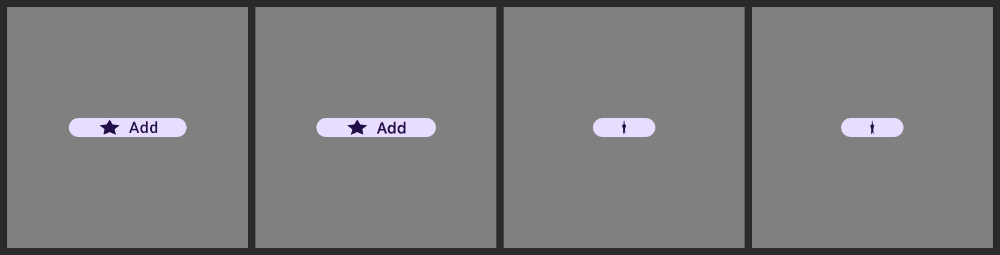
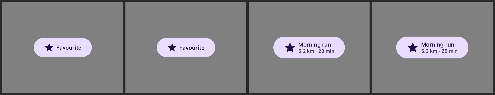
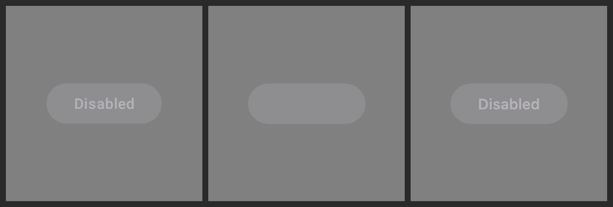

# Evidence: derived colours and wrapped dimensions in the `rc-compare` lanes

Renders from the `remote-m3` catalog (`design-artifacts/remote-m3`, `bundle/bundle.png`, 51 `ir/*.rc`
documents), at each document's captured size and the xhdpi density it bakes dp with. Every still is
flattened onto mid-grey before display, as `rc-compare` does before diffing — the catalog PNGs are
stickers on transparent, and light content on transparent reads as a false match otherwise.

Two defects, both about a colour *computed* by the document rather than written down as a literal,
and both invisible in a way that looked like the rest of the render working:

- **[#4165](https://github.com/yschimke/compose-ai-tools/issues/4165)** — the AndroidX embedded
  player (the `AndroidX Embedded` and `RC · cmp-jvm` columns, the same player on Robolectric and on
  skiko) painted no container behind any button.
- **[#4166](https://github.com/yschimke/compose-ai-tools/issues/4166)** — the CMP player's support
  report refused five documents outright, so the `RC · cmp-wasm` column showed an error string
  instead of a render.

## `icon-large-embedded.png` — #4165

`Button/Icon-Large` (`LargeRemoteIconButton`): **AndroidX Java baked reference | embedded player
before | embedded player after**.


The container is painted from a `ColorExpression` — `tween(surfaceContainer, primaryContainer,
<toggle>)` — inside the `Modifier.drawWithContent` canvas block hanging off the button's box, and
read back by a `PaintBundle.COLOR_ID` a few operations later. The player's computed-op index walks
the operation *tree*, and draw-content operations hang off a component as a field rather than as a
child, so nothing ever ran the expression: `getColor` fell through to a store no one had written and
returned 0. Fully transparent. The star drew over it from a plain `ColorConstant` tint, which is why
every button looked *nearly* right rather than broken.

Every `RemoteIconButton` / `RemoteButton` in the catalog builds its container this way, so the whole
column was affected — this is one representative row.

The remaining difference in the third still is the icon-scale gap the embedded lane already had
(the star renders a little small); it is unrelated to this fix and untouched by it.

## `buttons-cmp-200dp.png`, `buttons-cmp-320dp.png` — #4166

Pairs of **baked reference | CMP player**, for four of the five documents `composeSupportReport` used
to refuse:





Nothing rendered on this lane before — the page printed `WidthModifier[34]: dimension type 2 is not
implemented, HeightModifier[35]: dimension type 2 is not implemented, CoreText[109]: dynamic color id
74 is not declared`. Both halves of that were the report being wrong about a player that could
already draw these:

- **dimension type 2 is `WRAP`**, and wrapping the content is what Compose does when no modifier says
  otherwise — the absence of a modifier *is* the implementation, which is also how AndroidX's
  embedded player spells it (`Type.WRAP -> this // Default`).
- **colour id 74 is declared by a `ColorExpression`**, not by a `ColorConstant`. The player publishes
  literals, expressions and themed colours into one colour store, so a text style reading a computed
  id resolves exactly like one reading a literal.

Across the 51-document corpus the report goes from 42 to 47 fully-renderable (the remaining four are
the web-font specimens, which need the server's font set). Measured against the baked reference with
`pixelmatch` at threshold 0.1, the five newly-rendering documents come out at **0.00–0.20%**.

## `disabled-label-cmp.png` — #4166, second order

`DisabledRemoteButton`: **baked reference | CMP player with the gate fixed | CMP player with the
replay fixed too**.



Un-refusing the document exposed a defect the refusal had been hiding. The disabled label's colour is
`onSurface`'s channels at 38% alpha, and those channels are decomposed by `ColorAttribute` operations
*inside* the container's canvas block, while the `ColorExpression` that consumes them sits after the
block in the layout stream. AndroidX executes one flat operation list in wire order and always sees
them; the CMP player's layout replay skipped the canvas scope, so the alpha resolved to 0 and the
label rendered fully transparent — over a container the same chain painted correctly. Replaying that
scope brings the document from 0.43% to 0.04% against the baked reference.

It is the only document of the 51 whose render changes: diffing the corpus against itself across that
one commit reports a difference for `DisabledRemoteButton` and for nothing else.

## Reproducing

```sh
# the documents
git show design-artifacts/remote-m3:bundle/bundle.png > bundle.png && unzip -o bundle.png 'ir/*'

# the embedded lane (skiko, no Android)
./gradlew :third-party-rc-embedded-player-jvm:test --tests '*RcJvmRenderHarness*' \
  -Prc.jvm.input=<staged dir> -Prc.jvm.output=<out dir>
```

The CMP-lane stills come from `ImageComposeScene` + `RcComposePlayer` at the document's captured size,
the same entry point `:rc-player-compose`'s desktop render tests use.
