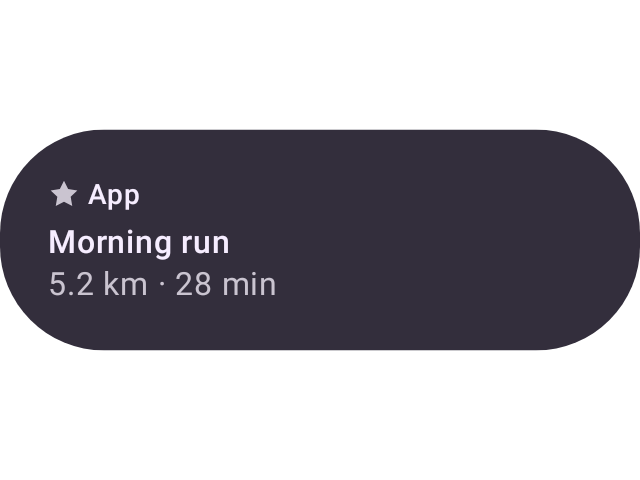
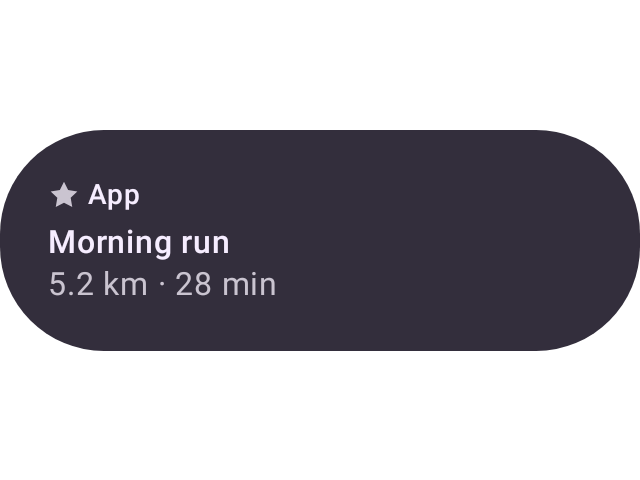
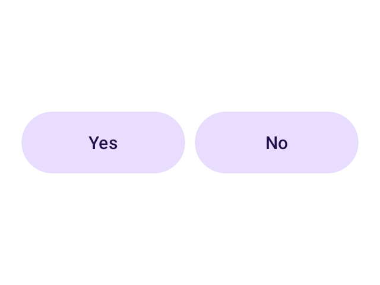
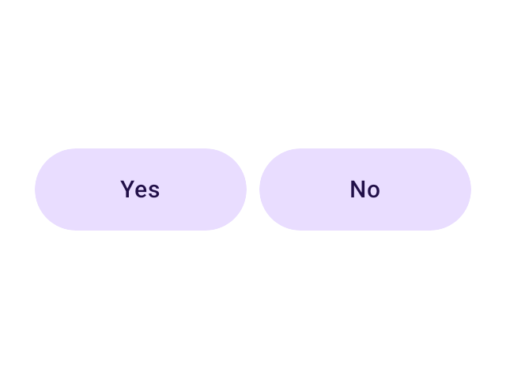

# The embedded `RcPlayer` is the default, not the AOSP view player

Evidence for moving three defaults off `RemoteComposePlayerKind.VIEW` and onto
`RemoteComposePlayerKind.EMBEDDED` — the vendored AndroidX `RcPlayer`
(`:third-party-rc-embedded-player`).

## What moved

| default | before | after |
| --- | --- | --- |
| `RemoteOverridablePreview` / `RemoteOverridablePreviewWrapper` — what a **capture bakes through** | `VIEW` | `EMBEDDED` |
| `RemoteComposeIrReplay` — what an **unqualified daemon replay** draws with | `VIEW` (null → view) | `EMBEDDED` (null → embedded; only an explicit `VIEW` picks the old lane) |
| the served **viewer** | already `cmp-android` since #3936 | unchanged |

The view-backed lane stays reachable two ways: `?rcPlayer=java` on a render, and the new
`RemoteViewPreviewWrapper` annotation for a preview that wants to bake through the framework
`Canvas` (glyph hinting is the usual reason).

Why: the payoff is the data tier rather than the pixels. `java` is `AndroidView { RemoteComposePlayer }`,
so a whole document reaches Compose as one interop leaf — `compose/figma-svg` exports it as a single
raster wearing an `.svg` extension, and the semantics tree describes a black box. The embedded player
emits real Compose nodes, so the same document exports editable geometry and describes the card.

## The pixels barely move

The whole `remote-m3` catalog rendered both ways (`:samples:design-catalog-remote-m3:composePreviewRender`),
diffed with the same `pixelmatch` settings and the same mid-grey flatten `rc-compare` uses:

**56 previews — 31 byte-identical, 25 moved, worst 0.64%.**

| preview | moved |
| --- | --- |
| `ButtonGroupRemote` | 0.641% (1,968 px) |
| `DisabledRemoteButton` | 0.426% (681 px) |
| `IndeterminateCircularProgressRemote` | 0.379% (607 px) |
| `IconLabelSecondaryRemoteButton` | 0.290% (891 px) |
| `TypographyRemote` | 0.278% (854 px) |
| `AppCardRemote` | 0.003% (8 px) |

The residual is text rasterization and sub-pixel layout — Skia and the Android canvas hint glyphs
differently — which matches the earlier all-catalog A/B recorded in `renders/rc-embedded-lane-ab/`.
Painted coverage is unchanged (`AppCardRemote`: 132,843 px → 132,386 px of 307,200; `BrandedTextRemote`:
806 px either way), so nothing stopped drawing.

`AppCardRemote`, the preview from #4442 — 8 pixels apart:

| before (`java`) | after (`cmp-android`) |
| --- | --- |
|  |  |

`ButtonGroupRemote`, the largest mover at 0.64% — a sub-pixel width difference on the pills plus
glyph hinting, not a layout change:

| before (`java`) | after (`cmp-android`) |
| --- | --- |
|  |  |

## What this forces elsewhere

The baked PNG **is** the reference every `rc-compare` lane is scored against, and it used to be a
Java capture. Two things follow:

- The compare page's first column is no longer "AndroidX Java". It is `AndroidX Embedded · baked`
  (the catalog's own capture) and the harness lane it sits beside is `AndroidX Embedded · harness`
  (this repo's Robolectric rasterization of the same player) — so the pair now reads as a
  capture-vs-harness check rather than as two different players.
- `RcPlayerBackend.JAVA.rcCompareLane` is `null`. It pointed at `baked`, which would now serve
  embedded pixels for `?rcPlayer=java` — the #3449 failure (the wrong player's pixels under a
  confident `200`). The java lane routes to the daemon, which can still draw it on request.

## Regenerating

```sh
./gradlew :samples:design-catalog-remote-m3:composePreviewRender
# renders land in samples/design-catalog-remote-m3/build/compose-previews/renders/
```

Render once on `main` and once on this branch, then diff the two directories with `pixelmatch` at
`threshold: 0.1` over `flattenedCopy(png, BG)` from
[`rc-compare-pixels.mjs`](../../../../scripts/design-artifacts/rc-compare-pixels.mjs) — the same
arithmetic the parity page uses, so the numbers above are comparable with its scores.
