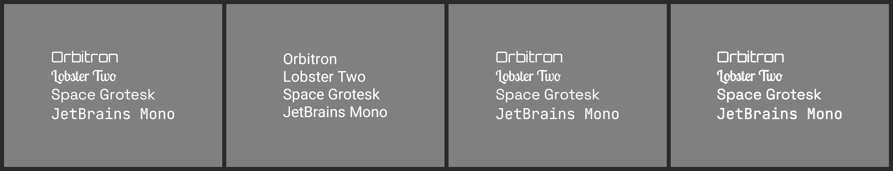
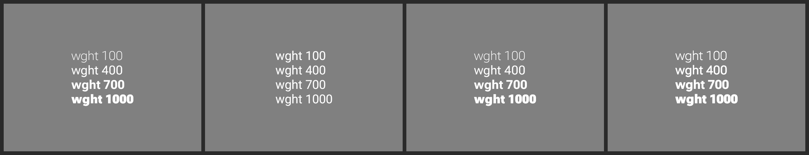
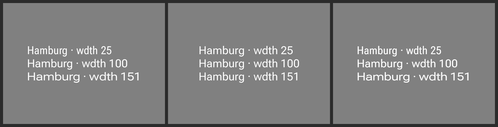

# Evidence: branded typefaces in the two embedded `rc-compare` lanes

Renders of `remote-m3`'s two typeface specimens, flattened onto mid-grey as `rc-compare` does before
diffing. Each strip is **AndroidX Java baked reference | embedded lane as published | embedded
(Android) after | embedded (jvm) after**.

The two columns the compare page labels `AndroidX Embedded` and `RC · cmp-jvm` are the same vendored
AndroidX player on two platforms, and both drew every branded family in the platform default
([#4170](https://github.com/yschimke/compose-ai-tools/issues/4170)). The published column is shown
once because the two were identical in this respect.

## `typeface-specimen.png` — a named `google:` family



The document names `google:Orbitron`, `google:Lobster Two`, `google:Space Grotesk` and
`google:JetBrains Mono` and carries no embedded font data, so each has to be resolved by the host.

Neither embedded lane could. Off Android the jvm player has a downloader
(`GoogleFontTypefaceResolver`) but is only given a cache directory to put it in when the render sets
`composeai.fonts.cacheDir` — and the `rc-compare` step never passed it. On Android the player hands
the name to Compose's downloadable-font path, which needs a font *provider* to answer: under
Robolectric that means the `FontsContractCompat` shadow, which the daemon's render carries and this
harness does not.

So the fix is in two places, and neither is the resolution logic:

- both lanes are handed `composeai.fonts.cacheDir` — the same machine-local cache the catalog's own
  baked render warmed earlier in the job — by
  [`design-artifacts-reusable.yml`](../../../../.github/workflows/design-artifacts-reusable.yml), and
  `:third-party-rc-embedded-player` forwards it to its test JVM the way the jvm module already did;
- the Android player resolves an unvaried `google:` family from that cache before falling through to
  the provider path, which is what the jvm player already does with the same request. Gated on the
  cache being configured, so a device — where the property is never set — keeps the provider path
  untouched.

## `typeface-variableweight.png` — the same family at four `wght` instances



`google:Roboto Flex` at `wght` 100/400/700/1000. The published column shows what a substituted face
costs beyond the letterforms: with no variable file to instance, all four lines render at one weight.
Both lanes now match the reference's ramp.

This lane already had the code to apply axes — `GoogleFontFamilies` resolves the family's variable
file and attaches a `FontVariation.Settings` — but it too reads the cache through
`composeai.fonts.cacheDir`, so it was inert for the same reason.

## `wdth`: fixed here too, and one lane still short

`typeface-variablewidth` asks for the same family at `wdth` 25 / 100 / 151. Eyeballing the strip is
useless — the three lines carry different strings — so this is the ink width in px of `Hamburg`, the
one token they share:

| lane | `wdth 25` | `wdth 100` | `wdth 151` | |
| --- | --- | --- | --- | --- |
| AndroidX Java (reference) | 153 | 174 | 203 | ✅ |
| RC · JS player | 175 | 175 | 175 | ❌ |
| RC · cmp-wasm player | 155 | 176 | 205 | ✅ |
| AndroidX Embedded, published | 176 | 176 | 176 | ❌ |
| AndroidX Embedded, with the cache | 155 | 176 | 205 | ✅ |
| RC · cmp-jvm, published | 196 | 196 | 196 | ❌ |
| RC · cmp-jvm, with the cache | 159 | 181 | 212 | ✅ |

Both embedded lanes were flat for the reason this change fixes — with no face resolved there was
nothing to vary — and both ramp once they have the cache. What is left is the **JS player**, flat at
175 across all three, in a face that does not look like Roboto Flex either:



*AndroidX Java (reference) | RC · JS player | RC · cmp-wasm player.* Tracked separately; the likely
cause is that the Google Fonts CSS API serves a baked static instance even for a purely variable
family, so that lane has no `fvar` table to apply `wdth` to. Weight survives that only because it
can be synthesised.

## Reproducing

```sh
git show design-artifacts/remote-m3:bundle/bundle.png > bundle.png && unzip -o bundle.png 'ir/*'
```

Stage the two documents with a `manifest.json` (`id`, `width`, `height`, `density`), then:

```sh
./gradlew :third-party-rc-embedded-player:testDebugUnitTest --tests '*RcEmbeddedRenderHarness*' -Prc.embedded.input=<staged> -Prc.embedded.output=<out> -Pcomposeai.fonts.cacheDir=$HOME/.cache/composeai/fonts
```

```sh
./gradlew :third-party-rc-embedded-player-jvm:test --tests '*RcJvmRenderHarness*' -Prc.jvm.input=<staged> -Prc.jvm.output=<out> -Pcomposeai.fonts.cacheDir=$HOME/.cache/composeai/fonts
```

Dropping the `composeai.fonts.cacheDir` flag reproduces the published column.
