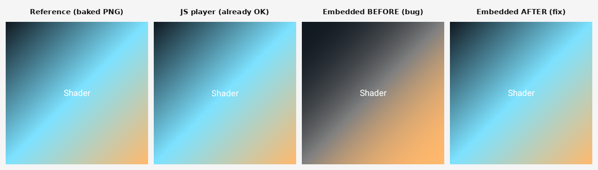

# rc-compare — embedded player resolves a gradient's bound colour stop

Evidence for the `RcPlayerPaint` fix that makes the embedded player (`RcPlayer`) resolve a
gradient stop that is a **colour-id reference** rather than a literal ARGB int.

## The bug

`ShaderGradientSticker` is a three-stop linear gradient — navy `#101820` → **`shaderColor`
(cyan `#7DE2FF`)** → gold `#FFB86C` — whose middle stop is a named/overridable value
(`rememberOverridableRemoteColor("shaderColor", …)`) so the connector can recolour it live. The two
literal endpoints serialise as plain ARGB ints; the bound middle stop serialises as a **colour-id
reference**, flagged in the bitmask packed into the `PaintBundle.GRADIENT` meta word's high 16 bits.

`remote-core` resolves those flagged stops into its `mOutArray`, and both the View player and the
vendored JS player read the resolved value. The embedded player, though, reads the raw `mArray` via
reflection and resolves references inline per op (the `COLOR_ID` path calls `read.getColor(id)`) —
but the `GRADIENT` handler masked the meta word down to the colour count and read **every** stop as a
literal. The bound stop therefore reached `Color(...)` as raw reference bits and rendered as a
transparent / mid-grey band, collapsing the cyan through the whole gradient.

This is the ~89% `ShaderGradientSticker` divergence the `rc-compare` embedded lane surfaced. Despite
the preview's name it never touches the AGSL `RuntimeShader` seam (`RcPlayerShaders.kt`) — it is a
plain `PaintBundle.GRADIENT` fill.

## The fix

Read the whole meta word, extract the `register` bitmask, and resolve each flagged stop through
`read.getColor(word)` — the same reactive lookup the `COLOR_ID` path uses, so a live recolour also
repaints.

## Evidence

Rendered through the real `design-artifacts/remote-m3` bundle's
`ShaderGradientSticker` document (400×400, dpi 320) with the one-document
`RcEmbeddedRenderHarness`, before and after the change:



Mid-stop pixel on the gradient's 50% iso-line (away from the "Shader" text):

| render | mid-stop RGB | vs reference |
|---|---|---|
| Reference (baked PNG) | `(125, 226, 255)` | — |
| JS player | `(125, 226, 254)` | already correct |
| Embedded **before** | transparent → grey/`(0,0,0)` | wrong (band collapses) |
| Embedded **after** | `(125, 226, 254)` | matches |

The embedded render now tracks the baked reference across the whole gradient (mid-stop, quarter
points, and endpoints all within 1 LSB), matching the JS player's ~0.2% rather than the pre-fix
~89%.

## Reproduce

```sh
# stage just this document from the published bundle, then render it through the harness
./gradlew :third-party-rc-embedded-player:testDebugUnitTest \
  -Prc.embedded.input=<dir with ShaderGradientSticker.rc + manifest.json> \
  -Prc.embedded.output=<out> --tests '*RcEmbeddedRenderHarness*'
```
