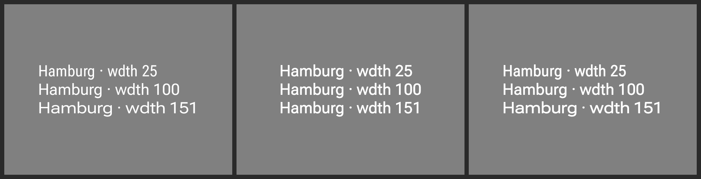

# Evidence: the JS player's `wdth` ramp, and why it only broke in a catalog run

`remote-m3`'s `typeface-variablewidth` document asks for `google:Roboto Flex` at `wdth` 25 / 100 /
151. On the `RC · JS player` lane all three lines drew at one width
([#4177](https://github.com/yschimke/compose-ai-tools/issues/4177)).

## `wdth-lanes.png`

**AndroidX Java baked reference | JS player before | JS player after**, flattened onto mid-grey the
way `rc-compare` does before diffing.



Eyeballing this is unreliable — the three lines carry different strings — so the number that matters
is the ink width in px of `Hamburg`, the one token they share:

| | `wdth 25` | `wdth 100` | `wdth 151` |
| --- | --- | --- | --- |
| AndroidX Java (reference) | 153 | 174 | 203 |
| JS player, before | 176 | 176 | 176 |
| JS player, after | 162 | 177 | 205 |

## Why a per-document test could not see it

The document renders correctly **on its own**. `rc-compare.mjs` renders a whole catalog into one
page, and the page is where the state lives:

1. `VariableWeightRemote` renders first and asks the CSS API for `Roboto Flex` over `wght` — the
   request that returns a genuine variable face rather than a pinned instance.
2. `VariableWidthRemote` renders next and asks for `wdth`. `registerStylesheet` short-circuited on
   "the page already carries a variable face for this family", which was true — of a face whose
   `wdth` is pinned at 100%. The request was skipped and the ramp drew flat.

That short-circuit is right about a face the *host* vendored and wrong about one the player fetched
itself, so it now consults a set of the families this module has already asked for. Reproduced by
rendering the two documents in that order into one page, and measured with the table above; rendered
alone, the width specimen is fine either way.

## The defect the fix exposed

With the axis applied, the widest line was **clipped mid-word** — `Hamburg · wdth 1`. The text had
been measured before the variable face arrived, in the fallback, and `repaint()` re-paints without
re-measuring. Reloading the same document once the faces were present laid it out correctly, which
is what identified it as a stale measure rather than a paint fault.

`fontsReady()` now invalidates the document's measure. That is the call a single-shot renderer makes
between the paint that *discovers* the families and the frame it keeps, so it is exactly where the
guarantee belongs; `onFontLoaded` already invalidates for faces that arrive through it, but a
variant already marked done notifies no one.

## Scope of the change

The rebuilt bundle was diffed against the previous one across all 51 catalog documents: two differ.
`VariableWidthRemote` is the fix. `IndeterminateCircularProgressRemote` is an animation and differs
run-to-run with the *same* bundle, so it is noise — verified by rendering the old bundle twice.

## Reproducing

```sh
git show design-artifacts/remote-m3:bundle/bundle.png > bundle.png && unzip -o bundle.png 'ir/*'
```

Then render `VariableWeightRemote` followed by `VariableWidthRemote` into a single Playwright page
with `cli/src/main/resources/rc-player/bundle.js`, using the same sequence `rc-compare.mjs` uses per
document (`loadFromArrayBuffer` → `repaint` → `await fontsReady()` → `repaint`). The hermetic version
of exactly this is
[`rc-font-axis-order.test.mjs`](../../../../scripts/design-artifacts/rc-font-axis-order.test.mjs),
which serves the repo's vendored variable Roboto Flex from a fake CSS API and asserts both halves.
