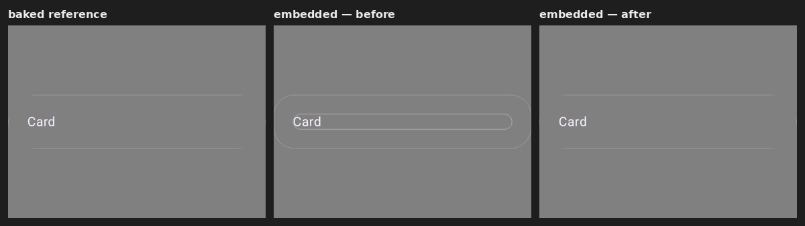
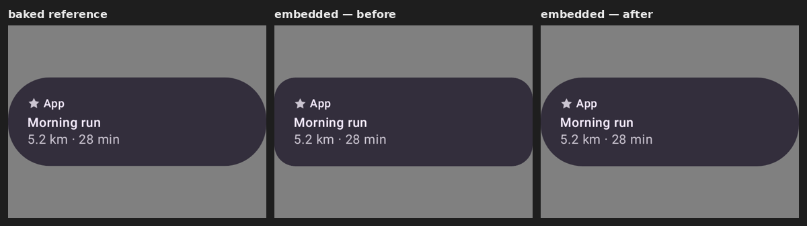

# rc-embedded-player — component chrome drawn twice

Evidence for the fix that stops the **embedded** player (`RcPlayer`) from drawing a component's
background/border chrome twice — which stroked a spurious inner outline hugging the content of any
padded, bordered component (most visibly `OutlinedCardRemote`).

## The bug

`RcPlayerComponent` built a component's modifier with
`componentModifiers.toModifier(component.getDrawContentOperationsListReflection())`. `toModifier`
already draws that `drawOpsList` — its `DrawContentOperation` branch (or its fallback for a component
with no explicit content marker) wraps the chrome ops in a `drawWithContent`. Immediately afterwards,
`RcPlayerComponent` executed the **same** `drawOpsList` a second time in its own `drawWithContent`.

Because the two `drawWithContent` wrappers sit at different points in the modifier chain, they render
the chrome at different sizes. For a component with content padding — an outlined card — the second
pass landed *inside* the padding and stroked the card's outline a second time at the content bounds,
producing a small pill outline around the word "Card" on top of the correct card-bounds outline.
Components without padding drew both passes at the same size, so the duplication was invisible — which
is why the latent double-draw only surfaced once a padded, bordered component (the outlined card) hit
it. Confirmed by instrumenting the draw stream: the outlined card's border path (`DrawPath`, stroke)
is emitted at both `640×134` (the card) and `544×38` (the content row).

## The fix

Remove the second execution in `RcPlayerComponent`; `toModifier` is the single owner of the chrome
draw. One-line-of-intent change, no behavior added.

## Before / after

Rasterized through the embedded player, flattened onto the mid-grey the `rc-compare` page diffs
against. Mismatch vs the baked reference (pixelmatch-style, threshold 32):



| preview | before | after |
|---|---|---|
| `OutlinedCardRemote` | 0.90% | **0.05%** |
| `CardRemote` | 0.60% | **0.05%** |
| `AppCardRemote` | 3.06% | **0.86%** |
| `TitleCardRemote` | 2.46% | **1.06%** |

Non-padded components are unchanged (the two passes coincided): `FilledRemoteButton`,
`NamedLabelRemoteButton`, `ButtonGroupRemote` all render byte-identically before and after.



## Known, unrelated

The outlined card's rounded left/right end-caps read very faint — a 1px light-`outline`-token stroke
anti-aliased along the curve, sitting at the sticker's edge. This is **pre-existing and identical in
the baked reference**, independent of this fix.

## Regenerating

```
# card .rc sidecars: ./gradlew :samples:design-catalog-remote-m3:composePreviewRenderAll
#   → samples/design-catalog-remote-m3/build/compose-previews/renders/<id>.rc
./gradlew :third-party-rc-embedded-player:testDebugUnitTest \
  --tests 'ee.schimke.composeai.rcembedded.RcEmbeddedRenderHarness' \
  -Prc.embedded.input=<dir with <id>.rc + manifest.json> -Prc.embedded.output=<out>
```
