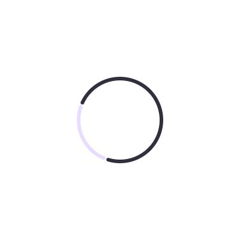
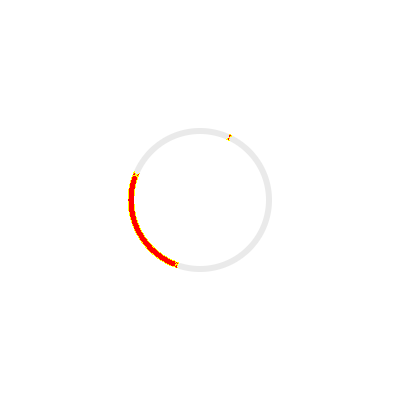

# Pinning the parity lane's wall clock (#4431)

The CMP/Wasm parity check reported one row moving on pull requests that could not have moved it —
`IndeterminateCircularProgressRemote`, 0.05%–0.94% across five unrelated changes, against a 0.25 pp
gate. Every other row said `unchanged` in the same runs.

## Cause

The indicator animates by reading the clock rather than by carrying an animation: its geometry is a
float expression over `CONTINUOUS_SEC`, which `RcPlayerState` loads from the wall clock
(`#4264` is why it is loaded at all). So the arc's pose is whatever the second hand said.

The capture is **not** caught mid-motion, which is why every settlement guard the lane already had
looked satisfied. Measured on the hosted Wasm player: after `ready` the frame is byte-identical
across 7 s of screenshots, and `rc-settle.mjs` converges in ~560 ms and reports `settled: true`. The
pose is picked once, at load, from the clock — and a different load picks a different one. A stable
frame that is stable at the wrong thing reads exactly like a measurement.

## Fix

`scripts/design-artifacts/rc-clock.mjs` freezes `Date` at **2024-01-01T10:10:00Z** — the instant
`renderers/android`'s `PreviewClock` pins Android renders to — using Playwright's
`clock.setFixedTime`, which leaves `setTimeout`, `requestAnimationFrame` and `performance.now()`
running, so boot, frame pacing and settlement are untouched. The contexts also run with
`timezoneId: "UTC"`, so the calendar is pinned alongside the instant — an epoch alone is half a pin,
since a non-UTC runner reads 10:10Z as a different local hour (`Asia/Kolkata`: 15:40, minute
included) and a document painting an hour, a weekday or a date would diverge from a baked reference
that pins the local time-of-day. Both browser lanes are pinned: the TypeScript player reads the same
clock and had the same swing.

## Two loads of one commit, same document

Straight off the published `design-artifacts/remote-m3` corpus, at the parity lane's own viewport
(200×200 dp, `deviceScaleFactor` 2), captured through the lane's own navigation and settle loop.

| Unpinned, load A | Unpinned, load B | Pixel diff |
| --- | --- | --- |
|  |  |  |

554 px, **0.35%** of the frame — between two renders of the same commit, minutes apart, with nothing
changed. That is the whole reported band, and more than the gate allows.

| Pinned, load A | Pinned, load B | Pixel diff |
| --- | --- | --- |
|  |  |  |

0 px. Byte-identical buffers.

## The whole lane, twice

The experiment #4431 (and #3558) asked for: render one commit twice through `rc-compare.mjs` against
the published 51-row corpus and diff the summaries against each other.

| | rows whose CMP/Wasm mismatch moved | rows whose TypeScript mismatch moved | `IndeterminateCircularProgress…` |
| --- | --- | --- | --- |
| unpinned | 1 | 1 | 0.712% → 0.210% (CMP/Wasm), 0.193% → 0.667% (TS) |
| pinned | 0 | 0 | 0.0019% → 0.0019% (CMP/Wasm), 0.0087% → 0.0087% (TS) |

The single moving row is the fixture from the issue, and it moves by 0.50 pp — twice the gate — with
no change under test at all. Pinned, nothing in the corpus moves.

The mismatch also *drops*, from a random point in the 0.05%–0.94% band to 0.0019%: the baked Android
reference is rendered with `PreviewClock` pinned to the same 10:10, so pinning this lane to the same
instant makes the two players draw the same pose rather than two arbitrary ones.

## Guard

`scripts/design-artifacts/rc-cmp-wasm-clock-pin.test.mjs` renders the committed fixture
(`rc-player/compose/src/jvmTest/resources/rc-fixtures/IndeterminateCircularProgress-400x400.rc`)
through the real player: pinned, repeated loads must be byte-identical; unpinned, they must not all
agree — so the control keeps proving the bug is still the bug it says it is. It runs in the `CMP/Wasm
Frame Pacing` CI job with `RC_CMP_WASM_REQUIRE=1`, where a skip is a failure.

## Not fixed here

The sweep does not actually animate in the hosted Wasm player: the pose holds still for at least 7 s
after `ready` while the AndroidX and TypeScript players keep it moving. That is a live-playback
parity gap, not a measurement one, and pinning the clock is what the *parity lane* wants either way.
