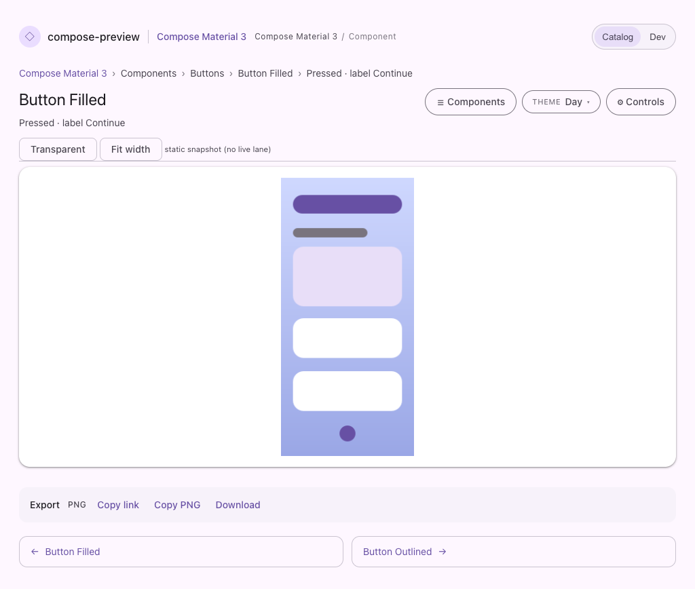
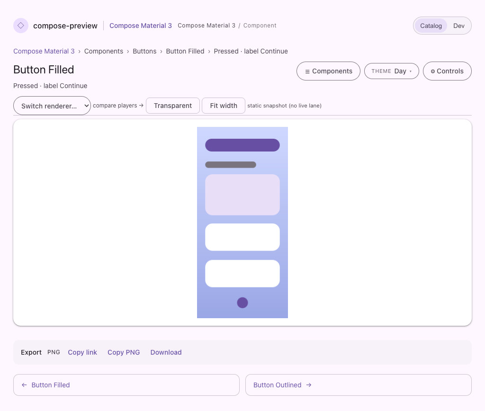
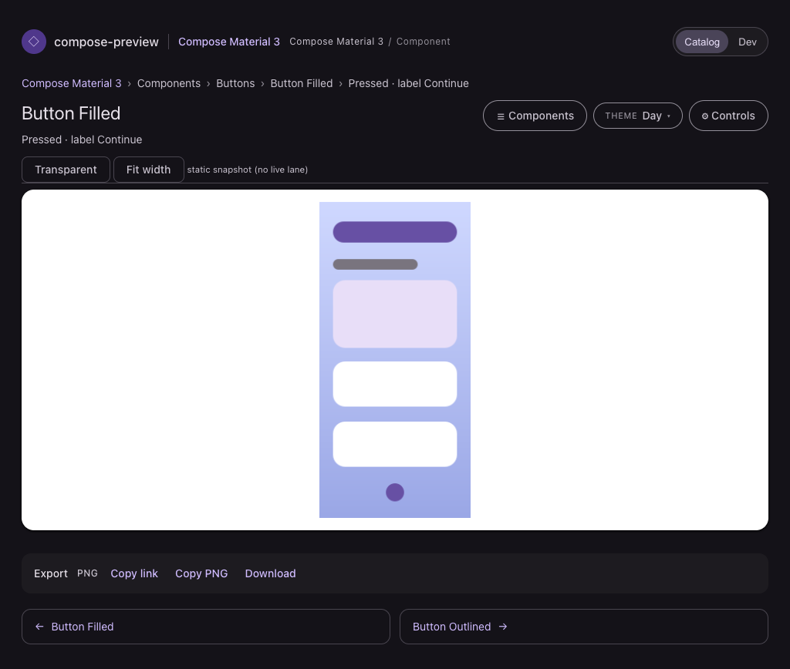
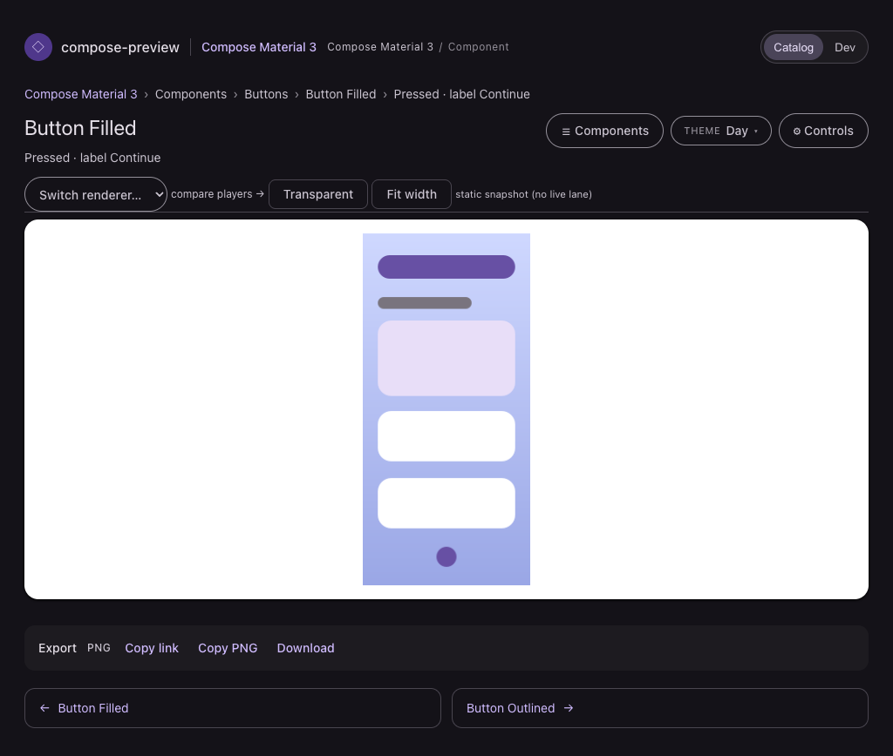

# The Remote Compose players were unreachable in Catalog mode

Catalog mode stripped the whole Remote Compose facet along with the rest of the dev surface
(`ServeWeb.viewerPage`, the `!componentBrowser` shadowing of `hasRemoteComposeDoc` /
`enabledRcPlayers`). The cost was a broken link rather than a merely simpler page: with no
`#cp-rc-canvas`, no player chips and no `#cp-lane-select`, nothing on the page owned the `rcPlayer`
parameter, so `url-state.js` cleared it from the address bar — a shared
`…/p/<id>?rcPlayer=java` silently became `…/p/<id>?uiMode=dark` and showed the baked snapshot.

Which player drew a document is the *subject* of a Remote Compose catalog, not an operational
detail, so the reader of one is exactly who wants to switch between them. The facet now stays whole,
and the lane a preview opens on is the embedded player here as it is in Dev, rather than the two
modes disagreeing about what the default rendering of a document is.

| Before — no renderer control at all | After — the full player switcher |
| --- | --- |
|  |  |

Dark:

| Before | After |
| --- | --- |
|  |  |

Both shots are the committed `serve-component-browser-remote-compose` page fixture through the
`pages-snapshot` harness, so the same inputs render both sides and only `ServeWeb` differs. The
stage itself is the harness's routed placeholder image, which is why the preview is unchanged
between them — the diffable claim here is the renderer row, and the fixture exists so that row is
diffed on every subsequent PR rather than being changed without a picture.
