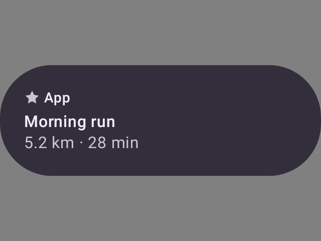
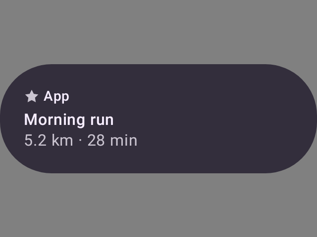
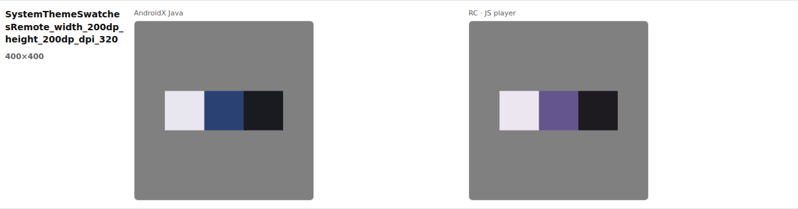

# Published rc-player lanes — the diff neutral is no longer baked into the render

Evidence for [#4442](https://github.com/yschimke/compose-ai-tools/issues/4442): every Remote Compose
preview served through a player selection came back on an opaque mid-grey card, so *all components
have grey background*.

## The problem

`rc-compare` flattens both sides of every comparison onto the mid-grey
[`BG`](../../../../scripts/design-artifacts/rc-compare-pixels.mjs) before `pixelmatch` runs — the
catalog PNGs are stickers on a transparent background, and without a shared opaque ground light
content on transparent scores as a false match against a blank canvas.

`flattenOnto` composites in place, and the driver then wrote *those* pixels out as the lane's PNG.
Those files are not only shown on `rc-compare.html`: a served catalog answers a bare
`?rcPlayer=<wire>` from them ("A player selection is published, not rendered" in
[public-preview-server.md](../../public-preview-server.md)). So the diffing background shipped as if
each player had painted it, on every lane — `baked`/`java`, `js`, `embedded`/`cmp-android`,
`cmp-jvm`, `cmp-wasm`.

The `java` lane is the proof, because its published bytes are the catalog's own baked capture and
nothing else: compositing the catalog PNG onto `[128, 128, 128]` reproduces the served PNG
**channel for channel, zero pixels differing**, and every alpha byte in the served file is `255`.

## Before

`GET /remote-m3/render/appcard__ideal__default__compact.png?rcPlayer=java` as published today — the
transparent surround has become an opaque `#808080` card:



The reported lane, `?rcPlayer=cmp-android`, is the same story:



## After

The lane PNG is now written from the capture's own bytes, so it carries the alpha the player
produced — for the `java` lane, exactly the catalog's baked sticker (shown here on this page's
background; the surround is transparent):


The diff is unchanged: `flattenedCopy` gives `pixelmatch` the same flattened pixels it always got,
on a copy, so no parity number moves. Rendering the published `remote-m3` corpus (51 documents)
before and after moved exactly one row — `IndeterminateCircularProgressRemote`, the animated one,
whose JS-player capture varies by phase run to run — and left the other 50 identical.

## The compare page

`rc-compare.html` had a checkerboard behind these cells all along (`.cell img` in
[`render-rc-compare-html.mjs`](../../../../scripts/design-artifacts/render-rc-compare-html.mjs)),
which nothing could ever show through while every image was opaque. It now can, so the checker is
tinted on the diff neutral rather than on the page: transparency reads as transparency, and a pale
swatch still contrasts with its ground the way the score says it does. Same row, before and after —
`SystemThemeSwatchesRemote`, whose leftmost swatch is nearly white:




## Regenerating

Before (any published Remote Compose catalog, no local build):

```sh
curl -o served-before.png \
  "https://preview.coo.ee/remote-m3/render/appcard__ideal__default__compact.png?rcPlayer=java"
```

After, for the `java` lane, is what the driver now writes — the bundle's own `previews/<id>.png`,
i.e. the same URL with the player dropped:

```sh
curl -o served-after.png \
  "https://preview.coo.ee/remote-m3/render/appcard__ideal__default__compact.png"
```

The equivalence the two rest on — served-before is served-after flattened onto `BG` — is checkable
without a catalog render:

```sh
node -e '
const fs=require("fs"),{PNG}=require("pngjs");
const a=PNG.sync.read(fs.readFileSync("served-after.png"));
const b=PNG.sync.read(fs.readFileSync("served-before.png"));
let n=0;
for(let i=0;i<a.data.length;i+=4){const al=a.data[i+3]/255;
  for(let c=0;c<3;c++) if(Math.round(a.data[i+c]*al+128*(1-al))!==b.data[i+c]) n++;}
console.log("channels differing:",n);'
```

Both compare-page rows above come from a full parity run of that same bundle:

```sh
node scripts/design-artifacts/rc-compare.mjs \
  --bundle bundle.png --player cli/src/main/resources/rc-player/bundle.js \
  --out /tmp/parity --system remote-m3
# then screenshot the first row of /tmp/parity/rc-compare.html
```

The other lanes are rasterized by the Robolectric / Skiko / Wasm harnesses, so reproducing their
pixels needs a catalog parity run; they go through the identical write and keep their capture's
alpha the same way.
