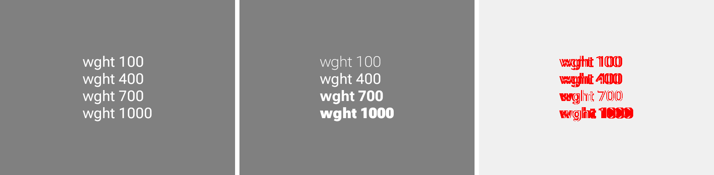
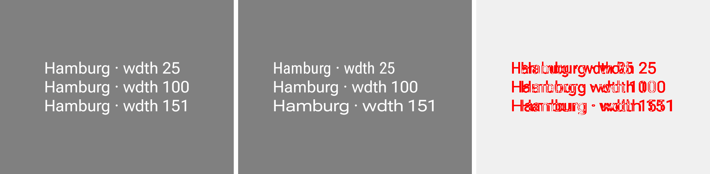
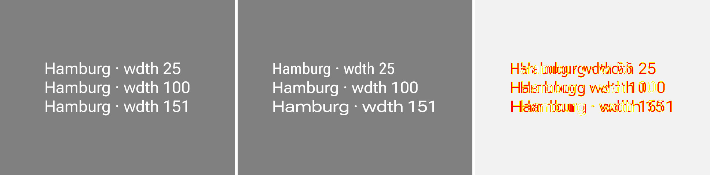
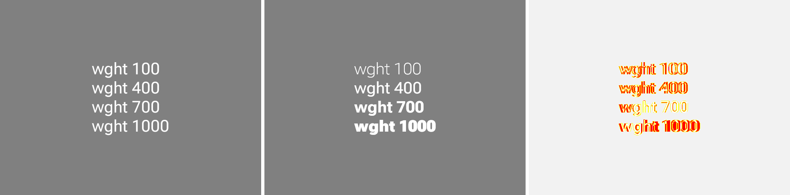
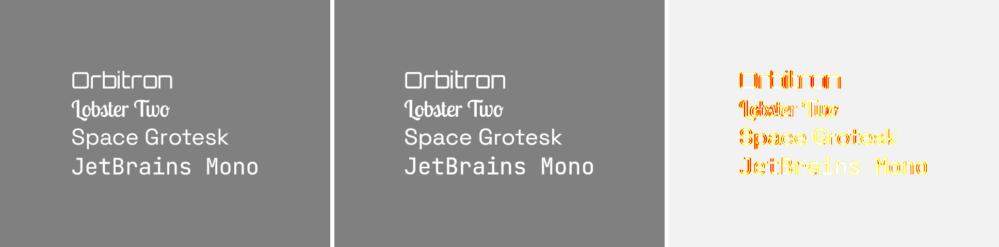

# remote-m3 CMP/Wasm parity — the three font previews (#3469, #3478)

> **Resolved, and not where this file first said.** The two axis previews below diverged because the
> `java` lane instanced their axes on the file the Google Fonts **CSS API** served — a baked
> instance with no `fvar` table — so every axis value rebuilt the same face. Not, as recorded here
> and in `RC_PLAYER_TYPEFACES.md`, because the AOSP `CoreText` renderer drops style-carried axes: it
> routes them all the way to `FontInstance.applyVariationSettings`. Resolving the family's
> **variable** file for that path fixes both previews in the reference lane (#3478). The
> baked-vs-wasm images further down are kept as the record of the divergence; the before/after pair
> here is the fix.

## The fix, in the reference lane

Baked **before** | baked **after** | changed pixels, both rendered from this repo with
`:samples:design-catalog-remote-m3:composePreviewRenderAll` (the renders are white text on
transparent; composited on grey here to be legible).





`VariableWeightRemote` goes from four identical weights to a real 100 → 1000 ramp (3.83% of pixels
move); `VariableWidthRemote` from three identical widths to a real 25 → 151 ramp (5.89%).
`TypefaceSpecimenRemote` re-renders **byte-identical** across the same change, which is the control:
it carries no axes, so a fix to axis instancing must not touch it.

## The divergence, as it was measured

Baked reference | CMP/Wasm render | `pixelmatch` diff, for the three previews that were failing the
strict 1% CMP/Wasm gate on `design-artifacts → remote-m3`. All three are reproduced locally from
this repo at the same numbers CI reported on run
[31209547232](https://github.com/yschimke/compose-ai-tools/actions/runs/31209547232) — 1.08% / 1.82%
/ 2.80%, matching to two decimals — so these are the actual pixels the gate is scoring, not a
stand-in.

The baked reference is the **AOSP view player**: `RemoteSticker` captures through
`RemoteOverridablePreview`, whose `player` defaults to `RemoteComposePlayerKind.VIEW`.

## `VariableWidthRemote` — 2.80%



The reference draws `wdth` 25 / 100 / 151 at **one** set width; the wasm player instances Roboto Flex
at each. The diff is the horizontal displacement that follows, on every glyph of every line — a
reference-lane gap, not a wasm fault — see the note at the top for what the gap actually was, and
[`RC_PLAYER_TYPEFACES.md`](../../RC_PLAYER_TYPEFACES.md) for the corrected lane detail.

## `VariableWeightRemote` — 1.82%



The same gap on the `wght` axis: four identical weights in the reference, a real 100 → 1000 ramp in
the wasm render. Smaller than the `wdth` case because weight thickens stems in place while width
moves whole runs.

## `TypefaceSpecimenRemote` — 1.08%



A different finding, and the one worth stating explicitly because the grouping invited the opposite
conclusion: this preview carries **no axes**, and both lanes resolve all four named families to the
same faces. Orbitron, Lobster Two, Space Grotesk and JetBrains Mono are each recognisably themselves
on both sides, at the same baselines and the same advances. The diff is a pure outline halo — glyph
*edges* only, with no displacement, no shape change and no substituted face anywhere in it. Contrast
the `wdth` diff above, where the text is visibly doubled and shifted. 1.08% is high for that class of
residual only because the preview is four lines of 22sp display text on an otherwise empty 640×480,
so glyph edges are nearly all of its ink.

## Reproducing

```
export ANDROID_HOME=…                                     # any SDK with platform 36
./gradlew :samples:design-catalog-remote-m3:composePreviewRenderAll   # baked PNGs + .rc sidecars
./gradlew :rc-player-wasm:wasmPlayerDist                              # the lane's player
```

then render each `.rc` sidecar through `rc-player/wasm/build/wasmDist` and `pixelmatch` it against
the baked PNG beside it, at `threshold: 0.1` and `deviceScaleFactor` = the preview's density —
`cmpWasmFor` in [`rc-compare.mjs`](../../../../scripts/design-artifacts/rc-compare.mjs) is the
authority on the details. That path needs no catalog bundle and no `bundle.png`, which is what makes
it a practical local check when the CI evidence artifact is out of reach.
