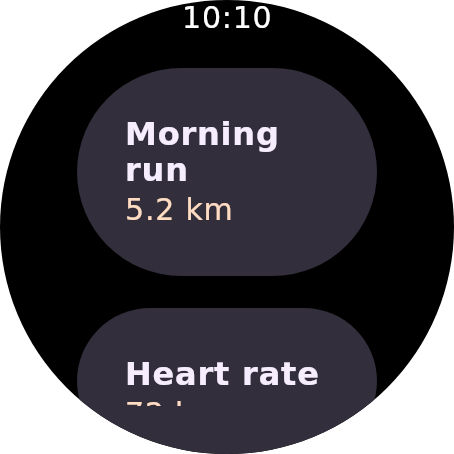
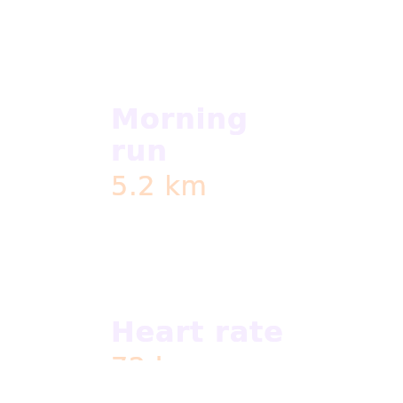

# Replay seeds — a six-digit colour erased what it was meant to recolour

Evidence for the connector fix that makes every Remote Compose **replay** lane read `#RRGGBB` as an
opaque colour, the way the cmp-jvm lane always has.

## The bug

A named colour seed reaches a replayed document as a `RemoteNamedValue.ColorValue` carrying a hex
string — from a hand-typed `?rc.WearM3.primary=color:%23FF6F61`, or from the theme expansion that
turns `?themeProvider=…` into the colours a declared theme stands for
(`ServeHost.themeReplayColors`). Six digits is the ordinary spelling of a colour, and it is what
both of those produce.

Three places parse it, and only one of them agreed with itself:

| Lane | Parser | `#FF6F61` became |
| --- | --- | --- |
| cmp-jvm (desktop subprocess) | `RcJvmServerRenderer.rcColorToArgb` | `0xFFFF6F61` — opaque |
| Android view player | `applyConnectorOverrides` | `0x00FF6F61` — **alpha 0** |
| Android embedded player | `toNamedColorOverrides` | `0x00FF6F61` — **alpha 0** |

`"FF6F61".toLong(16)` is a perfectly good number; it is just the wrong one. With the alpha byte
zero, a seed meant to *recolour* an element instead **erases** it — and the response still reports a
themed render, so the failure reads as "the theme did nothing" rather than as an error.

## The pixels

`watch-screen-round-clip.rc` (the committed round-clip fixture) has four named colour roles —
`WearM3.background`, `surfaceContainer`, `onSurface`, `tertiary`. Below, each role is seeded with
coral `#FF6F61`, rendered through the JVM player at 454×454 / density 2.0, once with the integer the
replay connectors computed **before** this change and once with the integer they compute **after**.
Same document, same player, same request — only the alpha byte differs.

| Unseeded | Before — `0x00FF6F61` | After — `0xFFFF6F61` |
| --- | --- | --- |
|  |  |  |

The middle frame is the bug in full: the watch screen's own background is one of the seeded roles,
so seeding it transparent takes the entire face with it and leaves the text floating on nothing.

## The fix

One `rcColorToArgb` in the connector, mirroring `RcJvmServerRenderer`'s: strip `#` / `%23`, prepend
`FF` to a six-digit value, and accept only a resulting 8 hex digits. Both connector call sites use
it, so the two Android players and the desktop one can no longer disagree about what a seed means.
Pinned by `ApplyConnectorOverridesTest`.
