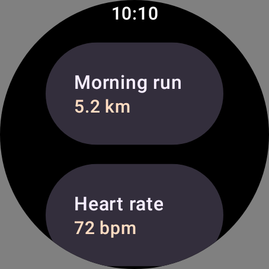
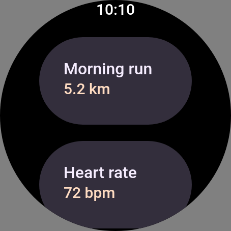
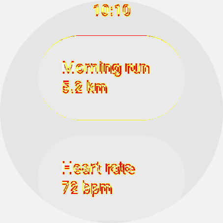

# rc-player — size-relative clip shapes (`RemoteCircleShape`)

Evidence for the fix to [#2930](https://github.com/yschimke/compose-ai-tools/issues/2930): the
vendored TypeScript player rendered the `remote-m3` catalog's round watch screen as a *completely
blank canvas*.

## The bug

`RemoteModifier.clip(RemoteCircleShape)` writes each `MODIFIER_ROUNDED_CLIP_RECT` (opcode 54) corner
as a NaN-encoded expression over the component's **measured size**, not as a dp literal — the
catalog's only size-relative clip, and the only document that hit it. The modifier read those bits
with `readFloat()`, which collapses the payload to a plain `NaN`; `ctx.roundRect` ignores a radius
list containing a non-finite value, so the `clip()` that follows inherited an **empty path** — and an
empty clip hides every draw inside the component, not just its rounded corners.

Nothing reported it. The document parsed cleanly, no opcode was unknown, no warning fired: the only
symptom was pixels that were never there.

## Before / after

All three at 454×454, flattened onto the mid-grey `rc-compare` diffs against, from the same
`design-artifacts/remote-m3` bundle (`1f5f5f2`) — only the player differs.

| baked reference | JS player, before | JS player, after |
|---|---|---|
|  |  |  |
| 78.85% of the canvas painted | **1 distinct colour** — nothing drawn | matches the reference |

`pixelmatch` against the baked capture: **75.97% → 1.92%**. The residual is text metrics, and it is
in line with every other text-carrying row in the catalog:



Catalog-wide, the JS lane's mean mismatch goes **4.26% → 1.16%** across all 24 documents. The other
round components — the ones whose corner is size-relative for the same reason — move too, though far
less, because a button's own fill was already being drawn outside the dropped clip:
`IconRemoteButton` 0.36% → **0.00%**, `TextRemoteButton` 0.26% → 0.30%. Every other row scores
exactly what it scored before.

## Regenerating

```sh
node scripts/design-artifacts/rc-compare.mjs \
  --bundle bundle.png \
  --player cli/src/main/resources/rc-player/bundle.js \
  --out /tmp/rc-out --system remote-m3
```

The guard that keeps this closed does not need a bundle or a catalog render — it replays a committed
2 KB capture of the same document through the built player bundle:

```sh
node --test scripts/design-artifacts/rc-round-clip.test.mjs
```
