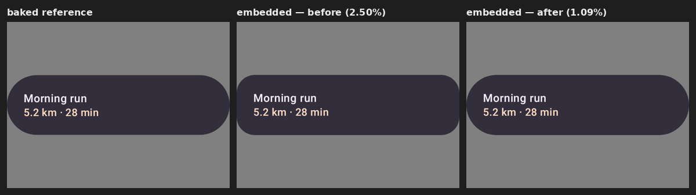
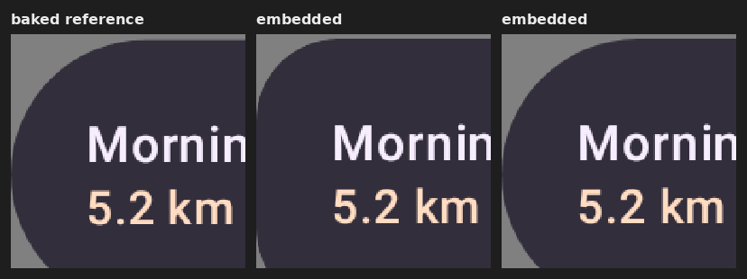

# rc-embedded-player — density-scale literal clip-corner radii

Evidence for the fix that makes the **embedded** player (`RcPlayer`) round buttons and cards to the
same corner radius as the baked reference and the TypeScript player.

## The bug

A `Modifier.clip(RoundedCornerShape(…))` serializes as a `RoundedClipRectModifierOperation`
(opcode 54). Its four corner radii come in one of two forms:

- a **literal** — a dp value the shape was authored with (a card's fixed corner,
  `RemoteRoundedCornerShape(4.dp)`), stored as finite float bits, **authored in dp**; or
- a size-relative **variable** — a NaN-encoded expression over the component's measured size
  (`RemoteCircleShape`'s 50%), already resolved to pixels.

remote-core's `RoundedClipRectModifierOperation.paint` scales a corner by the document density
**only under `DENSITY_BEHAVIOR_DP`**:

```java
if (ctx.getDensityBehavior() == DENSITY_BEHAVIOR_DP) { x1 *= d; y1 *= d; x2 *= d; y2 *= d; }
ctx.roundedClipRect(mWidth, mHeight, x1, y1, x2, y2);
```

The embedded player builds its own Compose `Shape` from the resolved corner fields and so bypassed
that paint-time scaling — a literal `26dp` corner clipped at `26px` instead of `52px` at density 2.0,
i.e. every literal-cornered button/card rendered **density× under-rounded**. The TypeScript player
already replicates the scaling (`RoundedClipRectModifier.resolve`), which is why the JS lane matched
the baked render and only the embedded lane was tight.

Size-relative variables are unaffected: they resolve to measured pixels, so they are used as-is
(scaling would double-apply the density) — the `RemoteCircleShape` watch-screen path is unchanged.

## The fix

`RemoteRoundedClipShape` now scales a **literal** corner by the display density under
`DENSITY_BEHAVIOR_DP` (and treats it as raw pixels otherwise), keeping the variable path byte-for-byte
as it was. This mirrors both the View player's `paint` and the TypeScript player's `resolve`.

## Before / after

`TitleCardRemote` from `design-catalog-remote-m3`, rasterized through the embedded player at 640×480
(density 2.0), flattened onto the same mid-grey the `rc-compare` page diffs against.





| lane | top-left corner radius (px) | mismatch vs baked |
|---|---|---|
| baked reference | 69 | — |
| embedded **before** | 39 | 2.50% |
| embedded **after** | 70 | **1.09%** |

The same literal-corner path carries the M3 button family (`FilledRemoteButton`,
`NamedLabelRemoteButton`, …) and the other cards, which were tight for the identical reason.

## Regenerating

Stage the document and rasterize it through the embedded harness:

```
# TitleCardRemote-640x480.rc is committed at
# third_party/rc-embedded-player/src/test/resources/rc-fixtures/
./gradlew :third-party-rc-embedded-player:testDebugUnitTest \
  --tests 'ee.schimke.composeai.rcembedded.RcEmbeddedRenderHarness' \
  -Prc.embedded.input=<dir with <id>.rc + manifest.json> -Prc.embedded.output=<out>
```
