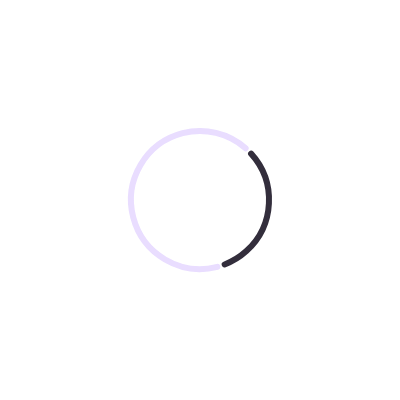

# Player-supplied system variables (#4264)

`remote-m3`'s indeterminate circular progress indicator rendered as a completely empty frame in the
CMP/Wasm player while the AndroidX Java, AndroidX Embedded and TypeScript players all animated it.
The `rc-compare` lane reported it as a hard failure rather than a parity number:

```
the player drew nothing in 5015 ms while the baked reference has ink —
the render did not finish, so there is no parity number to report
```

## Cause

The indicator animates by reading the clock, not by carrying an animation: its geometry is a float
expression over `RemoteContext.ID_CONTINUOUS_SEC` (id `1`), one of the ids AndroidX's
`TimeVariables` loads into the context at the top of every frame. This player never loaded them.

Nothing failed loudly, because a `NaN`-boxed reference to an unloaded id resolves to its own raw
`NaN` bits rather than throwing — so the arithmetic downstream produced `NaN`, and Skia discards a
shape whose geometry is `NaN`. The static track hangs off the same expression, so the whole
indicator disappeared rather than just the moving arc, which is why the frame was blank instead of
half-drawn.

Because nothing about that expression says "animation" either, the player also had no reason to keep
drawing frames for it — so loading the variables once would have frozen the arc at its first pose.
Both halves are fixed: `RcPlayerState.beginFrame` loads the variables, and
`RcDocument.referencesMovingSystemVariable()` tells `RcComposePlayer` to run its continuous frame
loop for a document that reads a clock this way.

## Before / after

The same document (`ir/…IndeterminateCircularProgressRemote…rc`, straight off
`design-artifacts/remote-m3`) rendered through `RcComposePlayer` on Skiko at 400×400, before and
after. The `.rc` is committed as
`rc-player/compose/src/jvmTest/resources/rc-fixtures/IndeterminateCircularProgress-400x400.rc` and
`RcIndeterminateProgressRenderTest` keeps it honest.

| Before | After |
| --- | --- |
|  |  |

The arc's position is the clock phase the frame happened to catch and is expected to differ run to
run — which is why the test asserts ink rather than pixels.
