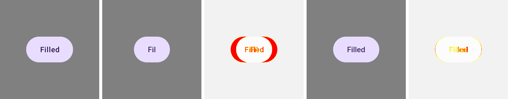
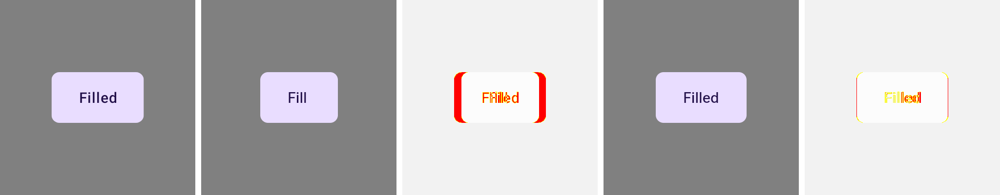

# Evidence: in-place document handoff, and capturing on convergence

Supporting measurements for [#3445](https://github.com/yschimke/compose-ai-tools/issues/3445) —
the CMP/Wasm parity lane navigating the page once per document, and what removing that navigation
exposed.

## How these were produced

The corpus is the published `design-artifacts/remote-m3` bundle (27 documents plus their baked
Android references), rendered in this session through `scripts/design-artifacts/rc-compare.mjs` in
headless Chromium, against two `wasmPlayerDist` builds: `main` and this branch. Nothing re-rendered
the catalog, so the only variable is the player and the driver.

```
node rc-compare.mjs --bundle <published bundle.png> \
  --player cli/src/main/resources/rc-player/bundle.js \
  --out <out> --system remote-m3 --cmp-wasm <wasmDist> --require-cmp-wasm
```

## The strips

Five panels, left to right: **baked Android reference**, **before** (capture at `ready`, as `main`
does), **before diff vs the reference**, **after** (capture on convergence), **after diff**.

The failure is not subtle once it is on screen: the label is measured in the fallback face and the
button is laid out around the truncated string, so the `before` panel is a *narrower pill reading
"Fil"*. It is a real intermediate frame, captured before Compose finished resolving the host fonts —
the player's 1,500 ms handoff tail used to sit in front of it, and dropping that tail for speed
(#3466) put it in the pixels.





## Numbers over the 27-document corpus

| | `main` | this branch |
|---|---|---|
| warm navigation-to-`ready`, mean | 819 ms | **107 ms** |
| warm navigation-to-`ready`, max | 1,745 ms | **293 ms** |
| cold (still navigates) | 1,199 / 1,078 ms | 1,307 / 1,045 ms |
| mean mismatch vs the baked references | 0.788% | **0.509%** |
| worst row | 2.98% | **2.35%** |
| rows whose pixels changed between two runs of the same build | 9 / 27 | **0 / 27** |

The last row is the one that matters most for a parity lane: the capture-at-`ready` lane produced
different pixels from run to run on a third of the corpus, so a moved number could always be noise.
Two runs of this branch came back byte-for-byte identical on all 27.

## Settle-window sizing

`settledScreenshot` stops when the pixels have held still for a quiet window. The window was sized
by measurement, not taste:

| quiet window | rows byte-identical across two runs | mean mismatch | lane wall clock |
|---|---|---|---|
| single repeated capture | — | 0.509% | 15.8 s |
| 250 ms | 23 / 27 | 0.489–0.509% | 16.5 s |
| **500 ms** | **27 / 27** | **0.489%** | 22.8 s |
| player's 1,500 ms tail instead | — | 0.489% | 45.8 s |

500 ms reaches exactly the pixels the player's own tail does, at a third of its cost, and is the
first window at which the lane is reproducible. `main`'s lane, for comparison, spent 22.8 s to
produce the *less* accurate and non-reproducible column.
