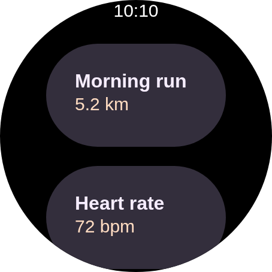
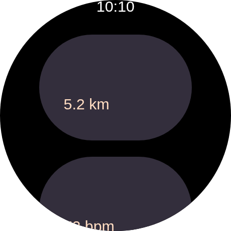

# rc-player — a weighted child measured at zero width

Evidence for the `WEIGHT` fix carried in the refresh of the vendored TypeScript player to upstream
`53e19e93`. All three renders are the committed round-clip fixture
(`scripts/design-artifacts/fixtures/watch-screen-round-clip.rc`, a 227dp round watch face at density
2) played at 454×454 in headless Chromium; only the player bundle differs.

## The bug

Upstream's `c3a08e1` gave `LayoutManager` a `WEIGHT` branch that sizes a weighted child from its own
modifier-defined size (`mPadBeforeWidth`, normally 0) rather than from the full `maxWidth`. That is
right for a weight that never gets distributed — one on the cross axis, or inside a parent that
wraps and so has no slack to share.

But `RowLayout` and `ColumnLayout` communicate the share they decided on *as the incoming
constraint*: they re-measure each weighted child with `minWidth == maxWidth == childWidth`. Taking
the modifier-defined size unconditionally discards that, so a child that *was* distributed to is
re-measured at ~0 — and then laid out and painted at that width. Its text re-wraps one word per line
and each line is centred about a zero-width box, landing at a negative x outside the component,
where the clip removes it.

## Before / after

| before the refresh | refresh without the fix | this branch |
|---|---|---|
|  |  |  |
| 78.8454% covered, 1046 colours | 78.8464% covered, 859 colours | 78.8454% covered, 1046 colours |

Both card titles are gone from the middle render. The values ("5.2 km", "72 bpm") survive because
they sit in a different, unweighted component.

## Why the existing test did not catch it

`rc-round-clip.test.mjs` asserted canvas coverage above 40%, which is the right shape of assertion
for the blank-canvas failure it was written for ([#2930](https://github.com/yschimke/compose-ai-tools/issues/2930)).
It cannot see this one: two titles are roughly 0.001% of a 454×454 canvas, so coverage moved from
78.8454% to 78.8464% — *up*, and four decimal places below the margin that guards against font
drift. The document also parsed cleanly and emitted no warning, so nothing else reported it either.

The test now additionally asserts on the text draws themselves: one `fillText` per expected string
(a re-wrap arrives as two), and no negative offsets (centring about a zero-width box is exactly what
a negative x means). Both are properties of a correct layout rather than of a particular font's
metrics, so they stay stable where a glyph-level pixel comparison would not. Verified failing
against the unfixed bundle above.
