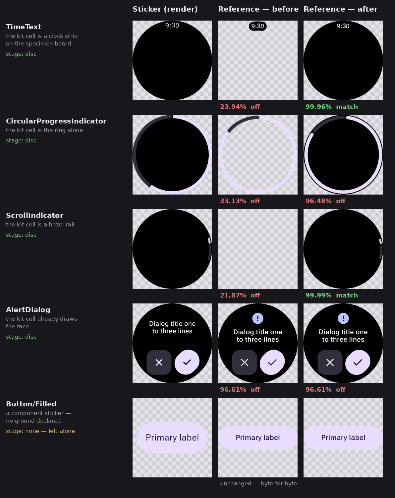

# reference-backdrop — publishing a design reference on the ground its sticker stands on

Evidence for `--reference-backdrop` in
[`emit-design-references.mjs`](../../../../scripts/design-artifacts/emit-design-references.mjs),
and the shape recognition in
[`reference-backdrop.mjs`](../../../../scripts/design-artifacts/reference-backdrop.mjs) that decides
where it applies.

## The problem

A `@Preview` that declares `showBackground` is drawn on an opaque ground. On wear-m3-catalog every
full-screen sticker does — `@CatalogFullScreenModes` is `showBackground = true,
backgroundColor = 0xFF000000` on a round device — so the render is a black watch face with the
component on it.

The Figma counterpart is a node export, and a node export carries only the node. For the components
the kit draws as a cell on a specimen board rather than on a watch, that leaves a piece of artwork
on transparency: `references/timetext__ideal__default__192dp.png` is 2.3% opaque, a black pill
holding `9:30`.

Both sides are cropped to their content box before scoring (`design-reference-score.mjs`, driving
the viewer's own `format-compare.js`). So the pill was enlarged to the size of a watch face and
compared with one. The published verdict on those rows was a statement about the missing ground.

## What changed

The caller declares the colour; the shape is read from the sticker's own alpha, and only the two
shapes `showBackground` can produce — the whole frame, and the disc inscribed in a square frame —
are recognised. A transparent component sticker matches neither and is left exactly as it was.

Across wear-m3-catalog's 380 published stickers the classification is unanimous: **215 device discs**
— every breakpoint of every full-screen component — and **165 left alone**, with no full-screen
sticker missed and no component sticker touched.

## Before / after

Rendered on a checkerboard so transparency is visible. The percentage under each pair is the real
publish-time score, from the same scorer that bakes `match` into `references/index.json`.



The last two rows are the control cases. `AlertDialog`'s kit cell already draws the face, so there
is nothing to add and its score does not move; `Button/Filled` is a transparent component sticker,
declares no ground, and comes back untouched.

## Every scored reference

35 of wear-m3-catalog's 186 published references sit on a device mask. Scored before and after with
`design-reference-score.mjs` against the same stickers:

| reference | before | after | Δ |
|---|---|---|---|
| `alertdialog__ideal__default__192dp` | 96.61% `off` | 96.61% `off` | +0.00 |
| `alertdialog__ideal__edge-button__192dp` | 96.63% `off` | 96.63% `off` | +0.00 |
| `openonphonedialog__ideal__default__192dp` | 94.72% `off` | 94.72% `off` | +0.00 |
| `datepicker__ideal__default__192dp` | 98.5% `close` | 98.5% `close` | +0.00 |
| `datepicker__ideal__month-first__192dp` | 98.46% `close` | 98.46% `close` | +0.00 |
| `picker__ideal__default__192dp` | 85.78% `off` | 85.78% `off` | +0.00 |
| `timepicker__ideal__default__192dp` | 96.02% `off` | 96.02% `off` | +0.00 |
| `timepicker__ideal__24-hour__192dp` | 96.26% `off` | 96.26% `off` | +0.00 |
| `timepicker__ideal__24-hour-with-seconds__192dp` | 96.18% `off` | 96.18% `off` | +0.00 |
| `stepper__ideal__default__192dp` | 84.29% `off` | 84.29% `off` | +0.00 |
| `stepper__ideal__disabled__192dp` | 97.91% `close` | 97.91% `close` | +0.00 |
| `stepper__ideal__icon__192dp` | 82.31% `off` | 82.31% `off` | +0.00 |
| `stepper__ideal__no-button-fill__192dp` | 93.73% `off` | 93.73% `off` | +0.00 |
| `swipetoreveal-button__ideal__default__192dp` | 91.89% `off` | 91.89% `off` | +0.00 |
| `swipetoreveal-button__ideal__two-actions__192dp` | 95.52% `off` | 95.52% `off` | +0.00 |
| `swipetoreveal-card__ideal__default__192dp` | 91.48% `off` | 91.48% `off` | +0.00 |
| `swipetoreveal-card__ideal__two-actions__192dp` | 91.94% `off` | 91.94% `off` | +0.00 |
| `circularprogressindicator__ideal__complete__192dp` | 35.3% `off` | 97.25% `close` | +61.95 |
| `circularprogressindicator__ideal__default__192dp` | 33.13% `off` | 96.48% `off` | +63.35 |
| `circularprogressindicator__ideal__zero__192dp` | 35.66% `off` | 99.54% `match` | +63.88 |
| `circularprogressindicator__ideal__overflow__192dp` | 31.79% `off` | 97.49% `close` | +65.70 |
| `circularprogressindicator__ideal__small-stroke__192dp` | 29.65% `off` | 97.88% `close` | +68.23 |
| `levelindicator__ideal__default__192dp` | 31.17% `off` | 99.99% `match` | +68.82 |
| `circularprogressindicator__ideal__disabled__192dp` | 25.07% `off` | 98.72% `close` | +73.65 |
| `timetext__ideal__24-hour__192dp` | 24.58% `off` | 99.93% `match` | +75.35 |
| `timetext__ideal__default__192dp` | 23.94% `off` | 99.96% `match` | +76.02 |
| `pageindicator-horizontal__ideal__six-pages__192dp` | 23.69% `off` | 99.95% `match` | +76.26 |
| `pageindicator-vertical__ideal__six-pages__192dp` | 23.68% `off` | 99.95% `match` | +76.27 |
| `pageindicator-horizontal__ideal__default__192dp` | 22.99% `off` | 99.99% `match` | +77.00 |
| `pageindicator-vertical__ideal__default__192dp` | 22.98% `off` | 99.99% `match` | +77.01 |
| `levelindicator__ideal__disabled__192dp` | 22.41% `off` | 100% `match` | +77.59 |
| `pageindicator-horizontal__ideal__two-pages__192dp` | 22.25% `off` | 100% `match` | +77.75 |
| `scrollindicator__ideal__middle__192dp` | 21.87% `off` | 99.89% `match` | +78.02 |
| `scrollindicator__ideal__default__192dp` | 21.87% `off` | 99.99% `match` | +78.12 |
| `scrollindicator__ideal__bottom__192dp` | 21.87% `off` | 99.99% `match` | +78.12 |

Mean **58.92% → 96.43%**. The split is exactly two populations: the 17 references whose kit cell
already draws the face do not move at all, and the 18 whose cell does not gain 61.95 – 78.12 points.

The `+0.00` rows are not "no bytes changed" — roughly 587 rim pixels per reference are topped up
from the reference's own softer edge to the sticker's coverage — but the published number does not
move, which is the bar a change like this should clear. Getting there is why the ground contributes
`max(0, ground − reference)` rather than compositing source-over: `over` stacks two descriptions of
one coincident edge, hardening the rim past what either image has, and cost every one of those 17
references 0.02 – 0.04 points in an earlier revision of this change.

## Reproducing

The pairs come straight off the delivery branch, so no render is needed:

```sh
git fetch --depth=1 origin design-artifacts/wear-m3-catalog   # in yschimke/wear-m3-catalog
git show FETCH_HEAD:references/timetext__ideal__default__192dp.png > before.png
git show FETCH_HEAD:images/timetext/ideal__default__192dp.png    > sticker.png
```

`stageOf(sticker)` then reports `disc`, and `applyBackdrop(before, …, '#000000')` produces the
right-hand column. Scoring needs `npm ci` plus Chromium in `scripts/design-artifacts`, the same two
the publish step installs.
