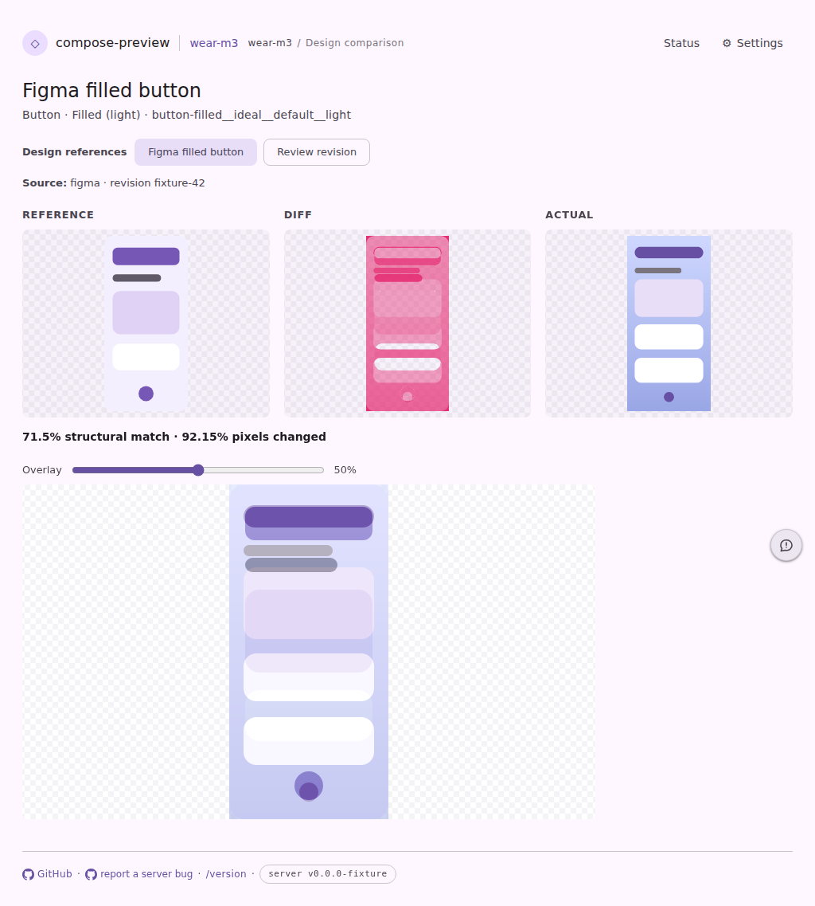
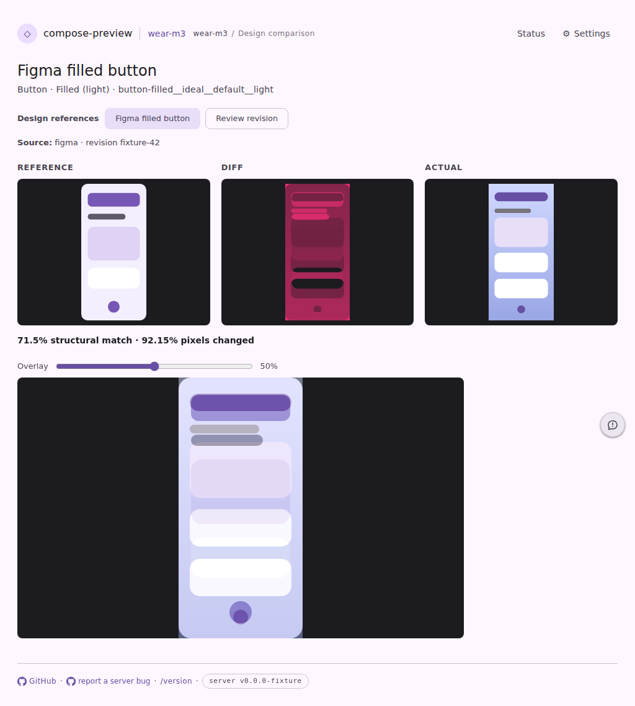

# The design comparison is drawn on the catalog's own stage

Issue [wear-m3-catalog#56](https://github.com/yschimke/wear-m3-catalog/issues/56): filed from
`/wear-m3-catalog/compare?format=reference` — "The missing backgrounds in the report makes it hard
to understand."

The reference-compare page was the one comparison surface with no ground of its own.
[`ServeWeb.referenceComparisonPage`](../../../cli/src/main/kotlin/ee/schimke/composeai/cli/serve/ServeWeb.kt)
emitted `#cp-reference-compare` with no `data-bg-theme`, unlike the grid cards and the viewer, both
of which resolve one. So all three panels fell through to `.cp-compare-shot`'s default in
[`serve.css`](../../../cli/src/main/resources/ee/schimke/composeai/cli/serve/assets/serve.css) —
a **transparency checkerboard**. The only solid override, `.cp-compare-row[data-bg-theme="dark"]`,
is scoped to the compare wall's rows, which this page has none of.

That is invisible on a light-first catalog and ruinous on a dark-first one. A dark-first system
renders its stickers transparent on purpose (`@Preview(showBackground = false)`, so a designer can
drop one onto any Figma canvas), so the panel's ground is the only thing making the content legible
— and the checkerboard is the one ground that makes both light and dark content hard to read.

Both shots are the committed dark-first page fixture
(`vscode-extension/preview-harness/fixtures/pages/serve-reference-compare-dark-first.html`, light
theme, production CSS + JS), captured with Playwright through the page harness:

```sh
UPDATE_SERVE_WEB_FIXTURES=true ./gradlew :cli:test --tests '*ServeWebFixtureTest*'
npm --prefix vscode-extension run harness:snapshot -- -g serve-reference-compare
```

The "before" shot is that same fixture with the two attributes the server now emits
(`data-bg-theme` / `--cp-stage-backdrop`) stripped back out, so the pair differs by this change and
nothing else.

## Before — three checkerboard panels



## After — the catalog's declared stage



All three panels take the **same** ground, deliberately: a reference and a render composited onto
different colours differ by that colour everywhere, which is exactly the signal this page exists to
isolate. The overlay slider below them gets it too, for the same reason.

The colour is not a literal. It comes from
[`PreviewBackdrop`](../../../data/render/core/src/main/kotlin/ee/schimke/composeai/data/render/PreviewBackdrop.kt),
the one chain every surface now shares — what the preview states about itself first
(`backgroundColor`, then `showBackground` resolved through its night bit), the catalog's declared
`display.surface` after. So an explicitly white specimen inside this dark-first catalog keeps its
white stage rather than being repainted black; only a preview that says nothing takes the system's
default.

The header's **Transparent** toggle still wins over all of it, so the raw alpha stays inspectable —
which is the point of never baking any of this into the PNG.

The dark-first fixture is new, and exists because the light-first one cannot catch a regression
here: its content is dark either way, so it looks identical whether the stage resolves or falls
through. It is registered in
[`pages-snapshot.spec.mjs`](../../../vscode-extension/preview-harness/pages-snapshot.spec.mjs), so
every later change to this page is diffed on both.
