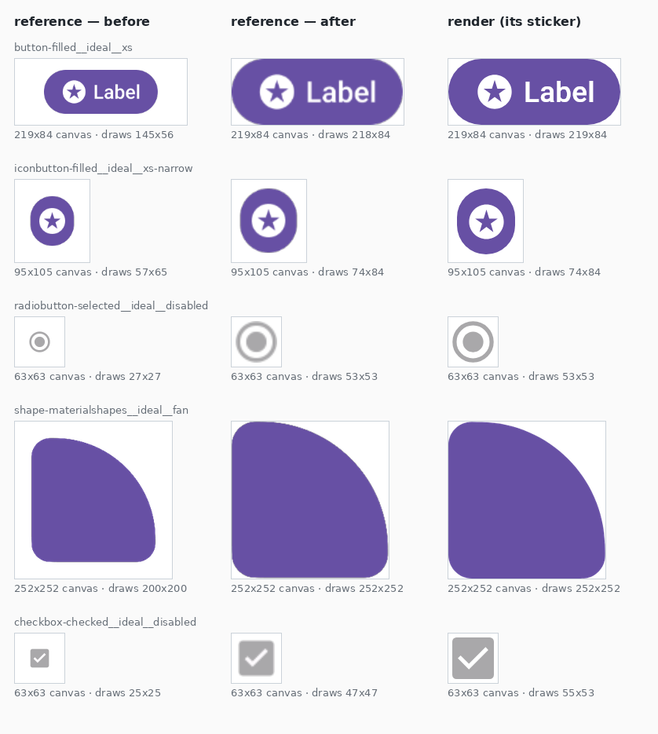

# reference-content-placement — sizing a reference off what it draws, not off its artboard

Evidence for the placement change in
[`png-resample.mjs`](../../../../scripts/design-artifacts/png-resample.mjs) and
[`emit-design-references.mjs`](../../../../scripts/design-artifacts/emit-design-references.mjs), and
for the gate in [`reference-scale.mjs`](../../../../scripts/design-artifacts/reference-scale.mjs).

Raised as [m3-catalog#180](https://github.com/yschimke/m3-catalog/issues/180).

## The problem

A Figma component reference is exported at the Compose renderer's density and centred on the
sticker's canvas without enlargement — its pixels already describe the component at the renderer's
scale, so scaling it up to fill a padded canvas would republish the design at a size its author
never drew. An oversized export is still reduced, so it stays representable rather than being
clipped.

"Oversized" was measured on the export's **whole raster**. A Figma export spans the node's
`absoluteBoundingBox`, and the Material 3 kit draws that box larger than the component: the XSmall
button is a 32dp button inside a 48dp touch-target frame, and every icon button, checkbox, switch
and radio is 48dp around something smaller. At 2.625 the XSmall button arrives as an 84px button in
a 126px raster; the sticker canvas is 84px, because the render draws the button and nothing else.
126 > 84, so the whole raster was reduced by 0.667 — and the button with it.

The measurement in m3-catalog#180, reproduced here over all 1340 published ids: **536** have a
reference, and **121** of those draw their component at a uniform 0.47–0.91 of the render, 108 of
them exactly centred in the render's canvas. The ratios are exactly the padding ratios — every `xs`
and `xs-square` cell across four button and four toggle-button emphases lands on 0.667, which is
32/48.

Nothing noticed, and the score could not: `design-reference-score.mjs` drives the viewer's own
`format-compare.js`, which crops both sides to their content box and redraws them into one shared
box before scoring. That normalisation is what makes the lane robust to a design tool's padding —
and it is exactly what makes a size difference invisible to it. So the `PNG ↔ Figma` percentage for
those 121 cells was a statement about the shape and none at all about the size.

## What changed

The **drawn** pixels decide. `alphaBounds` finds the content box of the export; `placeRgba` centres
*that* on the canvas and reduces only when *it* overflows. Transparent margin that would otherwise
force a reduction is cropped away instead — an empty row carries nothing the comparison can read,
and shrinking the artwork to keep it costs the comparison the one thing it can.

The returned `box` still describes where the whole source landed, so the annotation layer keeps
mapping design-frame coordinates onto the artwork; after a crop it simply starts outside the canvas.

## Before / after

The kit node geometry is read from the Figma REST metadata, the *before* and *render* columns are
the PNGs `m3.preview.coo.ee` publishes today, and the *after* column is the same pipeline code with
the change, replayed over a source raster rebuilt from the published reference — so it is a pixel
softer than a fresh export from Figma will be, and its **geometry is exact**.

| cell | canvas | before | after | render |
| --- | --- | --- | --- | --- |
| `button-filled__ideal__xs` | 219x84 | 145x56 | 218x84 | 219x84 |
| `iconbutton-filled__ideal__xs-narrow` | 95x105 | 57x65 | 74x84 | 74x84 |
| `radiobutton-selected__ideal__disabled` | 63x63 | 27x27 | 53x53 | 53x53 |
| `shape-materialshapes__ideal__fan` | 252x252 | 200x200 | 252x252 | 252x252 |
| `checkbox-checked__ideal__disabled` | 63x63 | 25x25 | 47x47 | 55x53 |

The replay is also the proof that the diagnosis is right rather than plausible: run the same rebuilt
source through the **old** placement and it reproduces what the catalog published, to a pixel, on
every cell — 145x56@(36,14) against a published 145x56@(37,14), 200x200@(26,26) against
200x200@(26,26).

Four of the five land on the render exactly. The checkbox does not, and that is the point of
separating the two readings: 0.47 was the pipeline, and the ~0.87 that remains is the kit and
Compose disagreeing about a checkbox's size — a parity finding, which is what the lane exists to
report.

## The gate

`reference-scale.mjs` compares each published reference's content box with its sticker's and reports
a **uniform** rescale outside tolerance: both axes off by the same factor is the fingerprint of the
pipeline resizing a picture, where a component that is genuinely the wrong size is wrong on the axis
its size axis controls, and a difference in proportion is already what the scorer's `geometry`
reports. Per-record lines are notes; one warning carries the count, so `--strict` can fail on it
without a warning per cell.

`splitbutton-filled__ideal__xl` is the case that shows the split working. Its reference is 371x126
against a 1049x105 render — but the kit node is 400x136 with no empty margin anywhere, so the
placement has nothing to crop and this change does not move it. Width ratio 0.35 against height
ratio 1.2 is not uniform, so the gate correctly leaves it to `geometry`: the kit's XL split button
is 136dp tall and the render's is 40dp, which is a defect in the component, not in the export.
