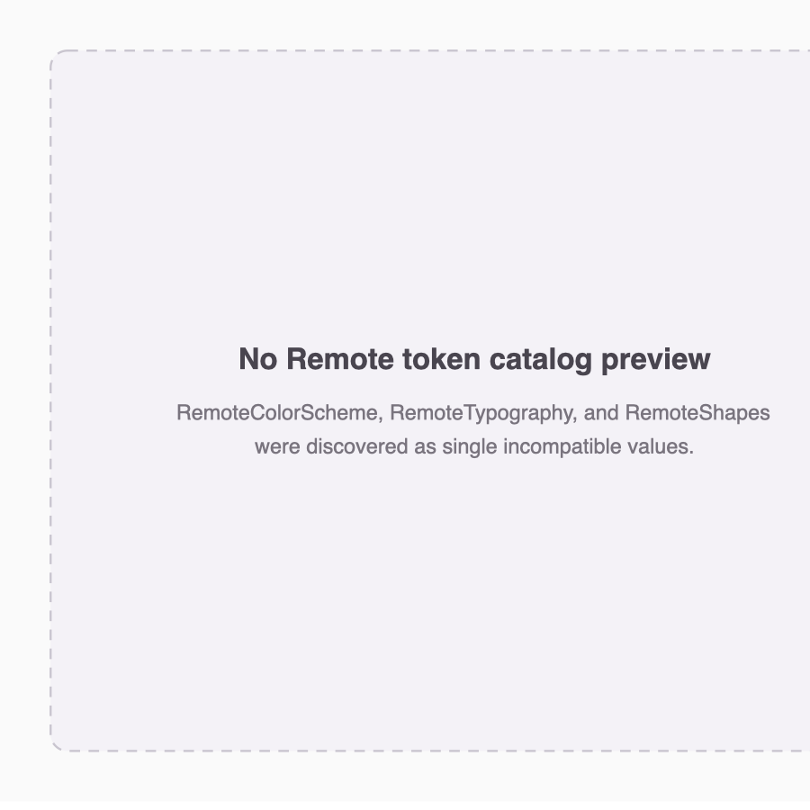
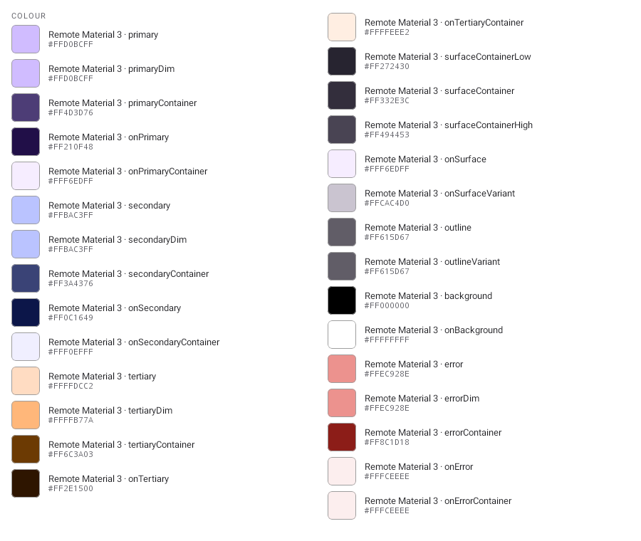
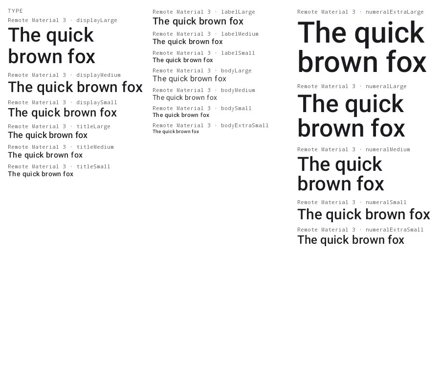
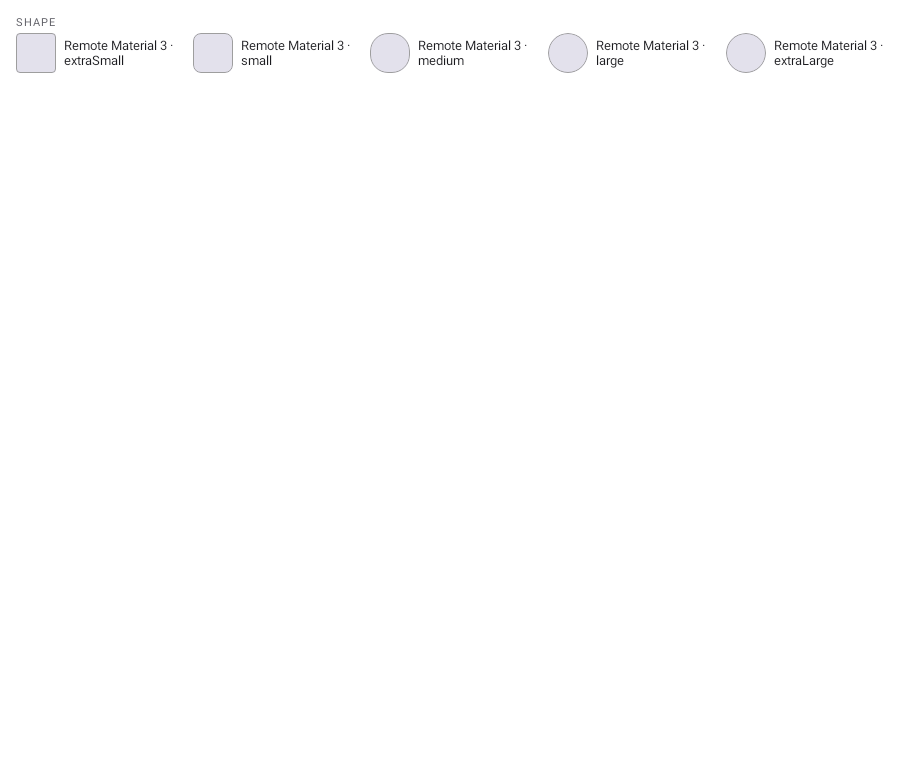

# Remote Compose token catalogs (#4858)

## Before

There was no renderer output to capture: Remote Material 3 whole objects were classified as single
`Color`, `TextStyle`, and `Shape` values, then failed reflection. This proxy records that absent
surface rather than presenting a fabricated token sheet.



## After

The in-repo Remote Compose sample declares the real `RemoteColorScheme`, `RemoteTypography`, and
`RemoteShapes` objects. The Android renderer resolves all 29 colour roles, 18 type roles, and five
shape roles into packed 900×760 sheets and writes the same complete sets to catalog-token sidecars.
These synthetic inventory sheets intentionally remain ordinary renderer-drawn rasters rather than
recorded `RemoteDocument`s; live named-value editing remains attached to actual Remote previews.

| Colours (29) | Typography (18) | Shapes (5) |
| --- | --- | --- |
|  |  |  |

Regenerate with:

```sh
./gradlew :samples:remotecompose:composePreviewRenderAll
```
