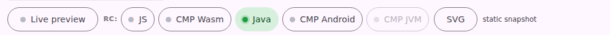
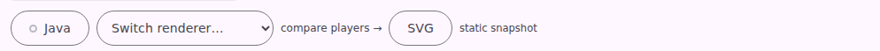
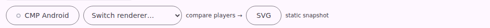
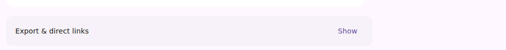
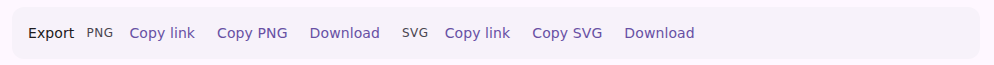

# Renderer picker (`compose-preview serve` viewer)

The viewer's per-preview lane controls, after collapsing the chip row into **one chip + one combo
box**. Captures come from the preview-harness (`pages-snapshot.spec.mjs`) at 1024px, light theme,
against the `serve-viewer-rc-players` / `serve-viewer-catalog-knobs` page fixtures.

## The renderer row

A Remote Compose preview (`remote-m3`) can be drawn by five different players, which is what made
this row grow. Before, every lane was its own chip and the answer to "what am I looking at?" was
spread across up to eight pressed-states:

After: the chip **names the current renderer** and its status dot says whether that render is
interactive — clicking it toggles live. The combo box holds the alternatives, the compare link steps
out to every player side by side, and SVG applies to whatever the chip is showing.

Switching player through the combo renames the chip rather than lighting one of six:

## The export bar

Before, the primary hand-off (the `/render` URL of what's on screen) was behind a disclosure, and
opening it gave a full-width read-only URL field per format whose only affordance was a `title`:

After: always visible, one line, three plainly-named actions per format. The URL still exists as a
field (`refreshLinks` writes it, both copy buttons and the lane e2e read it) but is taken out of the
flow — nobody reads a 200-character absolute URL.

## Kept diffed

`serve-viewer-rc-players` is a committed page fixture with a *switched-player* runtime state, so
the CI visual-diff bot renders and diffs both on every future PR — this page is a snapshot of the
change, not the mechanism that keeps it covered.

That state selects whichever lane is **not** the default, so it names the non-default player rather
than a fixed one: it was `player-cmp-android` when the viewer opened on Java, and became
`player-java` when #3936 flipped the default to the embedded player. The images above still show
the Java-default era they were captured in — they document the chip-row collapse, which is what
this page is about, and re-capturing them would only restate the same redesign with the two lane
names swapped.
